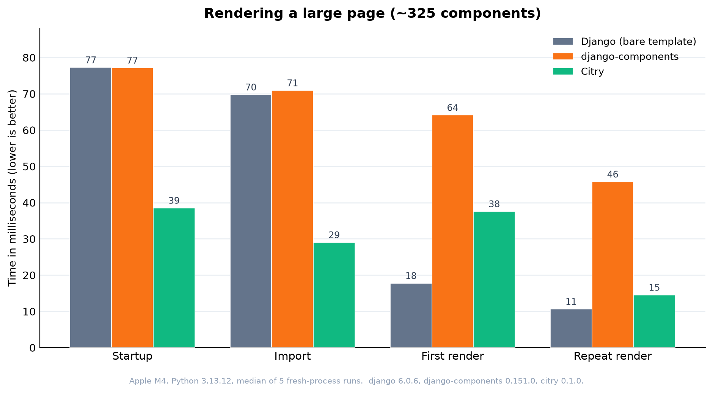

# Citry - Refreshingly simple UI

Citry is a **fast**, **simple**, and **smart** **frontend framework** for Python that brings the best of **Vue**, **React**,
**Django**, and **Jinja**.

Compatible with FastAPI, Django, and [other web servers](#use-with-web-framework).

```python
from citry import Component

# Define
class Welcome(Component):
    class Kwargs:
        title: str
        messages: list[str]

    # HTML
    def template_data(self, kwargs, slots):
        return {
            "title": kwargs.title,
            "messages": kwargs.messages,
        }

    template = """
      <div class="card">
        <h1>{{ title }}</h1>
        <p>You have {{ len(messages[:20]) }} new messages.</p>
      </div>
    """

    # JS
    def js_data(self, kwargs, slots):
        return {"count": len(kwargs.messages)}

    js = """
      $onComponent(({ els, data }) => {
        els[0].title = `${data.count} new messages`;
      });
    """

    # CSS
    def css_data(self, kwargs, slots):
        return {"accent": "tomato"}

    css = """
      .card {
        border-top: 3px solid var(--accent);
      }
    """

# Compose
component = Welcome(
    title="Welcome back",
    messages=["a", "b", "c"],
)

# Render
html = str(component)
```

## Why Citry?

Use Citry to build UI, HTML, XML, SVG, or anything that serializes to text.

Citry is:

- **Familiar** - if you know HTML and Vue/React, you are ready
- **Simple** - just 2 rules and 13 built-in tags
- **Fast** - Rust-powered parsing
- **Safe** - expressions are sandboxed to block dangerous operations
- **Smart** - manages JS and CSS scripts for you
- **Reliable** - typos and missing props fail at compile time, not in production
- **Universal** - one template language for your entire stack

## Quickstart

```sh
pip install citry
```

Define a component by subclassing `Component` and giving it a `template`. Use
`template_data` to prepare the values the template reads. Render it by turning
the component into a string:

```python
from citry import Component

class Welcome(Component):
    template = """
      <div class="card">
        <h1>{{ title }}</h1>
        <p>You have {{ count }} new messages.</p>
      </div>
    """

    # template_data prepares the values your template can read.
    # Run any computation here, in plain Python.
    def template_data(self, kwargs, slots):
        return {
            "title": kwargs["title"],
            "count": len(kwargs["messages"]),
        }

component = Welcome(
    title="Welcome back",
    messages=["a", "b", "c"],
)
html = str(component)
```

`html` is now:

```html
<div class="card">
  <h1>Welcome back</h1>
  <p>You have 3 new messages.</p>
</div>
```

Components compose by name. A `<c-Welcome>` tag renders the `Welcome` class.
Pass dynamic props with the `c-` prefix and static ones without:

```python
class Page(Component):
    template = """
      <main>
        <c-Welcome c-title="user.name" c-messages="user.inbox" />
      </main>
    """

    def template_data(self, kwargs, slots):
        return {"user": kwargs["user"]}
```

## Two simple rules

Citry extends HTML with two rules:

### 1. `<c-*>` tags are components

Any tag starting with `c-` is a component or a built-in tag.

`<c-Card>` -> `Card` component.

```html
<!-- Static HTML -->
<div class="container">
  <!-- A component -->
  <c-card title="Hello"></c-card>
</div>
```

### 2. `c-*` attributes are dynamic

Any attribute starting with `c-` is evaluated as an expression.
The `c-` prefix is stripped from the output:

`<div c-title="data.title">` -> `<div title="...">`

```html
<!-- Static HTML attribute -->
<div class="container">
<!-- Dynamic attribute (evaluated as an expression) -->
<div c-title="data.title">
<!-- Component with dynamic attribute -->
<c-card c-title="data.title">
```

If you know HTML, you already know most of Citry.

## Built-in tags

Beyond your own components, Citry provides 13 built-in tags. With these, Citry
is as expressive as Vue or React.

| Tag             | Purpose                                                       |
| --------------- | ------------------------------------------------------------- |
| `<c-if>`        | Conditional branch                                            |
| `<c-elif>`      | Else-if branch                                                |
| `<c-else>`      | Else branch                                                   |
| `<c-for>`       | Loop over an iterable                                         |
| `<c-empty>`     | Empty state for a `<c-for>` loop                              |
| `<c-slot>`      | Define a content insertion point                             |
| `<c-fill>`      | Fill a slot when using a component                            |
| `<c-component>` | Render a component chosen at render time                     |
| `<c-element>`   | Render an HTML element whose tag name is chosen at render time |
| `<c-provide>`   | Provide a value to descendant components                     |
| `<c-css>`       | Render the collected component CSS here                      |
| `<c-js>`        | Render the collected component JS here                       |
| `<c-raw>`       | Treat the contents as literal text                           |

## How templates look

A short tour. The [template syntax reference](docs/template-syntax.md) covers
every feature in depth.

### Expressions

With `{{ }}`, written in Python:

```html
<p>{{ user.name }}</p>
<p>{{ 'Member' if user.is_active else 'Guest' }}</p>
```

### Dynamic attributes

With the `c-` prefix. A `True` value renders the
attribute bare, `False` or `None` omits it:

```html
<button
  c-disabled="is_loading"
  c-class="['btn', { 'active': is_open }]"
>
  Submit
</button>
```

### Control flow

Write if branches and for loops directly in templates.

Long form:

```html
<c-if cond="is_admin">
  <p>Admin</p>
</c-if>
<c-else>
  <p>Guest</p>
</c-else>

<ul>
  <c-for each="item in items">
    <li>{{ item.name }}</li>
  </c-for>
  <c-empty>
    <li>No items found</li>
  </c-empty>
</ul>
```

Short form:

```html
<p c-if="is_admin">Admin</p>
<p c-else>Guest</p>

<ul>
  <li c-for="item in items">{{ item.name }}</li>
  <li c-empty>No items found</li>
</ul>
```

### Slots

Let a component accept content from its caller. Define insertion
points with `<c-slot>`, and fill them with `<c-fill>`:

```html
<!-- Modal.html -->
<div class="modal">
  <header>{{ title }}</header>
  <main>
    <c-slot /> <!-- Insertion point -->
  </main>
</div>

<!-- Using the component -->
<c-Modal title="Confirm">
  <p>Are you sure?</p>
</c-Modal>
```

## Beyond templates

Citry components are more than templates. A few of the things you can do:

### Build a component once, then compose and reuse it

`Component(...)` returns a value you can render on its own or pass into another component, and the same instance works in more than one place:

```python
class Layout(Component):
    template = """
      <main>
        {{ body }}
      </main>
    """

    def template_data(self, kwargs, slots):
        return {"body": kwargs["body"]}

card = Card(title="Welcome")

standalone = str(card)        # render the card to HTML on its own
page = Layout(body=card)      # or pass the same card into another component
```

### Ship JS and CSS with your components

As a page renders, Citry collects every rendered component's CSS and JS scripts, and injects them where you place
`<c-css />` and `<c-js />` (typically `<head>` and the end of `<body>`). No
bundler, no hand-managed `<link>` or `<script>` tags:

```python
class Page(Component):
    template = """
      <html>
        <head>
          <c-css />
        </head>
        <body>
          <c-Chart c-points="[1, 2, 3]" />
          <c-js />
        </body>
      </html>
    """
```

### Pass Python data to JS/CSS as variables

`js_data()` and `css_data()` pass values from the server straight to that component's JS
and CSS (as custom properties) in the browser, per rendered
instance. A server-rendered component can drive its own client behaviour and
styling from Python, with no manual data wiring:

```python
class Chart(Component):
    template = """
      <div class="chart"></div>
    """
    js = """
      $onComponent(({ els, data }) => {
        draw(els[0], data.points);
      )};
    """
    css = """
      .chart {
        height: var(--h);
      }
    """

    def js_data(self, kwargs, slots):
        return {"points": kwargs["points"]}   # reaches the JS as `data.points`

    def css_data(self, kwargs, slots):
        return {"h": "240px"}                  # reaches the CSS as `var(--h)`
```

### Provide data to a whole subtree

Set a value with `<c-provide>` and read it anywhere below with `inject()`, so you do not thread props through every layer:

```python
class Page(Component):
    # <c-Greeting /> renders <p>Dark mode</p>
    template = """
      <c-provide key="theme" label="Dark mode">
        <c-Greeting />
      </c-provide>
    """

class Greeting(Component):
    template = """
      <p>{{ label }}</p>
    """

    def template_data(self, kwargs, slots):
        # Read a value an ancestor provided, with no prop drilling.
        return {"label": self.inject("theme").label}
```

### Handle render errors with grace

500s due to an error in the template is poor UX. Instead of breaking the whole page, wrap a section in `<c-error-fallback>` to
render a fallback when error occurs. Boundaries nest, and the nearest one wins:

```python
class Page(Component):
    # If <c-Widget /> raises while rendering, the page shows the fallback
    # text instead of letting the error break the page.
    template = """
      <c-error-fallback fallback="Could not load widget">
        <c-Widget />
      </c-error-fallback>
    """
```

A `fallback` slot can receive the error itself if you want a custom message.

### Catch errors early with input types

Declare a component's inputs with plain annotated classes.
A wrong prop or slot name then fails when the template *compiles*:

```python
from citry import Component, SlotInput

class Card(Component):
    class Kwargs:
        title: str          # required
        size: int = 10      # optional

    class Slots:
        header: SlotInput

    template = """
      <div>
        {{ title }}
        <c-slot name="header" />
      </div>
    """
```

```html
<c-Card title="Hi" bogus="1" />      <!-- error: unknown prop -->
<c-Card />                           <!-- error: missing required `title` -->
<c-Card title="Hi">
  <c-fill name="headr">...</c-fill>  <!-- error: typo'd slot name -->
</c-Card>
```

### Support for HTML fragments (HTMX-style)

Fragments are rendered components that can be inserted into a page.

In browser, Citry smartly loads the fragments' JS/CSS scripts for you.

Render a component specifically as a fragment with `.serialize()`:

```python
card = Card(title="Welcome")
card.render().serialize(deps_strategy="fragment")
```

To use fragements, you must [mount a web framework](#use-with-web-framework).

### Performance - Render the constant parts once

If you have inputs that don't change between renders, wrap them in `Const(...)`.

Citry pre-renders and caches the parts of the template that
depend only on the constant inputs.

```python
from citry import Const

class Row(Component):
    template = """
      <tr>
        <td>{{ label }}</td>
        <td>{{ value }}</td>
      </tr>
    """

    def template_data(self, kwargs, slots):
        return {
            "label": kwargs["label"],
            "value": kwargs["value"],
        }

# The <td>{{ label }}</td> part is computed once and reused down the loop;
# only `value`, which varies per row, is recomputed.
rows = [
    Row(label=Const("Name"), value=v)
    for v in values
]
```

### And more

- Templates support infinite depth;
- Extension system;
- Dynamic components/HTML tags with `<c-component>` / `<c-element>`

See the [changelog](CHANGELOG.md) for the full list.

## Use with web framework

Some Citry features need a web server to work.

Citry can be easily integrated with popular Python web frameworks:

```python
from citry import citry  # the default instance
from citry.contrib.fastapi import mount

# `app` is your web framework's application object
mount(app, citry)
```

Supported hosts:

| Host | Entry point |
| ---- | ----------- |
| **FastAPI / Starlette** | `citry.contrib.fastapi.mount(app, citry)` |
| **Flask** | `citry.contrib.flask.mount(app, citry)` |
| **Django** | `citry.contrib.django.urlpatterns(citry)`, added to your `urls.py` |
| **Any ASGI server** | `citry.contrib.asgi.asgi_app(citry)` |
| **Any WSGI server** | `citry.contrib.wsgi.wsgi_app(citry)` |

Cache backends plug in the same way, through `Citry(cache=...)`:
`citry.contrib.caches.RedisCache`, `citry.contrib.caches.DiskCache`, and
`citry.contrib.django.DjangoCache`.

## Command line

Installing Citry puts a `citry` command on your PATH.

Scaffold a new component (no project setup needed):

```bash
citry create MyButton        # writes my_button.py, ready to edit
```

You get a ready-to-edit starting point:

```python
# my_button.py
class MyButton(Component):
    class Kwargs:
        title: str

    def template_data(self, kwargs, slots):
        return {"title": kwargs.title}

    template = """
      <div>
        <h1>{{ title }}</h1>
      </div>
    """
```

The other commands act on a Citry engine. Point them at the one you configured
with `--app`, given as `module:attribute`:

```bash
citry --app myproject.app:engine list        # components registered on that engine
citry --app myproject.app:engine ext list    # extensions installed on it
```

Extensions can ship their own commands; run one with `citry --app ... ext run
<extension> <command> [args]`. Run `citry --help` to see everything, and `citry
--version` to print the installed version.

## Documentation

- [Template syntax reference](docs/template-syntax.md) - every template feature
  in depth.
- [Codebase and development setup](docs/codebase.md) - how to build, test, and
  contribute.

## Performance

Rendering a large page (~325 component instances, ~205 KB of HTML):



- **Versus django-components** (the fair component-to-component comparison),
  Citry is about **1.7x faster** on first render and **3.4x faster** on repeat
  renders, and about **2x faster** to start up and import.
- **Versus bare template engines** (Django and Jinja2 render no components), Citry pays for the component lifecycle they skip, yet its repeat render
  is only about **1.3x** a Django template.
- **Jinja2** is the fast no-component baseline: fastest to start up and fastest
  once warm, because each component is just a precompiled macro. It has no
  component model, and it pays on first render, recompiling its whole macro
  library at once.

These are relative numbers from a single machine. See
[`benchmarks/`](benchmarks/README.md) for the methodology and how to reproduce
them, and the [performance notes](docs/design/performance.md) for where the
remaining time goes.

## Help bring Citry to your language

Today Citry ships as a Python package, but designed to work with any language.
The code inside `{{ }}` and `c-*` attributes is the only host-language-specific logic.

If you want Citry in your stack, this is a great place to contribute. Star the
repo to follow along, and open an issue if you would like to help port it.

| Language   | Status  | Binding      |
| ---------- | ------- | ------------ |
| **Python** | Ready   | PyO3/maturin |
| **JS/TS**  | Planned | wasm-bindgen |
| **PHP**    | Planned | FFI          |
| **Go**     | Planned | cgo          |
| **Rust**   | Planned | Native       |

## License

MIT License - see [LICENSE](./LICENSE) for details.

## Acknowledgments

This project is the continuation of work originally done in
[django-components](https://github.com/django-components/django-components) and
[django-components/djc-core](https://github.com/django-components/djc-core).
