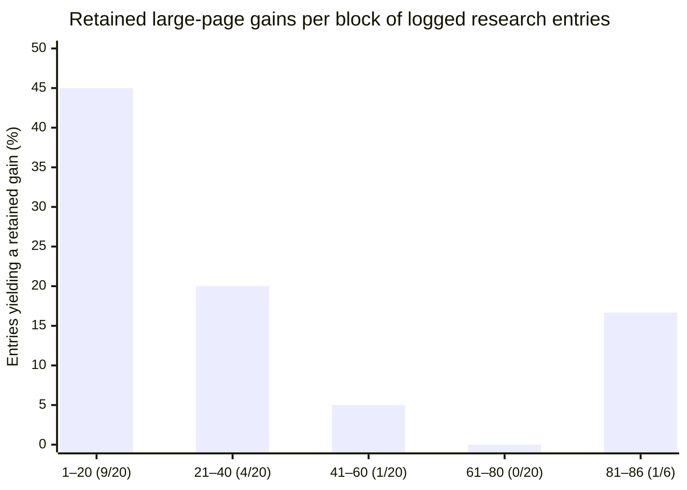

## Devlog story: letting Astra optimize Citry overnight

Experiment scripts, candidates and raw captures are retained on the
[performance research branch](https://github.com/citry-dev/citry/tree/research/performance-render-20260910).
Historical paths describe the original checkout; the archive guide records
the renames.

I let Astra work on Citry's rendering performance overnight. This was the first agent I'd trusted to keep working like that while I slept. Across the whole optimization journey it ran for roughly **14 hours**, using medium or high reasoning. I don't remember which setting; that detail needs checking before recording the video.

**Overall, I consider it a success.** The first stretch delivered roughly a quarter less render time. Getting another quarter off the remaining time needed more direction from me, and that is the interesting part of the story.

### The overnight result

Our client wasn't happy with rendering performance. We had already done substantial optimization, so I asked the agent to revisit the measurements and find where the time actually went. Ownership tracking alone accounted for about a quarter of an instrumented render: recording component calls and source occurrences, tracking slot placements, and retiring replaced output.

I gave the agent permission to keep experimenting in a separate worktree, commit retained changes by area, and keep a research log. It could reject its own experiments. A positive timing result wasn't enough if it broke component behavior, retained objects indefinitely, or didn't survive stronger measurement.

My recollection is that the overnight run found around seven useful improvement areas. That's a grouping of the work, rather than seven literal patches: cheaper ownership records, retirement and region selection, attribute handling, traversal and render frames, ownership-scope and value dispatch, input and expression work, and native ownership storage. The detailed ledger contains more individual retained changes.

The later cumulative comparison measured warmed renders at **39.609 → 30.147 ms**, a **23.89% reduction**, while retaining the ordinary component contract. That is the measured basis for “the first ~25%.” It isn't a sum of the individual experiment timings.

### Then the useful findings became harder to find

The journal makes the diminishing returns visible. Early on, many candidates survived qualification. Later, the agent spent much more of its search revising candidates, profiling, and finding reasons not to keep them.

| Logged entries | Retained gains | Share |
| --- | ---: | ---: |
| 1–20 | 9 / 20 | 45% |
| 21–40 | 4 / 20 | 20% |
| 41–60 | 1 / 20 | 5% |
| 61–80 | 0 / 20 | 0% |
| 81–86 | 1 / 6 | 16.7% |

These are **logged research entries, not independent trials, elapsed hours, or equal amounts of work**. They include revised candidates, profiling and qualification. The final group is shorter. A provisional speedup counts only when it reached the retained implementation; multiple steps toward the same eventual change don't each get credit. The graph measures how often the search produced retained gains, not how many milliseconds each gain saved.

### The question I had to change

From my perspective, Astra was increasingly treading water within the same general component design: moving work between Python and Rust, adding caching, and removing small inefficiencies. Some of that work was useful, but I had to steer it toward different usage patterns and eventually allow changes to the public contract.

The concrete question was: **if a component only transforms data into HTML, why should it pay for all the machinery of an independently managed interactive component?** A component with no slots, Alpine behavior or JS/CSS variables ought to have a path closer to an ordinary Django or Jinja template.

That led to an explicit `Component.simple = True` API. A compatible presentation component can render as part of its caller, without its own component instance, identity or component/slot hooks. Its data callback still runs on every render. The public API preserves deferred scheduling for direct tags; the earlier prototype that ran callbacks immediately was a separate experiment. Unsupported declarations and calls raise errors. This is an opt-in contract with restrictions, so the later gain isn't a free improvement for every existing component.

In the first public-API benchmark, ordinary Citry measured **31.589 ms** and the selected simple components measured **23.215 ms**. The median paired saving was **8.425 ms / 26.63%**, roughly another quarter of the remaining render time. Those figures use paired measurements, so the saving need not equal the subtraction of the separately reported medians.

These two stages were measured in separate comparisons. We shouldn't add the percentages or present them as a single measured 50% reduction. Nor did we reach Django parity: Django measured **11.032 ms** in the public-API comparison, and the frameworks produce different amounts of HTML and perform different supporting work.

The late rise in the graph includes the final qualified simple API. It followed a change in what the design was allowed to do, after many earlier ideas had been rejected.

### What I take away

I could leave an agent running overnight and come back to meaningful, measured improvements, a record of rejected ideas, and changes I could review. That first roughly 25% is impressive to me.

For the next step, my understanding of the domain still mattered. I had to suggest separating component scenarios and asking which conveniences those scenarios actually needed. Astra could then explore and implement that direction. This one run makes me optimistic about autonomous optimization, while showing where I still needed to supply the deeper design insight.

### What to show in the video

- The original time breakdown, then one concrete ownership change and its benchmark.
- The diminishing-returns graph and an example of a promising candidate rejected during qualification.
- The question about data-only components, the `simple = True` declaration, and its measured result.

**Evidence and chart method:** the local worktree contains `docs/design/performance_render_research.md`, `docs/design/performance_render_experiment_summary.md`, and the chart data in `docs/design/assets/performance_render_retained_gains.json`. The chart uses the ledger's first 64 rows, one entry each for iterations 48–68, and one final public-API integration/qualification checkpoint. Iteration 47 is a cumulative comparison and is excluded. The final checkpoint includes the later handoff and validation, not just the initial benchmark. The work is awaiting review/promotion; public source links can be added when the PR exists. The 14-hour runtime, reasoning-setting uncertainty and overnight account are my recollection, not quantities reconstructed from this graph.
