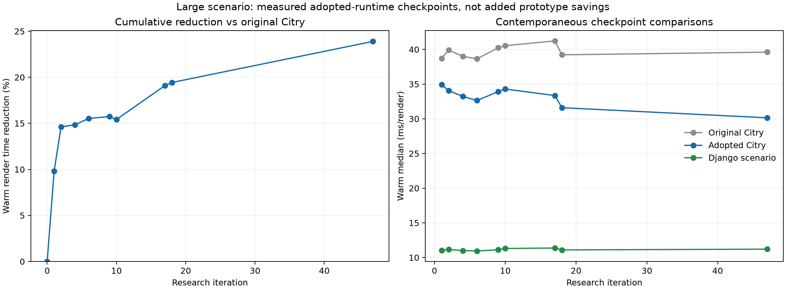

# Repeat-render experiment results

This ledger summarizes the experiments in [the research journal](repeat_render_research.md)
through iteration 46, followed by a fresh cumulative comparison at iteration 47.
The journal retains the individual runs, checks, limitations and source hashes.
Rows group revisions and confirmation runs of the same idea; distinct candidates
within an iteration get separate rows.

Savings below are milliseconds per complete large render unless stated otherwise;
positive means faster and negative means slower. They are local comparisons,
not contributions that can be added together. Early rows use differences of
medians or within-process paired savings, as indicated; from iteration 16 onward,
the main statistic is the median of differences between paired fresh-process
means, including normal garbage collection. An observed positive median does
not necessarily establish a reliable improvement.

| Iteration | Experiment and result in one sentence | Observed saving, ms | Decision |
|---|---|---:|---|
| 1a | Replace six frozen ownership dataclasses with NamedTuple records, reducing the fresh-process warm median from 38.403 to 37.151 ms. | +1.253 | Adopted |
| 1b | Reduce temporary retirement sets and lists, with a small within-process median change that did not establish a material standalone gain. | +0.126 | Adopted, no material speed claim |
| 1c | Prepare extension configuration constructors once per exact class, with only a small within-process median change. | +0.081 | Adopted, no material speed claim |
| 1d | Simplify attribute accumulation, reuse bounded normalization results and avoid redundant Markup creation, reducing the within-process median from 37.552 to 35.670 ms. | +1.881 | Adopted |
| 1e | Use mutable builders for ownership records, which increased the within-process median by 0.139 ms. | -0.139 | Rejected |
| 1f | Use NamedTuple source sites and occurrences, reducing the within-process median from 36.273 to 35.700 ms. | +0.573 | Adopted |
| 1g | Traverse plain text directly, reducing the within-process median from 34.768 to 34.542 ms. | +0.227 | Adopted |
| 2a | Skip physical-region searches for fresh text containers, reducing the strengthened comparison's medians from 33.582 to 32.982 ms. | +0.599 | Adopted |
| 2b | Initialize Dependencies and Events configurations lazily, with a positive local median difference but unqualified compatibility guards. | +0.229 | Rejected |
| 2c | Reuse spread-key validation work, reducing the local median by 0.240 ms. | +0.240 | Adopted |
| 2d | Cache final plain-string class merges, reducing the local median by 0.304 ms. | +0.304 | Adopted |
| 3 | Combine invocation capture, queue updates and retirement in a native journal, with confirmation medians of 32.765 versus 32.513 ms that did not justify the partial migration. | +0.252, difference of medians | Rejected at this stage |
| 4 | Keep unchanged empty root RenderFrame objects, saving 0.401 ms by the median paired difference. | +0.401 | Adopted |
| 5a | Share an unbounded source-site cache across renders, with a small saving in only 35 of 60 pairs and unresolved retention limits. | +0.185 | Rejected |
| 5b | Reuse prepared hook lists, with a small saving and unqualified invalidation when hooks change. | +0.220 | Rejected |
| 6 | Skip the ownership context manager when its graph is already active, saving 0.169 ms by the median paired difference. | +0.169 | Adopted |
| 7 | Move retirement relationships into Rust, adding only 0.053 ms incremental saving over the existing native journal. | +0.053 incremental; +0.348 versus production | Rejected |
| 8a | Compile all four component transaction functions with Cython, retaining about half a millisecond of saving across two runs. | +0.487 / +0.521 | Rejected, insufficient for added build system |
| 8b | Compile component construction alone, with a small paired saving. | +0.091 | Rejected |
| 8c | Compile rendering of one component alone, with a small paired saving. | +0.170 | Rejected |
| 8d | Compile component input resolution alone, with little paired saving. | +0.049 | Rejected |
| 9 | Replace generator-based input constness checks with a direct loop while preserving error behavior, saving 0.180 ms in the final comparison. | +0.180 | Adopted |
| 10 | Combine eligible bare-name expression evaluation while retaining live lookups and key identity, passing two active-helper comparisons. | +0.198 / +0.274 | Adopted |
| 11 | Assemble symbolic serializer chunks before flattening, accelerating a deep synthetic chain but barely changing the real page. | +0.023 real page; +1.042 synthetic assembly, paired | Rejected |
| 12 | Store more ownership rows beside native retirement, with a final incremental regression despite a modest complete-candidate saving. | -0.040 incremental; +0.250 versus production | Rejected at this stage |
| 13 | Query ancestry beside native rows, improving that prototype but missing a convincing complete-candidate result against production. | +0.469 incremental confirmation; +0.282 versus production | Kept experimental, not adopted |
| 14 | Omit hook retirement when its captured order interval is empty, with no reliable standalone Python speedup but a useful later interaction with native storage. | -0.048 final Python confirmation; +0.631 native comparison | Adopted, no standalone speed claim |
| 15a | Cache final attribute formatter strings, with confirmation savings below the declared magnitude threshold. | +0.230 | Rejected |
| 15b | Cache the complete node attribute-formatting result, showing larger savings but missing the original pair-count screen. | +0.482 final guards | Advanced to better-controlled timing |
| 16 | Recheck that node cache in independent process lifetimes to include each variant's own GC costs, passing seven of eight paired comparisons. | +0.688 | Advanced to production qualification |
| 17 | Integrate the guarded attribute-output cache, saving 0.551 ms with eight of eight joint wall/CPU wins. | +0.551 | Adopted |
| 18a | Avoid repeated structural protocol inspection for qualified exact strings and render objects, passing the corrected prototype's eight process pairs. | +0.800 | Advanced to production qualification |
| 18b | Integrate the guarded value-conversion shortcut, retaining a 0.755 ms saving in all eight process pairs. | +0.755 | Adopted |
| 19 | Represent RenderFrame as a named tuple, with six of eight wins and incompatible public object behavior. | +0.266 | Rejected |
| 20 | Delay unused fallback Slot initialization, avoiding 194 initializations but slowing rendering and changing public behavior. | -0.345 | Rejected |
| 21 | Add bounded shared source-site caching, reaching 115 warm hits but regressing complete rendering. | -0.076 | Rejected |
| 22 | Derive ownership row positions directly from consecutive IDs, with five of eight wins and incompatible missing/custom-ID behavior. | +0.256 | Rejected |
| 23a | Reuse generated Provided classes, passing the timing screen but sharing mutable class state across calls. | +0.380 | Rejected, incompatible |
| 23b | Cache only Provided constructor compilation while preserving fresh classes, missing both timing requirements. | +0.101 | Rejected |
| 24a | Replace known context-merge hooks with prepared dictionary operations, passing timing but skipping instance hook overrides. | +0.548 | Rejected, incompatible |
| 24b | Resolve each context-merge hook live before using the dictionary shortcut, preserving tested overrides but losing most of the saving. | +0.147 | Rejected |
| 25a | Cache merged attribute contributions, with six of eight wins and stale-helper/current-object-identity problems. | +0.296 | Rejected |
| 25b | Cache only attribute-name positions while keeping values live, which regressed complete rendering. | -0.118 | Rejected |
| 26 | Recheck the combined native ownership backend with independent process lifetimes and the current renderer, passing seven of eight pairs. | +0.911 versus production | Advanced |
| 27 | Group native fill checks and binding, removing 388 intermediate record exports but regressing the native backend. | -0.138 incremental | Rejected |
| 28 | Prepare a slot region in one native operation, removing 304 net exports but winning only six of eight pairs. | +0.351 incremental | Advanced only as part of a combination |
| 29 | Construct exported NamedTuple records directly from existing field tuples, winning only six of eight pairs. | +0.418 incremental | Advanced only as part of a combination |
| 30 | Combine native slot preparation and direct record exports, passing all eight pairs both incrementally and against production. | +0.569 incremental; +1.284 versus production | Advanced |
| 31 | Broaden native ownership tests and inspect numeric boundaries, finding queue-order overflow that blocked integration. | Not timed | Qualification, no gain claimed |
| 32 | Retain arbitrary-precision Python queue-order objects, fixing the boundary failure while preserving the whole backend's gain. | +1.329 versus production | Advanced, not an incremental gain |
| 33 | Extract the unchanged portable ownership calculation into its shared Rust crate, retaining the complete backend's gain. | +1.444 versus production | Integrated shared crate, not an incremental gain |
| 34 | Package native storage in the ordinary extension, retaining a 1.572 ms whole-backend saving with the release ABI3 build. | +1.546 CPython build / +1.572 ABI3 | Integrated inactive binding |
| 35 | Activate native ownership in normal rendering, saving 1.534 ms on the large case while adding 0.006525 ms to the tiny case. | +1.534 large; -0.006525 tiny | Adopted with tiny-case tradeoff |
| 36 | Allocate native ownership storage only at the first nested invocation, recovering 0.004560 ms on the tiny case while meeting the large-case nonregression margin. | +0.004560 tiny; +0.135 large, inconsistent | Adopted, no new large-throughput claim |
| 37 | Capture body-builder values in default arguments rather than closure cells, removing 2,394 cells but producing little full-render benefit. | +0.046 | Rejected |
| 38 | Perform the attribute contribution merge loop in Rust, activating 505 times but missing both timing requirements. | +0.163 | Rejected |
| 39 | Build compact attribute-output cache keys in one native call, passing all eight prototype pairs. | +0.392 | Advanced to packaged qualification |
| 40 | Package that native attribute-key operation, where the saving disappeared and the Python fallback also regressed. | -0.036 packaged large; -0.170 fallback | Reverted after qualification |
| 41 | Move attribute-output cache lookup earlier to skip more merge work, missing the magnitude threshold and changing a live property-read count. | +0.209 | Rejected |
| 42 | Discover deferred render tasks in Rust, where guards and conversion accompanied a complete-render regression. | -0.930 | Rejected |
| 43 | Replace four generator context managers with slotted scope objects, producing negligible savings and lifecycle differences. | +0.018 | Rejected |
| 44 | Compile the whole ownership module with ordinary Python classes, winning all eight pairs but missing the 1 ms requirement for another native build system. | +0.445 | Rejected |
| 45 | Delay SourceLocationRecord construction in native storage, winning six pairs while snapshots still exported all 1,077 deferred rows. | +0.416 | Rejected, including constructor compatibility gap |
| 46 | Let internal snapshots read raw source fields, eliminating 1,077 production public-record exports but missing both timing requirements and changing identity/descriptor behavior. | +0.117 | Rejected |

Untimed investigations also checked pure-body shapes, GC and reader allocation
counts, known kwargs/slots, generated methods, previous-render reuse, ownership
omission, alternate tree representations and browser-triggered lazy rendering;
these have no measured optimization gain to list. The shared discussion's
symbolic serialization proposal became the timed iteration 11 experiment.

Iterations 36 through 46 contain one adopted correction
(iteration 36, for tiny renders) and no newly established large-render throughput
gain after native ownership activation in iteration 35. The accepted native
combination in iteration 30 also shows why independently weak results should
occasionally be measured together: their interaction passed even though the
two preceding candidates missed the consistency screen.

<!-- timeline:start -->
## Performance across adopted checkpoints

Each row compares the adopted runtime with the original branch and Django in
the same five-round run, using 20 warm samples per process after six renders.
The x-axis shows research progression, not elapsed engineering hours; straight
lines connect measured checkpoints and do not locate intervening gains.
Differences between rows include desktop timing variation, so individual
changes must be assessed through the local comparisons above.

| Iteration | Adopted checkpoint | Original Citry, ms | Adopted Citry, ms | Reduction | Django, ms | Citry / Django |
|---|---|---:|---:|---:|---:|---:|
| 1 | Initial six areas | 38.730 | 34.927 | 9.82% | 11.026 | 3.17x |
| 2 | Selection and attributes | 39.901 | 34.072 | 14.61% | 11.168 | 3.05x |
| 4 | Retain empty frames | 39.010 | 33.221 | 14.84% | 11.000 | 3.02x |
| 6 | Skip active graph scope | 38.646 | 32.642 | 15.53% | 10.948 | 2.98x |
| 9 | Input constness loop | 40.251 | 33.918 | 15.73% | 11.121 | 3.05x |
| 10 | Simple-name evaluation | 40.549 | 34.296 | 15.42% | 11.310 | 3.03x |
| 17 | Attribute-output cache | 41.226 | 33.353 | 19.10% | 11.373 | 2.93x |
| 18 | Value conversion | 39.228 | 31.604 | 19.43% | 11.101 | 2.85x |
| 47 | Current, native ownership | 39.609 | 30.147 | 23.89% | 11.206 | 2.69x |

The current warm comparison is **39.609 to 30.147 ms, a 23.89% reduction**;
Django takes 11.206 ms, leaving Citry at 2.69 times its time.
Actual second-render medians are 42.158 to 34.522 ms
(18.11% lower), with Django at 11.513 ms.
Second-render figures contain only five observations per variant.

The current measurement uses unchanged production runtime code from `b11a895`,
at research HEAD `e0c77ad1`; both Citry checkouts load the same current release
ABI3 binary, and the original checkout's binary was restored afterward.
Earlier checkpoints use their then-current matching native artifacts.
Citry emits 1,013,746 bytes and Django 456,422 bytes in these scenarios:
the comparison includes different output and framework features.

[Raw timeline](../../benchmarks/results/repeat-render/performance-timeline.json),
[current observations](../../benchmarks/results/repeat-render/round47-comparison.json),
[current provenance](../../benchmarks/results/repeat-render/round47-comparison-provenance.json).
Regenerate with `uv run --no-project --with matplotlib python benchmarks/repeat_render_timeline.py`.
<!-- timeline:end -->

## Continued experiment: native collector field layout

Iteration 48 compiled ownership capture with native offsets for all 30 collector
fields, saving **0.743 ms/render with 7/8 joint wall/CPU wins**, but it was
**rejected** because it missed the declared 1 ms requirement for another native
build path and changed descriptor, class replacement and introspection behavior.
This compares the whole compilation/layout combination against production;
it does not isolate the incremental effect of layout from iteration 44.
Actual second renders saved 0.791 ms across eight pairs. HTML and four complete
snapshots matched; 168 ownership/manifest tests passed, while the additional
storage selection had 24 passes and two failures in a frame-sensitive replay
trigger. All 194 tests pass against the unchanged production runtime.
Production performance remains the iteration 47 checkpoint above.
[The research entry](repeat_render_research.md#forty-eighth-iteration-native-field-offsets-throughout-ownership-capture)
records the implementation, checks and limitations.

## Broader research mode from iteration 49

The user requested a shift toward larger-scope and architectural experiments
at iteration 49, after `1805e15`; the transition's production anchor is the
30.147 ms warm checkpoint above. [The mode-change marker](repeat_render_research.md#research-mode-change-larger-scope-and-architectural-experiments)
records this explicitly for later analysis.

Iteration 49 compiled the complete component-render, node and slot modules
together, saving **2.149 ms by the median paired reduction in process mean warm
render time, with 8/8 joint wall/CPU wins**; this advances to qualification but
is **not adopted**, because two of 625 selected tests expose render-state
retention through compiled callback/closure cycles. The next experiment will
replace those callbacks with methods on explicit settlement state and remeasure.
This prototype result does not change the production timeline.

Iteration 50 replaced the compiled pipeline's nested settlement callbacks with
methods on an explicit state object, resolving the observed reference cycle and
saving **3.132 ms by the median paired reduction in process mean warm render
time, with 8/8 joint wall/CPU wins**; it **advances to broader qualification**,
with 4,821 non-browser tests passing and immediate graph release restored in
both the small and full-page diagnostics. This measures the complete corrected
pipeline against production; it is not an incremental 3.132 ms gain over
iteration 49 and does not yet change adopted performance.

Iteration 51 rebuilt that corrected pipeline against the Python 3.10 stable ABI,
saving only **0.533 ms by the median paired reduction in process mean warm time,
with 5/8 joint wins**, so this distribution target is **rejected**; its 625 selected
tests and lifetime checks pass on CPython 3.14, but the performance screen fails.
The interpreter-specific candidate remains available for further qualification.

Iteration 52 targets the corrected pipeline at the Python 3.12 stable ABI,
saving **1.295 ms by the median paired reduction in process mean warm time,
with 8/8 joint wins**, so it **advances to execution qualification**; 625 selected
tests and both lifetime diagnostics pass on CPython 3.14, while actual second
renders save 0.572 ms with only five wins. It remains experimental and does not
change the adopted timeline.

The user **parked Cython and ABI exploration after iteration 52**. The prepared
older-interpreter qualification did not run; installed test environments carry
no compatibility or performance claim. Further research continues in the broader
mode through rendering algorithms and data representation.

Iteration 53 counts ordinary tree construction and deferred discovery, finding
**1,015 render/frame constructor calls each, 274 physical wrappers and 4,167
part entries across deferred-scan inputs** on the full page; this is **untimed design
preparation**, with no gain claimed, for carrying pending work alongside tree
construction while preserving mutations and hook behavior.

Iteration 54 carries pending child positions through body construction, reducing
ordinary deferred-scan inputs from 4,167 to 1,111 entries but **adding 0.912 ms
by the median paired increase in process mean warm time, with 0/8 joint wins**;
it is **rejected**, and a custom constructor also demonstrates a child that the
prototype fails to settle. Production and the adopted timeline remain unchanged.

Iteration 55 omits 194 unused fallback objects and invokes their supplied template
fills without generic slot-call contexts, saving **0.370 ms by the median paired
reduction in process mean warm time, with 7/8 joint wins**; it **supports further
qualification under the earlier 0.25 ms screen**, with callable replacement and
an equality-based helper check still exposing compatibility failures. It was
initially rejected against 1 ms; the user's threshold question prompted an explicit
reassessment because this candidate adds no build complexity. It did not pass
its original predeclared screen. Actual second renders save 1.240 ms across eight
observations per variant. Production and the timeline remain unchanged.

Iteration 56 adds live helper-identity and active-graph checks to direct template
fills, saving **0.158 ms by the median paired reduction in process mean warm time,
with 6/8 joint wins**; it is **rejected** under the corrected 0.25 ms / seven-win
screen, and a provided-key equality callback exposes a remaining binding change
the candidate misses. All 625 selected tests and fourteen other focused cases
pass. Actual second renders save 0.552 ms across eight observations per variant.
Production and the adopted timeline remain unchanged.

Iteration 57 retains marker inheritance, scanned frames and assembly in a Rust
session, saving **0.280 ms by the median paired reduction in process mean warm
time, with 6/8 joint wins**; it **does not advance to production qualification**
because it misses the seven-win screen, and two lone-surrogate string cases
remain incompatible. All 360 selected serializer-related tests pass. Production
and the adopted timeline remain unchanged.

Iteration 58 moves five settlement callbacks onto one state object in ordinary
Python, showing a **0.013 ms median paired increase in process mean warm time,
with 4/8 joint wins**; it is **rejected** under the 0.25 ms / seven-win screen.
Only two states are constructed per full render, and all 625 selected tests and
both fixture lifetime comparisons pass. This isolates the representation from
the earlier compiled pipeline; it establishes no new adopted gain. Production
and the adopted timeline remain unchanged.

Iteration 59 changes research direction to **component cases and API tradeoffs**:
an untimed census finds 54 ordinary leaves among 342 large-case component renders,
while input-dependent children, fallback slots and renderable expression values
prevent treating that observation as a class-wide guarantee. HTML and four ownership
snapshots match the ordinary renderer in both input cases. No optimization or speedup
is claimed; the next comparisons will test which work a restricted template-only
case can omit and what each restriction costs users.

Iteration 60 executes trusted template-only fixtures without component instances,
hooks, ownership or document serialization, saving **37.9–47.0 microseconds per
standalone call with 8/8 joint wins in all six cases**; it advances to a real-case
experiment under an explicit restricted contract. Warm static, scalar and typed
cases beat Django and Jinja in all eight pairs; loops remain 1.187 times Django
and 2.495 times Jinja. Early second-call results differ and are recorded separately.
No complete large-page saving, compatible production optimization or new adopted
checkpoint is claimed.

Iteration 61 renders the 41 selected HeroIcon calls without live components while
preserving checked HTML and ownership identity, but makes the page **0.154 ms slower
by median paired warm time, with 0/8 joint wins**, so it is rejected. Profiling finds
1,804 recursive value-validation calls and 82 attribute-region resolutions versus
22 in ordinary Citry, which already reuses prepared output for 30 icon calls. No adopted improvement
is claimed; the next comparison should retain that reuse and isolate the cost of
enforcing the restricted contract.

Iteration 62 restores body reuse to the restricted icon prototype, saving
**0.454 ms versus iteration 61's guarded implementation with 8/8 joint wins**;
its final variant also trusts the registered callback's output and saves
**0.273 ms versus ordinary Citry with 6/8 joint wins**, missing the consistency
screen and remaining unadopted. Four-way timing and profiling separate body
reuse from redundant validation; production and the adopted timeline are unchanged.

Iteration 63 makes selected HeroIcon SVG caller-owned, saving **0.950 ms versus
ordinary Citry and 0.729 ms versus the identity-preserving contract, both with
8/8 joint wins**, so it advances to broader qualification. It removes 41 identities,
13 browser graph instances and 12 Alpine isolation markers while preserving the
checked remaining output and ownership; the API/browser behavior changes and it
is not adopted. Production and the adopted timeline remain unchanged.

Iteration 64 qualifies the unchanged caller-owned icon in three browsers, with
**15 active interaction passes and 12 expected rejections for variants retaining
identity**; it establishes **no new speedup**, but shows that the restricted SVG
can also work under Alpine x-if and teleport where independent client-active
components are currently rejected. Production and the adopted timeline remain
unchanged; this is bounded browser qualification of iteration 63's 0.950 ms result.

Iteration 65 renders the 114 direct Button tags as caller-owned template functions,
saving **5.731 ms (18.7%) in median paired warm time with 8/8 joint wins**, so it
advances architectural qualification while giving up wrapper identity, component/slot
hooks and deferred callback order; projected application output and bounded checks
in three browsers pass, but general ownership/lifecycle behavior remains unqualified
and production is unchanged. This measures the button change alone and does not add
iteration 63's separate icon saving.

Follow-up qualification in iteration 66 found that the retained iteration 65
prototype renders static formatting-only content that ordinary Citry discards;
the composed implementation fixes this case and keeps the unchanged control for
historical comparison.

Iteration 66 composes 114 Button, 40 Icon and 41 HeroIcon calls as caller-owned
functions, saving **9.473 ms (30.7%) with immediate execution or 8.429 ms (27.4%)
with deferred execution, both with 8/8 joint wins versus ordinary Citry**; it
advances architectural qualification, with **0.965 ms** attributable to the direct
immediate-versus-deferred comparison and **3.741 ms** saved beyond the Button-only
control in the same run. The two composed schedules have matching checked ownership
snapshots and application HTML, and all nine browser pages pass, but the explicit
identity/hook restrictions remain unadopted and production is unchanged.

Iteration 67 profiles the composed function representation and claims **no new
speedup**: despite removing 195 component identities, render-object construction
falls only from **1,289 to 1,151**, interior renders increase from **963 to 1,020**,
and traversal/attribute work largely remains; the next experiment will emit function
text directly while preserving metadata and structured child boundaries.

Iteration 68 emits selected function output into a shared parts list, saving
**1.367 ms (6.4%) beyond iteration 66's immediate composition with 8/8 joint wins**
and reducing render-object construction from **1,151 to 610**; complete paired
output digests, activation and observed ownership snapshots match, but hooks that
inspect function interiors remain unqualified and production is unchanged.

The first public `Component.simple = True` measurement opts Button, Icon and
HeroIcon into the checked API, saving **8.425 ms (26.63%) in median paired warmed
time versus ordinary Citry, with 6/6 wall-and-CPU wins**; simple takes **23.215 ms**
warm versus **31.589 ms** ordinary and **11.032 ms** Django, while broader API
qualification remains pending and the adopted historical timeline is unchanged.
This includes one Python Icon insertion beyond iteration 66's tag-only selection
and does not apply iteration 68's shared text buffer; the comparisons must not be
added together. Full method and evidence are in the research log's
"Simple API measurement: public declarations on the large page" section.
