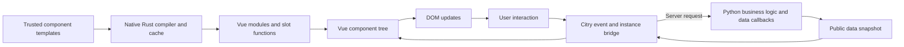

# Vue as Citry's browser renderer

The active completion plan and integration status are in
[Complete the Vue migration](vue_migration.md).

## Vue-only cutover, 2026-09-12

The worktree is now migrating to Vue as its sole browser runtime. Historical
benchmark artifacts provide the Alpine comparison; maintaining an executable
Alpine renderer or ownership-graph control in current source is not a
requirement. The earlier V1-V8 findings below describe the experiments leading
to this decision, not a requirement to preserve their temporary modes.

### Prior art and deletion boundary

The dependency audit covers `component_render.py`, `nodes/__init__.py`,
`slots.py`, `citry_context.py`, `citry_element.py`, `citry_render.py`, and
`serialize.py`; dependencies, Events, cache, i18n, and security consumers;
`ownership.py`, `ownership_manifest.py`, the `citry_ownership` Rust crate and
PyO3 storage bindings; and the JS dependency manager, Events client, Alpine
build transformations, and client-graph protocol. The V8 native Vue compiler,
direct slot relationships, retained-instance coordinator, and signed Events
adapter supply the replacement mechanisms.

The cutover removes graph construction, source-occurrence storage, retirement,
physical range wrappers and manifests, Alpine scope projection, and the DOM
morph planner. Python still executes kwargs and slot validation, data callbacks,
provides, lazy fills/fallbacks, extension hooks, and selected-result settlement.
Static HTML serialization remains useful and must work without an ownership
graph or a browser runtime.

### Implementation sequence

1. Make Python rendering graph-free. Keep lexical source and selected placement
   relationships on returned structure. Remove graph-only branches and fields,
   then delete their modules and native bindings. Port semantic tests; obsolete
   graph-internal tests do not constrain the new architecture.
2. Ship the Vue runtime-only bundle, coordinator, asset loader, and Events
   bridge as the sole interactive runtime. Document serialization and Events
   consume an already-rendered tree through `prepare_from_render`; neither
   may repeat Python callbacks to obtain a second representation. Keep nonce,
   integrity, CSRF, signed state, action order, and dependency delivery.
3. Record final `js_data` on each component's render context after data hooks.
   Select it with the component's returned structure and detach it once at the
   wire boundary. An external capture extension and graph-keyed store are not
   needed for this lifecycle.
4. Combine typed capture and prepared-output assembly. Reuse validated authored
   element/source descriptors; evaluate Python values once; resolve selected
   component/slot relationships without rebuilding every ordinary HTML node.
   Validate untrusted inputs at their boundary, rather than repeatedly checking
   internally generated identifiers and source spans.
5. Profile the resulting default path, then optimize the dominant measured
   costs. Record each structural change, rejected attempt, correctness evidence,
   timings, and remaining limitations in the research log. Use installed wheels
   for the end-to-end comparison and keep historical results intact.

Compiler/browser-expression diagnostics, LSP and editor completion, owned UI
components, examples, and documentation must follow Vue's syntax and lifecycle.
Independent competitor adapters can retain the frameworks they benchmark.
The published Citry competitor must use its published Python and browser bytes;
workspace runtime substitution is not part of the new comparison.

### Contracts and failure behavior

The public Python component model remains the starting contract. Browser
updates target component instances or explicit markers inside the Vue app;
arbitrary CSS selectors and direct mutation of Vue-managed DOM are rejected.
Document head and outer HTML/body metadata remain server-managed. Unsupported
inputs must fail explicitly before mutation, and each intentional behavior
change must be documented rather than hidden behind an Alpine fallback.

Normal rendering should produce one typed selected tree. Static serialization
materializes it directly and does not invoke the Vue assembler or compiler.
Interactive serialization prepares the Vue definitions and document shell;
it should not first flatten and scan the entire body only to discard that HTML.
JavaScript omission still needs the complete static output. After built-in
dependency materialization, each user `on_serialize` hook runs once against the
current initial-page shell. Returned edits become final output, but interactive
serialization rejects removal, duplication, or population of the managed mount
host. Events subtree responses do not run this document hook. Hooks must not
receive a temporary body whose edits are then silently ignored by Vue.

Required runtime, component Options, definition assets and bootstrap must have
one executable order for every dependency-placement setting, including
`deps_position="append"`. User hooks see the composed shell with those assets;
removing or corrupting required assets fails final validation rather than
leaving an earlier emission flag as proof of their presence. The host check
counts every occurrence of its ID, including elements with additional
attributes, and rejects self-closing non-void host syntax. Validation must agree
with the browser about which element the mount selector resolves to.
Two separately serialized instances of the same component class must share a
compatible runtime and class definition without resetting earlier apps.

The packaged Vue runtime uses explicit production definitions. Its build retains
Options API and disables production devtools and detailed hydration warnings;
these are [Vue's compile-time flags](https://vuejs.org/api/compile-time-flags.html).
Do not infer production from whitespace minification: [esbuild's browser build
defaults to development unless all minification options are enabled or
`NODE_ENV` is explicitly defined](https://esbuild.github.io/api/#platform).
This is repository asset-build tooling, not a production Python-server Node
dependency.

Generated definition assets need a retention contract separate from the
compiler's lookup cache. A compiler cache may evict an entry that it can
recompute; publishing a URL and evicting its bytes before the browser fetches
them breaks the response. The current 128-entry publication cache needs
qualification with a single response containing more than 128 distinct
definitions. A bounded asset store/retention policy or inline publication must
keep every emitted reference usable. Retaining complete page histories is not
the solution. This remains a cutover integration item until tested.

Acceptance covers static serialization, normal interactive serialization,
component and slot hooks, fallback/provides, keyed state preservation, signed
Events and callback cleanup, and the canonical browser actions. The dependency
sweep must find no executable Citry Alpine/ownership path. Performance claims
must identify their baseline and distinguish local profile overhead from normal
request time.

### Prepared-output assembly without duplicate element construction

The V8 profile shows two representations of each ordinary element: capture
builds `PreparedAttribute` and `PreparedElementOpen` values, then assembly builds
`ElementOpen` and validates its generated names and source span. Much of that
input is authored template structure, invariant across component instances.

The next implementation should construct a validated source descriptor when
the template node is compiled, including the tag, authored attributes, source
span, and locations requiring Python values. Rendering resolves only the values
that depend on component inputs or extension hooks. The selected-output visitor
then emits the definition and its value bindings without constructing a second
element object or validating the authored span again.

Binding identifiers need only be unique within their lexical component's
prepared data. A deterministic ordinal assigned while visiting selected output
can replace hashing the entire template source for every text/attribute value.
Definitions and their matching values are committed together; component and
slot identities retain authored-site and explicit-key semantics independently.
Discarded hook output must not affect final ordinals. Forwarded fills must write
values into their lexical owner's data, including when several receivers use
the same fill. These are required regression cases, not assumptions that a
faster implementation may skip.

Dynamic attribute hooks and spreads remain runtime inputs. They must preserve
source-order merging and cannot inject executable Vue source from Python data.
Static source validation can move earlier; data/source separation and final
wire validation still apply. The implementation must preserve these guarantees
while reducing intermediate allocation and repeated conversion.

### Architectural candidate: reusable programs for Python-selected structure

Prior art: `IfNode.active_branch_body`, `ForNode.iter_bodies` and `_render_body`
already distinguish authored structure from Python execution. The prepared
assembler currently receives their expanded output, so each selected loop body
is visited again to reconstruct template source. Combining those visits reduces
overhead but still repeats structural work for every row.

A later experiment can preserve a reusable browser program for an eligible
template and have Python produce only its execution data: the selected branch,
the executed loop entries, text/attribute values, and already-rendered component
occurrences. An internally generated Vue loop would enumerate that prepared
list; it would not run Python or permit the browser to create unprepared Python
components. For example, a Python `c-for` containing a Card could provide an
ordered list of Card occurrence IDs to one reusable generated component call.
Native slot closures would capture the corresponding prepared iteration data.

This is an eligibility-based candidate, not a replacement for arbitrary
hook-generated structure. Source-transform hooks must finish before the program
is built. Runtime structural substitution, foreign nodes and callable slot
results can use the general selected-output assembler until equivalent program
instructions are defined. Static source is trusted compiler input; all Python
values stay in data. No Node dependency or request-time JavaScript execution is
introduced.

Measure this only after the combined assembler and authored-run experiment.
Potential wins are eliminating per-row template reconstruction and making
definition size independent of loop length. Falsifiers include changed branch
selection, keyed reorder, two uses of the same slot fill with different loop
contexts, extension hook order, and component callbacks running a different
number of times. The reference is the current Vue-only general assembler.

### Avoiding discarded body HTML: shared document selection

The first serializer shortcut is deferred. Its recursive shell walker and the
assembler's per-component body selection disagree when control flow wraps the
document or its body. It also rejects dependency placeholders, omits attributes inside discarded
body content from settled security inspection, and leaves required scripts
invisible to user serialization hooks. The complete typed-shell bypass was removed, but subsequent review found
an earlier unconditional root-child skip still active. That skip must be
removed or guarded before claiming general serialization contracts are restored.

The replacement should select physical document regions once from the typed
render result and expose that selection to both serialization and assembly.
It must retain component and slot wrappers along the selected body path so
ancestor browser data and caller-owned fills keep their lexical scope. Static
head contributions remain in the shell. Vue bindings outside the body are
rejected by their actual physical position, including when their owning
component also contributes body content. Empty head components still count
when checking component-level browser requirements.

Before discarding body HTML, inspect authored and Python-resolved attributes
with the existing security policy classifiers. Preserve explicit dependency
placeholders and their intended placement; materialize runtime, component
Options, definitions and bootstrap before user hooks. After hooks, validate
the mount host and required assets. JavaScript omission keeps the ordinary
static body. The serializer and assembler must agree on exactly one body or
reject the document before producing an interactive response.

Qualification includes a whole document inside `c-if`, a conditional body,
a body supplied through a slot, duplicate bodies, mixed head/body owners,
empty interactive head components, explicit `c-css`/`c-js`, all dependency
positions, dangerous authored and dynamic attributes, and hook removal or
reordering of required assets. This is planned work, not a measured saving.

### Render-side experiment: coalesced authored runs

Prior art is the prepared-node constructors in `_vue/capture.py`, the
per-item `_render_body` interpreter in `component_render.py`, and the
ordinary-element reconstruction in `_vue/direct_capture.py`. Reusing a static
descriptor avoids allocation, but the renderer and assembler still visit every
opening tag, closing tag and static text segment on every instance.

After template-extension transformations, consecutive authored pieces that
need no Python evaluation or per-render attribute hook could become one typed
static run. The run would carry reusable HTML/template text and validated
source metadata. Both the static serializer and Vue compiler-input builder
could consume it directly. Python values, component calls, slot execution,
control flow, dynamic attributes and metadata remain explicit boundaries.
The current implementation keeps elements with authored Vue attributes as
explicit boundaries so runtime-requirement detection can inspect them.
Python-produced text must never enter the authored run.

The source implementation now groups these pieces after assembly fusion.
An initial single-observation comparison regressed at 140 outputs. The
follow-up comparison averages five consecutive renders per process, includes
garbage collection, and confirms zero native compiler calls in measured
batches. It saves time at both 140 and 1,400 outputs. Grouping is retained
for further end-to-end qualification; the research log records the limits.
It targets dispatch and traversal count in addition to object allocation.
The coalescing pass must run after source-transform hooks, and
components with per-render attribute hooks must retain their required visits.
Falsifiers include hooks that alter attributes, Events code generation,
source/data injection tests, SVG and raw-text boundaries, and literal markup
surrounding dynamic branches. Compare visit counts and render/assembly time
before considering a larger compiled execution plan.

### Native binding and tooling audit

Removing ownership storage changes the private PyO3 surface. The deletion set
includes the `citry_ownership` workspace member/dependency, the core binding's
ownership module and registration, `citry_core._ownership`, its `_rust.pyi`
declarations, and storage-specific tests. Client-graph registration, validation
code and fixtures follow the protocol's removal. Generic schema-constraint
ownership tooling is unrelated and remains. Generic HTML parsing and marking
also remain where static serialization needs them.

These deletions do not change `LangImpl` or its Python, JavaScript, PHP, Go and
Rust implementations. The Python wrappers and stubs must agree with the rebuilt
extension. Removing registration only, while retaining a Python import of it,
is a failed cutover.

The grammar trio (`grammar.pest`, `grammar.rs`, and `template_grammar.md`) already
accepts Vue attribute names. No Pest atomicity change is needed. Semantic
classification, compiler output, diagnostics, and editor metadata must agree
that `c-*` attribute expressions execute in Python, while authored `v-*`, `:`,
and `@` browser expressions execute in Vue. Reserved Citry Events channels stay
distinct. Component browser props and listeners must not become Python kwargs.
Each structural tag's allowed attributes are checked separately; permitting
Vue attributes on ordinary elements is not a blanket permission on `c-fill`,
`c-slot`, or Python control-flow tags.

### Full-snapshot updates without server page-history storage

Initial serialization assigns a random app identifier and revision zero. The
browser sends that identifier and its committed revision with an Events request;
the response identifies its base and incoming revision. These values correlate
render updates. They do not authorize server events, which still use the normal
signed State, CSRF, handler, and application authorization checks.
Occurrence targets are also untrusted placement inputs. They must not become
server data-lookup or authorization keys. The browser checks the current
target and its type before committing; no extra occurrence signature is needed
for that correlation-only role.

The server need not retain the previous `PreparedView`. A root update carries
a complete app snapshot; a nested update carries a complete target-subtree
snapshot. The browser already holds its committed occurrences and can
derive additions, removals, and retained identities before mutation. The default
producer should therefore retain compiler/asset caches, not a per-page history
of rendered values. The client must verify the base revision and incoming tree
before applying it; stale or malformed updates fail explicitly. Structural
updates within one app must be ordered so concurrent component actions cannot
commit against different interpretations of the same base.

Component/marker targeting needs the target's stable placement identity and a
defined subtree operation;
it must not infer an arbitrary CSS target or require a hidden server ownership
graph. The existing browser snapshot is the source for reconciliation.

The canonical benchmark places its Events owner at the app root, so passing
that benchmark does not establish nested-component updates. A nested
`action.Render(self)` must assemble its selected subtree using the existing
target occurrence as the identity anchor. The browser replaces that subtree
in its committed logical snapshot, preserves unrelated siblings, and validates
the resulting complete tree before publishing the revision. The server does
not need the rest of the page to render this response. Root identity must be
an assembly input, not a string replacement over generated identifiers.

Changing the target's component type requires additional handling: an existing
parent's compiled component call can still name the old type. Same-class
subtree refresh, different-class replacement, and explicit-marker insertion
are separate qualification cases. Supporting the first must not be reported
as support for all three. Multiple Events owners and multiple Vue apps also
need coverage outside the single-root benchmark.

A parent refresh may introduce a component class absent from the initial page
even when the target's own class stays unchanged. Revision preparation must
stage that class's Vue type, tag registration, component Options and CSS before
committing the new occurrences. Loading only the generated render definition is
insufficient. Qualify a newly introduced class with JavaScript and CSS, then
remove and reintroduce it; a same-class row insertion does not cover this case.

Subtree refresh must also respect Python's selected slot output. If a parent
originally supplied a native Vue slot and the receiver is later rendered
independently with fallback content, the parent's old Vue slot closure still
exists. A plain `renderSlot` call could prefer that stale fill over the newly
selected fallback. Qualification must cover this case, including nested
components in the old fill. The receiver needs an explicit selected-slot rule
if its new definition alone cannot express the selection; preserving an old
closure is not evidence that the Python result was applied correctly.

Server-event bindings should also use native Vue lexical scope. The temporary
bootstrap scanned `data-cev-on` and chose a component through the closest DOM
marker. That selects the wrong owner for a caller-authored fill rendered inside
a receiver, especially when several instances share one class. The compiler
should instead emit a native Vue handler that dispatches through the lexical
component instance. Vue then preserves that binding in its slot closure.
Authored argument expressions must also execute in that generated closure,
including any enclosing `v-for` variables. Sending an argument expression as a
string for runtime evaluation would lose those lexical bindings and undermine
the runtime-only compiler/CSP contract. The dispatcher receives evaluated
argument values and the native event, then performs the existing handler and
State protocol. Python-produced attribute values remain data, never generated
handler source. Repeated ordinary elements from `c-for` may share an authored
event site; repeating that site must not be treated as duplicate component
identity or require recompiling identical handler metadata.
Retain Citry's handler, State and modifier validation, but remove DOM scans and
closest-marker ownership inference. Dynamic argument expressions must remain
authored code; Python-provided data must not become executable handler source.

CSS-variable delivery should use Vue's existing VNode relationships rather
than restore DOM range discovery. Vue 3.5.42's SFC `useCssVars` runtime helper,
marked private in its source,
already handles component roots and fragments, with additional handling for
static ranges and teleports. It also installs observation work, and its setter
does not explicitly remove absent keys. It is a candidate to evaluate for
components that actually use CSS variables, with removal and root-change tests,
not a helper to install on every component. See the pinned
[Vue implementation](https://github.com/vuejs/core/blob/v3.5.42/packages/runtime-dom/src/helpers/useCssVars.ts).

### Vue diagnostics and editor contract

#### Compiler helper and lifecycle coverage audit

The ordinary target's allowlists in `crates/citry_vue_compiler/src/lib.rs` and
`_vue/compiler.py`, the helper-contract hash, and the browser adapter must move
together. The initial benchmark exercised a limited subset. Owned Vue templates
also need `renderList`, `withKeys`, `normalizeClass`, and `normalizeStyle`.
These can use Vue's existing helpers while VNode construction continues through
the ordinary target. Object listeners and dynamic slots additionally need
qualified `toHandlers` and `createSlots` support. Browser-generated loops or
dynamic slot selection must not create unknown Python component occurrences.

Models require more than broadening the allowlist. Checkbox, radio, select,
and dynamic-input helpers have distinct listener lifecycles. A definition
change from a text model to a checkbox model must change the replacement key
and install the new listeners. The lifecycle identity must therefore include
the resolved native directive kind. For models directly on repeated elements,
compose the authored item key with lifecycle identity; rejecting all authored
keys or injecting one identical key across siblings is not sufficient.
Qualification includes reorder, insertion/removal, and a subsequent model-kind
change. `.window` is not a Vue keyboard modifier and needs an explicit
lifetime-managed global listener when migrating owned Alpine templates.

Object `v-bind` needs a consistent property-sink policy. The current Python
dynamic-attribute filter does not cover properties read from a browser object,
including one seeded by `js_data`. Do not solve that by rejecting arbitrary
field names everywhere in application JSON. Validate at generated dynamic
property spreads: reserve prototype-sensitive keys and disallow hidden
content-replacement properties; require explicit authored content directives
for that operation. Native event-function values must remain usable, while
server-provided strings must not become executable event properties. This
policy needs initial-render and update tests before broad spread support is
claimed.

#### Diagnostic and editor metadata

The tooling audit covers `browser.rs` and its PyO3/Python wrappers,
`_browser_expressions.py`, `analysis.py`, `_checker.py`, `_linting.py`, settings,
the diagnostic catalog, LSP engine, VS Code browser routing/retriggering, and
i18n's component-JavaScript analysis. OXC already provides JavaScript syntax,
scope resolution, and exact source offsets. Reuse that implementation rather
than parse JavaScript patterns again in Python.

`$component({...})` defines Vue Options. The template namespace includes proven
keys returned by `data()` and `setup()`, plus `methods`, `computed`, and declared
`props`. A bare `$component(callback)` and `onServerRender({component, revision})`
are post-render callbacks and introduce no template bindings. Their parameters
must not be confused with Vue's native `data` or `setup` parameters.

Replace scope-write extraction with public-binding records containing name,
source span, and kind (`data`, `setup`, `method`, `computed`, or `prop`), plus a
namespace-completeness flag. Unknown spreads, returned identifiers, and dynamic
keys preserve proven bindings but make the namespace incomplete. Unknown-name
diagnostics require a complete applicable namespace; proven `js_data` collisions
can still be reported when other bindings are unknown. Runtime checks remain
authoritative for dynamically determined collisions.

A shared OXC parameter-pattern analyzer should provide declared identifier and
free-reference spans for `v-for` aliases and `v-slot` patterns. Loop RHS and
same-element `v-if` see outer bindings; other loop directives and body see the
aliases. Slot-pattern defaults see outer bindings and slot variables apply only
to the slot body. Named sibling slots must not share their variables. Match the
Vue compiler's permitted globals rather than assuming all browser globals are
available in a template expression.

The native change adds parameter analysis and changes the component-analysis
result. Update parser exports, PyO3 registration/glue, `_rust.pyi`, and Python
wrappers together. No Pest grammar, template AST, or `LangImpl` change is
required for this analysis API. New tests cover shadowed `$component`, static
and open namespaces, non-ASCII offsets, nested destructuring/default references,
invalid patterns, loop/conditional precedence, and sibling slot isolation.

The public tooling names become `VueTemplateLintConsumer/Finding`,
`VueGlobalInfo`, `rule_unknown_vue_binding`, `vue_globals`, and
`citry.vue.unknown-binding`. Regenerate all diagnostic-catalog outputs. LSP and
VS Code browser-host routing must change together and advance their internal
capability version because their expression-host contract changes. Unsupported
Options forms receive a specific contract diagnostic, not a misleading
unknown-variable error. i18n analysis must use its actual Vue integration path.

## Historical V7-V8 integration findings

**Status before the Vue-only cutover, 2026-09-12:** first integrated canonical
comparison complete.
The private implementation now completes the canonical page and all nine server
actions at 14 and 140 outputs through real Citry rendering and Events routes.
A local comparison with four other stacks
shows a much shorter post-response browser interval for the measured 140-output
selection, but higher server preparation cost; it is not an overall initial-load
improvement at 140 outputs.
These findings preceded the Vue-only migration selected above. The source
baseline for Vue is **3.5.42**, matching the current
Python + Vue benchmark. Local measurements refer to the completed browser
optimization worktree, not a published Citry release.

## Direct relationships during Python rendering

The private direct mode now renders without the server ownership graph and
passes the canonical page and all nine Events actions at 14 and 140 outputs.
The V8 comparison
found a modest warm producer saving, about 1 ms at 140 outputs by difference of
medians; prepared-view assembly still costs about 32 ms. The V7 implementation
and its frozen wheels remain the historical control, and both graph and direct
modes were compared in the same new wheel.
The initial target is the same component/slot subset and Events wire contract;
this experiment does not expand Vue syntax or public APIs.

### Prior art and required behavior

`ComponentNode.render` collects fills and resolves keys before creating deferred
children. `_make_body_slot` and `_TemplateSlotContent` retain the writer's
context. `SlotNode.render` knows the receiver, selected fill, fallback, outlet
source location, and final slot-hook result. These implementations are in
[`nodes/__init__.py`](../../packages/py/citry/citry/nodes/__init__.py).
[`component_render.py`](../../packages/py/citry/citry/component_render.py)
already settles deferred children and selected replacement output. The existing
[`conversion`](../../packages/py/citry/citry/_vue/direct_capture.py) then recovers
relationships from ownership snapshots. Direct capture should retain those
relationships where they are known, without reconstructing them afterward.

Events capture and signing in
[`emission.py`](../../packages/py/citry/citry/ext/events/emission.py) use component
identity, State, and render-context extras. They do not need graph records.
The graph currently filters discarded instances during HTML emission; direct
Vue preparation must instead select Events records from the final component
occurrences. Python execution still needs kwargs and slot validation, lazy
callbacks, lexical variables, invocation-site provides, and normal error
propagation for supported structured output. Unsupported replacement forms fail
explicitly.

### Chosen implementation

1. A private direct-capture scope keeps `context.ownership` and the active graph
   unset. Nested prepared renders reuse the scope. Ordinary HTML rendering keeps
   its current graph. Crossing an incompatible capture scope fails explicitly.
2. Template fills retain a frozen source-ownership record. Each actual slot
   invocation produces a transparent structural result carrying its receiver,
   lexical owner, authored outlet location, and selected-content relationship.
   Repeated invocations have distinct execution identities; physical placement
   must never be stored on a reusable Slot object.
3. Deferred component calls retain their resolved key, authored template source
   and byte span, lexical caller, and active placement context. Settlement
   restores the direct
   placement context, including through forwarded fills. Source identity includes
   the caller's template text, not only a byte span; two different templates can
   have calls at the same offsets. File-origin metadata is retained for
   diagnostics; compiler offset mapping remains separate work.
4. The final assembler visits selected results and writes the existing prepared
   definitions, occurrences, values, and native slots. Discarded results do not
   enter that view. No capture-order journal or graph retirement is required.
   A final visit for definition assembly and validation remains necessary; this
   is not a promise of zero traversal. Assembly must reject selected fill or
   forwarding relationships that are left unconsumed or consumed more than once.
5. Browser-data capture uses an explicit render-session store. Events credentials
   keep their existing signed representation and are matched to selected frame
   IDs. Recording data for an attempted component does not make it selected.

The first implementation should avoid recording the same facts in both direct
records and graph records. A graph-shaped object with most methods disabled
would preserve that architecture and hide dependencies. Replacing the renderer
wholesale would also risk Python behavior without first proving which work can
be omitted. Small direct records attached to selected structure are the chosen
middle step. Further combining value capture with final definition assembly is
appropriate only after measuring the remaining work.

### Falsifiers and measurement

Tests must make constructing or snapshotting an `OwnershipGraph` fail in direct
mode, then run the canonical page and real Events actions. Behavior comparisons
also cover a fill used by two receivers, repeated outlets, fallback invocation,
three-level forwarding, keyed reordering, slot hooks that repeat, compose, or
move structured output between sibling outlets, and lexical variables combined
with receiver-provided values. A captured Slot used
after its direct session closes must fail explicitly; it must not mutate a
finished view. Existing unsupported raw output and cache modes remain rejected.
Ordinary HTML Slots must also be rejected before they can resume a captured
ownership graph inside direct mode. A fallback invoked from within a supplied
fill needs its own relation because its variable owner differs from the fill's.
An execution counter may identify temporary records, but stable browser IDs
must not depend on discarded calls or other unrelated capture order.

The shared full-page checks and callback/local-state checks precede timing.
Measure warm prepared rendering, final assembly, and end-to-end results against
V7 using the same Python version and compiler build. Record new failures and
tradeoffs before claiming a saving. The remaining 140-output browser gap
(32.7 ms versus 28.0 ms for the second-load browser/subsequent-request interval)
is queued separately; it does not yet establish bridge or ordinary-VNode cost.

## Recommendation

Implement an isolated Vue path that owns an interactive component tree, with Citry producing
its server data and handling server events. This is a credible way to remove
Citry's reconstruction of lexical browser scope, much of its DOM-region
discovery, and its custom lifecycle reconciliation inside that tree. Translating
`c-slot` and `c-fill` into actual Vue component slots is central to that design.

The proposed server path preserves component calls instead of expanding them
into their final HTML. A Citry `<c-my-card>` remains a component invocation in
the Vue template, backed by a registered Vue component; supplied fills remain
slot functions in the caller. This supplies the relationships Vue needs
directly. There is no need to recover them from flattened server output.

Citry will compile that structure through a native Rust library during
serialization, then deliver executable JavaScript render functions and data.
No Node installation or separate application build may be required. This
preserves the [landing page's](../../docs_site/content/index.md) development
model. Reusing already-compiled templates is an optimization, not a restriction
to statically discoverable templates. Browser template compilation is not the
selected path. Vue creates, moves, and destroys the resulting DOM.

Render actions in this proposal address component instances or explicit named
markers inside the Vue application. They may address several independent targets
in one response. Arbitrary CSS selectors are outside this proposed contract.
The document shell, including `html`, `head`, and `body`, uses a separate metadata
and shell-attribute extension; its public name remains to be decided.

Vue supports multiple root nodes. A single-element-root requirement would be a
Citry policy that simplifies event targets and server islands, not a Vue
requirement. It would not eliminate every fragment or comment: slots and
structural directives still introduce ranges that Vue manages.[^attrs][^slot-runtime]

Python's API and execution model remain intact: Citry still evaluates Python
expressions, callable slots, `template_data()`, and render hooks on the server.
Server structure such as `c-for` creates the component occurrences before their
calls and fills are transformed into Vue. A browser `v-for` may repeat plain Vue
HTML, but it may not contain a Citry component, including one supplied through a
fill; component repetition uses `c-for`. This boundary prevents the browser from
needing to invoke Python. Initial Python-rendered HTML and hydration are an
optional feasibility step, not a prerequisite for the component model.

Here, preserving the Python API means preserving the public component contract.
Internal Python ownership records, slot-placement queues, and capture machinery
are implementation details that may be removed or redesigned after auditing
their remaining server responsibilities.

## Integrated implementation decision

The ownership records used by the first proofs are compatibility scaffolding.
They are not a requirement to retain the current physical-region graph in the
Vue architecture. The target renderer should construct a prepared component
tree directly while Python executes. That tree needs component identities and
JSON data, the component that authored each fill, each selected outlet's result,
and nested fallback provenance. It does not need to describe browser DOM ranges.
Vue owns browser scope and structure; its own fragment comments may still exist.

In the private model, an occurrence's `parent_id` names its Vue placement
parent. A component instantiated inside a supplied fill can therefore have the
receiver as its placement parent, while the fill's `lexical_owner_id` names the
caller. `result_owner_id` records the selected result's provenance separately.
These fields must not be collapsed into one generic owner, and they do not
change the existing Python invocation ownership contract.

The first integrated implementation isolates an adapter for the current
`CitryRender` and ownership snapshot behind a private prepared-view interface.
The compiler and browser consume that interface, not ownership records. This
allows the renderer to produce it directly later without redesigning the client.
While the compatibility adapter remains, existing server capture costs remain
too. Removing the adapter and capture is an implementation step, not an assumed
performance saving.

### Prior art for the first implementation

- `slots/probe.py` under the ignored research directory transforms real selected
  fills and per-occurrence fallbacks, and rejects unsupported body shapes.
- `slots/advanced_probe.py` preserves a nested component and distinct executions
  of one public slot. `slots/remaining_cases.py` demonstrates a receiver fallback
  nested inside a caller fill and the actual converter's rejection.
- `browser/slots-revision-probe.js` proves new prepared code delivery through a
  caller remount. It does not preserve instances inside that target.
- `browser/integration-client.js` demonstrates revision checks and grouped
  effect cleanup, but its owner records are not the actual native instances.
- The source baseline below identifies the production renderer,
  compiler, Events, and binding contracts that the private adapter must respect.

### Implementation sequence

The current local work continues through these stages until a critical assumption
fails or an integrated demo can join the framework comparison. Each stage records
its changes, rejected alternatives, implications, and verification here. Checkpoints
are review points during the work, not requests for renewed authorization. The
benchmark must include real Python component preparation, native compilation,
delivery, Vue mounting, and server-action processing. Isolated browser timings do
not stand in for that result. Existing comparison reports remain historical evidence.

The immediate coordinator change gives each browser mount its own data reference
and generation. Before updating Vue, the server declares which prepared replacement
locations will remount descendants. The client checks those declarations, keeps old
data available through cleanup, and verifies the actual generations after the flush.
It then invokes callbacks on the current instances. Mounted callbacks created during
the transaction wait for this same completion step. This supports simultaneous
descendant updates without invoking a retired instance or duplicating a new callback.
The bounded HTTP integration now passes 26 browser checks and 10 Python checks,
with independent review. Its replacement declarations still contain fixture-specific
absolute IDs; the reusable local-call representation below remains the next step.

The coordinator now gives every expected remount a fresh authoritative data object,
including when its server payload did not change. Every mount during a transaction
defers Citry's `onServerRender` callback, and verification requires exactly one next
generation for each expected remount. Native user `mounted` hooks still run at
Vue's usual time. Post-flush callbacks resolve current instances; a callback failure
stops its newly created effect scope and makes the app terminal. Tests cover dirty
server fields before remount, old cleanup reading those old fields, simultaneous
new payloads, unaffected sibling edits, missing/extra declarations, and repeated
replacement. The reviewed client hash begins `c04f1fa3`, and the browser result hash
begins `a645c8ad` in the ignored stable-instance harness.

The alternatives were to reject all enclosing replacements, or initially reject
replacements that also update descendant data. The accepted state-reset policy makes
the first too restrictive, and the second would postpone a normal server update
case. The selected implementation coordinates remounts explicitly. It does not
assume that a component-parent graph alone identifies which descendants lie inside
an ordinary HTML wrapper; the producer must supply that narrower relationship.

1. **One prepared-view interface.** Add private experimental Python modules for
   prepared components, selected fills/outlets, source/data distinctions, and
   serialization. Keep the existing graph-specific adapter separate. Package
   native compilation behind Citry's Python/Rust binding; reject compiler
   diagnostics and never fall back to browser compilation. The executable-based
   research adapter remains a reproduction tool for its earlier measurements.
2. **Retained native Vue instances.** Keep component type and key stable while
   changing its compiled render definition and server values. Give each accepted
   definition revision a fresh compiler cache. Verify actual Vue instance
   identity, native local state, methods, computed values, and data access.
3. **Native nested slot scopes.** Transform supplied fills, repeated outlets,
   and receiver fallback invoked inside a fill through native Vue closures.
   Use generated safe identifiers. Detached callable/default/hook output must
   retain its explicit scope or be rejected before publication.
4. **A real request and update loop.** Render the example through Citry in
   response to an HTTP action, transform and compile the result, then apply it
   through the same reusable client. Validate the app, base revision, target,
   definitions, and data before mutation, and revalidate after asynchronous
   loading. Run cleanup and `onServerRender` once per updated component after
   Vue flushes the accepted view. Local-only updates do not retrigger that hook.
5. **Move capture into rendering and add syntax/tooling support.** Replace the
   graph adapter with direct prepared-tree construction. Partition Python
   arguments from Vue bindings using the tag/attribute rules below, then update
   diagnostics and the LSP from that same contract. Shared AST/compiler/PyO3
   changes require a separate concrete structural plan and binding audit.
6. **Measure the integrated path.** Once its behavior is correct, compare total
   server preparation, native compilation, transferred bytes, and browser work
   on the small example before expanding to the canonical benchmark page.

The first delivery is reusable private implementation plus a local harness,
not another independent handwritten rendering example. It does not expose a
public extension, change default rendering, or require a published migration.
No commits or pull requests are made during this local integration work.

### Prior art and plan for direct prepared compilation

This is the structural plan for the next shared compiler change. The existing
Citry AST retains byte spans and structured HTML attributes in
`crates/citry_template_parser/src/ast.rs` (`Token`, `HtmlStartTag`, and `HtmlAttr`).
`compile_template_body` and `compile_html_node` in `src/compiler.rs` deliberately
flatten static HTML into strings; `_render_body` in
`packages/py/citry/citry/component_render.py` then combines those strings with
evaluated node results. `RenderPart` in `citry_render.py` preserves deferred
components and nested renders, but has no general element or source/data record.
Reconstructing that distinction from final strings is therefore insufficient.

The planned internal prepared compiler entry point preserves ordinary element
open/close records, structured attributes, and authored text as explicit runtime
nodes. Evaluated text and attribute values occupy separate data fields. These
typed parts travel through the existing `CitryRender` container, so its deferred
component and control-flow traversal remains shared. Existing
component, Python control-flow, input validation, slot execution, and render-hook
semantics remain shared with the normal renderer. The runtime selects this path
explicitly and includes the mode in relevant template/body cache identities.
It must not change process-global node implementations or let an HTML-mode cached
body enter a prepared render. Every recursive compiler call must carry the mode.
`CitryTemplate.generate` currently stores one generator, so prepared generation
needs separate storage and the same reset/invalidation coverage. A downstream
cache-key change alone is insufficient. Events and other extension rewrites must
still see their expected semantic node stage before prepared capture.
Constant folding, pure-body reuse, and output-cache
replay need explicit qualification; unsupported combinations fail before emitting
a browser response.

The alternatives were parsing final HTML to guess which strings came from Python,
or building a second component engine. The former loses provenance; the latter
duplicates input, hook, slot, and extension semantics. The selected path adds a
prepared output representation to the existing pipeline. A transitional stage
may still construct ownership records while replacing the adapter's string
classifier. Such a stage cannot claim to have removed ownership-capture cost.

The existing `LangSpecArgument` and `LangSpecStruct` can represent constructor
calls without adding language-trait operations. Implementation must first confirm
that this suffices. The downstream audit covers:

- Rust compiler entry points, exports, deterministic tests, and default HTML
  output assertions. The grammar and AST shape do not need to change for this
  initial output mode; a discovered need would require an amended plan.
- All five `src/lang/{python,js,php,go,rust}.rs` emitters and `LangImpl`. Python
  supplies the runtime nodes; the other emitters must explicitly reject an
  unsupported prepared target rather than imply a working runtime.
- PyO3 registration in `crates/citry_core_py`, the matching `_rust.pyi`, Python
  wrapper, and binding tests for the added private entry point.
- Citry's compile selection, node execution, source/data capture, slots, hooks,
  cache handling, and serialization tests.
- LSP source mapping and diagnostics, preserving exact authored UTF-8 ranges.
  Editor changes are required only if capabilities or protocol actually change.
- Native Vue compiler packaging, workspace dependency pins and locks, licenses,
  and wheel compatibility. No Node or browser compiler fallback is permitted.

Falsifying tests include Python values containing Vue interpolation syntax,
quotes, tags and directive names; non-ASCII source spans; attributes with merging
and spreads; repeated/keyed component calls; nested receiver fallback inside a
caller fill; and discarded hook output. A fallback must execute only when selected
and keep its receiver scope. Detached callable output must retain a defined data
or inert-HTML representation, or be rejected; it must not acquire an invented
browser scope. Default HTML output and behavior must remain unchanged.

Native directive discovery is qualified first using Vize's public pre-transform
AST in a separate executable within the existing compiler target directory.
Previous binary hashes remain valid. Its output records element sites, ordered
directives, explicit keys, descendant component calls, and diagnostic spans.
Production bindings will expose Citry-owned records rather than Vize's Rust types.
The exact schema is reviewed with the coordinator before connecting the producer.

The native metadata proof now passes 18 assertions and independent review. It
discovers ordered multiple directives on one element, keeps explicitly keyed
sibling sites stable across reorder, changes lifecycle keys on directive removal,
attributes supplied-slot instructions to their emitting definition, and reports
UTF-8 byte spans. It rejects dynamic Vue keys and Citry component calls under
`v-for`, including direct calls and calls inside supplied fills. The output is
currently a key-instrumentation plan; applying those keys in generated code is
the next compiler integration step. Through-slot errors need one stable diagnostic
locus before shipping. Full source spans remain server-side tooling data; browser
assets need only the compatibility and replacement metadata used at runtime.

Review caught two insufficient searches: checking only the first `v-bind` could
miss a later `:key`, and checking only descendants could miss `v-for` on the
component call itself. Both are corrected and covered by counterexamples. The
proof lives at `.benchmarks/research/vue-poc/compiler-metadata/`; the reviewed
binary hash begins `67fee9f3`, source hash `86712c9d`, and runner hash `976bb201`.

### Stable browser identities and fresh server render IDs

The maintained native compiler will apply replacement keys using the parsed
template's byte ranges, then compile that transformed template through Vize's
public DOM compiler. It inserts a generated key only on native elements with
runtime directives and replaces an authored static key at its parsed attribute
span. A later definition without that directive gets its ordinary key again,
so Vue replaces the element and performs directive cleanup. Runtime directives
on component calls need a separately qualified rule and are rejected initially.

This avoids copying Vize's private DOM transformation pipeline. It also avoids
editing generated JavaScript or discovering attributes with text searches.
The compiler checks every edited source range, rejects overlapping edits and
untrusted dynamic keys, and maps diagnostics back across inserted text. Artifact
identity includes the original and transformed source, compiler version, options,
and replacement plan. The alternative of returning metadata alone was rejected:
the browser needs executable keys to enforce the selected cleanup behavior.

Generated component calls use local bindings such as
`preparedData.calls.call0.id` and `preparedData.calls.call0.key`. The compiler
accepts these dynamic keys only when the call's tag, exact expression, local ID,
and byte range match the producer's declared call. Application-authored dynamic
keys do not gain that permission. Full paths and spans remain available for
server diagnostics; browser definitions receive the compact lifecycle records.

The integration audit found that the proof's `semantic_key` callback is not a
general identity mechanism. Normal Python rendering creates fresh render IDs.
Events uses those IDs and signed state, while Vue needs stable identities to
retain browser instances across accepted revisions. The prepared model must
carry both identities explicitly; a Vue key is not an authorization credential.

The selected direction combines the compiler's component call site, an explicit
application key for repeated calls, and the physical slot/outlet placement route.
Vue mode can use the evaluated `#c-key` value under an explicit identity contract;
the existing HTML morph implementation does not establish that contract for Vue.
Repeated component sites without an unambiguous key should be rejected initially,
with an actionable diagnostic. Positional matching across insertion and reorder
would silently attach old local state to a different domain object. Canonical
phase and output IDs supply natural explicit keys for the benchmark.

Definitions must also separate their local call locations from these absolute
occurrence IDs. The current fixture embeds child IDs in its compiled calls and
replacement metadata; that cannot be the reusable definition contract. The
integrated generator will refer to local call bindings in `preparedData`, with
each occurrence supplying its actual child IDs. A caller-supplied slot reads
those bindings through its native lexical Vue context. Compiler metadata names
local call locations; the producer resolves them to occurrence IDs for each
revision's replacement declarations. Generated IDs use a specified ASCII format
so Python and JavaScript agree on ordering. When changed replacement sites nest,
the outermost selected site accounts for the affected descendants once.

The actual Events integration must preserve declared handler dispatch, CSRF,
signed State, send sequences, action ordering, and stale-response handling.
`ext/events/results.py::encode_actions` currently always serializes a Render
as HTML. The implementation needs a reusable internal render encoding/applying
interface so ordinary user event handlers can still return their components.
A bespoke benchmark POST or direct assignment of shared JSON would not establish
that integration. The new benchmark adapter will have its own name, `citry_vue`,
and retain the existing Citry/Alpine and Python-API/Vue adapters for comparison.
Readiness follows Vue's flush, component callbacks, and completion of the actual
Events operation. Server preparation includes native compilation and serialization.

### Plan for the Events rendering backend

The source audit identifies a reusable boundary inside the existing event flow.
`ext/events/results.py::encode_actions` currently always renders and serializes
HTML. The Python and TypeScript protocol validators require `html` on every
Render action, and the browser action scheduler selects the HTML morpher directly.
CSRF, handler authorization, signed State, request correlation, send sequences,
queueing, and action ordering already exist independently of that HTML operation.

The selected design keeps Render as a Render action and negotiates its renderer.
An omitted renderer capability retains the existing HTML behavior. A Vue-capable
client advertises `vue-prepared/1`; its render action carries a structured prepared
payload, with exactly one content representation. Unknown renderers, unadvertised
renderer output, mixed HTML/prepared content, or malformed payloads fail validation.
Using Data actions as a disguised renderer was rejected because it changes action
semantics, token-refresh behavior, and the meaning of client promises.

The implementation adds a Citry-owned internal render encoder/applier interface.
The HTML implementation remains the default. The Vue encoder renders a returned
`CitryElement` once in prepared mode. An already-rendered `CitryRender` is accepted
only if it carries compatible prepared provenance; an ordinary HTML-mode render
cannot recover lost source/data distinctions and is rejected before publication.
It must not be silently rendered a second time. Events manifest construction becomes
a reusable record builder, so fresh render IDs, descriptors, public State, and signed
tokens enter the prepared payload directly. Neither serialization nor an extension
should scrape HTML to recover them.

The browser keeps transport validation, CSRF, correlation, timeout, liveness/epoch
checks, and the faithful action scheduler in shared code. The Vue host supplies
current anchor data, reactive state, and a structured render applier. Generated Vue
handlers address stable occurrences and consult their current mount generation and
server credentials at dispatch time. The Vue host must not depend on Alpine, its
expression evaluator, DOM-range discovery, or a MutationObserver to rebuild scope.
The initial integration accepts component-root targets. Explicit marker targets
follow the same host interface; arbitrary CSS targets are rejected in Vue mode.

Commit order matters: validate the prepared view and event records, publish and
flush Vue, verify mounted generations, commit fresh event credentials, then run
`onServerRender`. A callback may itself send an event and must see the current
token. The existing action chain awaits this work. Later actions in the same
response must observe the resulting live or retired targets.

The downstream audit includes both protocol reference implementations under
`packages/protocol/events/v1`, their schemas and goldens, the shipped Python mirror
under `citry/_protocol/events`, TypeScript action types and client dispatch,
capability validation, OpenAPI output, Events encoding/emission, and Python/browser
tests. This is not wire-compatible merely because a private payload has matching
field names; those contracts must move together while preserving old HTML inputs.

An event anchor's send sequence is not an application-wide prepared-view version.
The first integrated benchmark may use one Board-root app and one serialized event
owner. Supporting concurrent owners requires a separate explicit application-view
version in the call contract and conflict handling; it cannot borrow a per-anchor
counter. This restriction must appear in the adapter and report if still present.

Required checks include real-route CSRF rejection and signed-State validation,
current credentials on the second send and callback-triggered sends, stale responses
causing no mutation, retired handler rejection, invalid definitions before commit,
and Render/Data/Event ordering with timing fields. The canonical fixture must use
the normal form collection rules and all nine existing actions. The first/second
load and action measurements must include the complete preparation/compilation,
delivery, Vue update, callback, and Events completion path.

### Shared prepared compiler checkpoint

The Events protocol and encoder groundwork now has focused passing checks:
306 Python tests, 13 TypeScript runtime tests, type checking, and the 19 existing
protocol exchanges. Both language implementations and the shipped Python copy
accept explicitly negotiated prepared Render actions while preserving the legacy
HTML action shape. This checkpoint established the negotiated protocol shape.
The later Events bridge and the remaining route/coordinator integration are
recorded in the disk-space checkpoint below.

The direct-capture review found that typed leaf values alone were insufficient.
An empty render, a final hook replacing the result, or an already-rendered HTML
tree could lose the distinction between prepared output and HTML. The selected
correction added render-level provenance and checks it across hook and slot
boundaries. The review also identified unbounded prepared-body caches, repeated
HTML-protocol probing, and lost attribute ordering/provenance. The later capture
qualification and its remaining converter/slot limits are recorded in the
disk-space checkpoint below; no performance optimization is claimed.

The private `_compile_prepared_template` entry point is implemented through Rust,
PyO3, the type stub, and the Python wrapper. Prepared mode reaches recursive HTML,
component, slot/fill, and Python control-flow bodies. It emits source-text,
expression, element-open, and element-close nodes with UTF-8 byte spans. Ordinary
compilation remains separate. Unsupported raw/foreign source and non-Python prepared
targets raise errors. Review corrected the authored self-closing flag for unslashed
void tags, which share an AST variant with explicitly self-closing tags.

Verification after rebuilding the corrected extension: six Rust contract tests and
349 focused Python core/render/node/component/slot tests pass. The installed local
release extension hash is
`4abc75ecb8cf144bce079ac5f78e7023e9b39f83972b939d4140d7c667b01294`.
This qualifies the prepared-template compiler binding, not the complete Vue serializer or all supported
platform wheels. The Python runtime capture and native Vue compilation integration
continue separately.

Native build recovery removed only 13 validated September 10 qualification runs,
351,927,932 bytes, under the user's existing cleanup authorization. Performance runs
were retained. The audit is at
`.benchmarks/research/vue-poc/compiler/prepared-build-cleanup.json`. `uv run` caused
an automatic package build before the requested build command; direct environment
executables now avoid that duplicate work. Free space after recovery/build is about
1.8 GiB. Further builds must fit the remaining space; other directories are not
authorized for deletion.

### Implementation paused for disk space, 2026-09-12

The native build cannot safely finish within the available disk space. About
995 MiB remains. The optimized Vize dependencies are not yet present in the
release target; their build and the Python extension link are estimated to need
another 600–900 MiB. The remaining old qualification captures total about 127 MiB,
which would not provide adequate working space while retaining a 500 MiB reserve.
The user permits deleting old qualification captures only and requires stopping
if that is insufficient. No other builds, environments, research, or performance
runs were deleted. Native build processes are stopped.

The current implementation state is:

- The callback coordinator passed the bounded 26-check browser fixture and ten
  Python checks. Its reusable compiler-derived replacement integration is still
  pending.
- Direct capture now carries an immutable render target, ordered attributes with
  source/data provenance, typed text/elements, and lexical component call records.
  Prepared-body caches are bounded. Unsupported raw, hook, callable-slot, Const,
  and cache-replay cases fail explicitly. The capture agent reports 468 focused
  passing tests, including 25 capture-specific checks, after the review corrections.
  The installed PyO3 extension contains the corrected prepared-template binding
  identified by `4abc75ec...` above.
  Converting these records into complete prepared views and native slot calls is
  still pending.
- Events now has a pure manifest-record builder, renderer configuration shared by
  normal and ViewEvents routes, and a separate Vue bridge. The bridge checks the
  current mount generation and credentials, serializes sends for one owner, and
  preserves State refresh and action timing rules. Its first scope is POST calls
  to component-root targets. GET, downloads, batching, markers, and multiple owners
  are not qualified. The agent reports 316 focused Python checks and 22 client
  checks passing. Standard, CSP, and Vue generated Events outputs are synchronized.
  The actual Vue render encoder, event-context publication in the coordinator, and
  real-route browser checks remain pending.
- The native Vue compiler source includes parser-derived replacement keys,
  original-coordinate diagnostics, local-call/element binding checks, helper
  checks, and a private Python binding. An initial Rust check passed before the
  final edits. Two test failures prompted source corrections that have not been
  rerun. The current native source and binding are unqualified. The dependency
  lock resolution also needs review for unrelated version changes. Resume checks
  must also bound the native compiler's Python cache and align the expanded helper
  contract with the browser coordinator before accepting generated definitions.

There is no new end-to-end benchmark result or comparison report. The next work,
after freeing disk space, is to qualify the current native compiler and binding,
connect direct capture and native slots, finish the real Events update loop, and
add the canonical `citry_vue` adapter. Its first comparison must use Python 3.12.13
like the existing cohort, an optimized compiler, and the complete readiness and
payload checks. Earlier isolated browser timings do not establish this result.

### General implementation checks

Implementation resumed on 2026-09-12. The earlier disk checkpoint remains a
record of what had been tested at that boundary. The checks below describe the
resumed native compiler, direct-capture, and Events work.

The worktree now contains a separate `citry_vue` adapter for the canonical
project-board workload. The first comparison used 14 and 140 outputs against
Citry/Alpine, Django + HTMX + Alpine, Python API + Vue, and Python API + React.
These controls distinguish the renderer change from server-template overhead
and from the lower browser cost of an API-driven application. The same nine
actions and complete semantic checks apply. A 1,400-output diagnostic follows
only after the smaller cases complete correctly. This is a local diagnostic
comparison; it does not require a new publication benchmark matrix.

The adapter uses the real Events route and an optimized native compiler on
Python 3.12.13. Its renderer timing includes Python preparation, Vue compilation,
and payload serialization. Browser readiness follows the Vue flush, accepted
server callbacks, and completion of the Events operation. Compiled definitions
can share one content-addressed script bundle, loaded once with native script
integrity checking. Fetching the script to hash it and then downloading it again
through a script element would add avoidable request and payload cost, so that
delivery pattern is excluded from the integrated adapter.

Direct conversion exposed one necessary model correction. Storing a selected
fill inside the receiver definition ties that definition to a particular caller
and prevents reuse. The component call will therefore hold supplied fill closures;
the receiver definition will hold its outlet and any fallback actually prepared
by Python. Vue then creates the fill closure in the caller's scope. Per-occurrence
data binds local calls to stable browser identities without embedding those
identities in compiled code. Repeated plain HTML also needs a distinct value
binding for each execution of a source location; using only its source span either
collides or overwrites earlier loop values. The converter now checks these cases.

This representation does not invent a fallback that Python did not execute.
If a browser condition removes a supplied slot and would require an unprepared
Python fallback, the first implementation rejects that arrangement. A fill that
explicitly invokes its Python fallback supplies real prepared content, whose
receiver scope must be retained. The repeated-outlet and nested-fill cases remain
required integration checks.

The canonical page forwards the same fill through `ProjectLayout`, `Layout`, and
`RenderContextProvider`. A component call in that fill reads the original
caller's prepared data, but its mounted Vue parent is the final receiver. Each
local call therefore carries its instance ID, key, and expected physical parent
in occurrence data. The parent does not enter the reusable compiled definition.
The browser checks the nearest tracked Vue ancestor after mounting and after
updates; comparing two copies of the server metadata alone would not establish
that Vue created the intended relationship.

The optimized native compiler wheel has executed successfully under Python
3.12.13, including a multiple-root template. The seven focused Rust compiler
tests passed. With the source CPython 3.14t binding, the focused prepared-view,
capture, and compiler suites now pass 53 tests. These checks qualify the compiler
connection. The separate official benchmark qualification and timed run also
passed in the local research run.

Keyed insertions are distinct from directive-driven element replacements. A new
keyed child can mount while its siblings retain their existing Vue instances.
The update coordinator must account separately for new instances, removed
instances, and surviving instances that an enclosing element replacement will
remount. Treating every insertion as an element replacement would unnecessarily
reset sibling state. All newly mounted callbacks wait for the complete Vue flush
and the new Events context before running.

For the bounded Events adapter, a request sends its last successfully applied
prepared revision in `X-Citry-Vue-Revision`. The producer compares against that
exact prior view in a bounded history. Emitting a response is not evidence that
the browser applied it. An expired or unknown prior revision fails explicitly;
the header selects a comparison baseline and grants no authorization. The
existing signed Events session still identifies the application state.

The first Chromium run of the real adapter completed initial mounting and all
nine Events actions: selection, filtering, clearing the filter, invalid and valid
saves, insertion, reordering, removal, and the server probe. It reported no
browser errors. The shared semantic checks subsequently passed at both 14 and
140 outputs, including local controls, preserved draft input, and complete
nested state. These browser checks are separate from the subsequently completed
Python 3.12.13 comparison; their timings are not substituted for that run.

The final focused capture, prepared-view, and compiler checks passed 53 tests.
An additional browser lifecycle check retained the Board, phase, and output
instance identities across the action sequence, including an output's local
`open=false` value. The Board received ten callbacks for revisions zero through
nine, with final DOM visible in each callback, nine cleanups, and the expected
reactive effect values without a stale effect. Directive-signature changes are
accepted only when the changed sites are covered by declared keyed element
replacements; the canonical action sequence itself does not test directive
removal.

The integrated compiler deliberately checks an explicit Vue runtime-helper list.
The current canonical page uses the supported text, attribute, click-handler,
native slot, `v-show`, and text-model forms. Other forms still fail compilation,
including helpers emitted for dynamic classes/styles, browser `v-for`, keyboard
filters such as `@keyup.enter`, checkbox/select models, and dynamic component
selection. Earlier isolated syntax proofs do not qualify those forms in this
integrated runtime. Expanding and testing that list is required for a general
Vue authoring API, but is not necessary for this bounded benchmark.

Python-generated HTML attributes also need explicit Vue rules. Moving arbitrary
attribute names into Vue object bindings can change their meaning: `innerHTML`
would become a property assignment that parses HTML and discards children.
The prepared path rejects such content-replacing properties and generated event
listener names. It also rejects competing authored and Python key sources,
which could otherwise overwrite the key responsible for directive cleanup.
These checks apply before compilation; rendered values do not become template
code simply because Vue can accept the resulting property name.

Retaining the full graph as the permanent Vue model would preserve unnecessary
DOM-oriented machinery. Replacing whole component trees on every server update
would sidestep state continuity rather than establish it. Both remain useful
controls, but neither is the selected implementation target.

Server data must be visible consistently in templates, methods, and the actual
Vue component passed to callbacks. A separate expression-only proxy that hides
server fields from `this` is not equivalent to the proposed component API.
Adding, removing, and reintroducing server fields must preserve local fields;
collisions are rejected before cleanup or mutation. Callback scope is managed
with Vue `effectScope`; no replacement public `scope` API is introduced.

The first transport commits one coherent prepared-view snapshot. A parent and
child can both receive changed definitions in that snapshot; this is not the
same as two independent, overlapping Render actions. Explicit updated-component
IDs distinguish an accepted server render from an unchanged sibling. An
explicitly updated component must receive its server snapshot and callback even
when the new bytes equal the previous server snapshot, because local edits may
have changed its current values. Every component with changed server or prepared
data must be listed explicitly; omitting it is a protocol error, not permission
to update an allegedly untouched sibling. Validate a rooted, acyclic occurrence tree
before publication. Integrate Vue's error reporting so a failed render cannot
be reported as successful merely because `nextTick` resolves.

Stop and revise a mechanism if selected ownership cannot be placed uniquely,
if safe template source cannot be distinguished from rendered values, if
retaining an instance leaves stale compiler caches or invisible server fields,
or if the runtime needs to rediscover physical ownership from DOM comments.
Do not infer missing scope from DOM ancestry. Rendering or user-hook errors
after commit enter a defined failure state; the implementation must not claim
general rollback. A local HTTP harness does not establish production Events
authorization, CSRF, or signed-state integration by itself.

Fresh compiler caches alone do not establish safe render-definition replacement.
Vue's compiled static nodes, block metadata, and stable-slot flags assume a
fixed template. The integrated qualification must exercise changed static text
and attributes, different dynamic-child shapes, and replaced slot closures.
Generated dynamic-slot syntax can make Vue update supplied slots through its
normal compiler/runtime contract, but does not resolve every static-tree
assumption. Until a revision-safe compilation strategy is qualified, unsupported
structural replacements must be rejected before cleanup or publication. A
remounted subtree is not evidence of retained descendant state.[^renderer][^slot-runtime]

### First integrated implementation and structural counterexample

The private implementation is in `packages/py/citry/citry/_vue/`:
`prepared.py` defines the prepared view, `ownership_adapter.py` reads the
temporary ownership snapshot, `compiler.py` composes templates and calls the
persistent native compiler, `protocol.py` serializes complete snapshots, and
`client.js` coordinates actual Vue instances. The local HTTP fixture and browser
runner remain in the ignored research directory, under `stable-server/` and
`browser/stable-*` respectively.

The first integrated browser run falsified unrestricted definition replacement.
After a server revision, the component exposed the new `label` value, but its
DOM retained the old static shape, old event handler, and old supplied slot
closure. This occurred with a fresh render cache and dynamic slots generated
through Vue template syntax. Keeping the type and key stable preserved the
instance, but did not invalidate Vue's assumptions about its compiled tree.

The first guarded slice restricted updates to data: reject a
changed render definition, occurrence set, type, or placement parent before
cleanup or publication. All prepared occurrences must currently be mounted;
updates involving a component hidden by browser control flow are rejected too.
Structural replacement was blocked in that version of the implementation.
The ordinary-VNode integration described below extends this boundary for
qualified structural changes. Representing structure as reactive input to a fixed render
program remains another option. Rewriting Vue's private VNode metadata or
remounting descendants is not silently substituted for the selected behavior.

The adapter also has an explicit trusted-source boundary. The local fixture
allowlists exact authored HTML chunks and recognizes one known text position;
it does not infer trusted source from the presence of angle brackets. Rendered
text travels as JSON through generated text bindings. Dynamic text bindings
inside selected slot regions are currently rejected, because their storage
must follow the fill's lexical owner rather than the receiver. Receiver fallback
invoked inside a supplied fill and detached result policies also remain gated.
Direct prepared-tree construction must provide general source and context
provenance before this can accept arbitrary application templates.

Qualification of that first guarded slice passed seven focused Python tests and
seventeen browser checks with Vue 3.5.42. Those browser checks covered actual instance
and setup continuity, local `v-model` state, methods/computed/watch access to
server fields, nested JSON reactivity, field removal and reintroduction,
affected-component lifecycle callbacks, preservation of an untouched sibling,
and rejection before mutation of invalid or unsupported updates. These are
correctness checks, not performance measurements or a production migration
qualification. The structural counterexample is retained separately as
`browser/stable-structural-failure-results.json`; `browser/stable-results.json`
records the latest integrated run and its producer hashes. Both are ignored
research artifacts.

The private component wrapper rejects `mixins`, `extends`, authored render
functions, and asynchronous or render-returning `setup` functions. It accepts
checked Options API `inject` declarations and includes their public names in
collision validation. These restrictions keep Citry's generated render and
public-instance ownership explicit.

The initial private modules leave Pest, public AST types, `LangImpl`, PyO3
registration, `_rust.pyi`, and host wrappers unchanged. Before step 5 changes
that shared contract, enumerate Python plus JS/PHP/Go/Rust implementations,
native registration, stubs, wrappers, fixtures, caches, and Rust/Python tests.
The existing native compiler executable is an experimental dependency; package
integration must not depend on ignored files or install Node on request servers.

## Changing templates and Vue's optimization contract

This investigation uses the production Vue 3.5.42 runtime and native Vize
`vize_atelier_dom` 0.420.0. It distinguishes calling a new render function from
correctly reconciling its result against the previous compiled tree. The
delegating component does execute the selected function; keeping its type and
key stable does not invalidate the old tree's optimization assumptions.

### What the compiler tells the renderer

There is no single cache responsible for the failed update. Several independent
mechanisms reduce work when a component keeps the same template:

| Mechanism | Work it avoids | Consequence when the compiled template changes |
| --- | --- | --- |
| Static hoisting and cached VNodes | Rebuilding constant objects and visiting identical VNodes. | A fresh function cache alone does not address static-node handling or other compiler hints. |
| Block trees and `dynamicChildren` | Traversing static descendants. A block keeps a list of descendants the compiler marked dynamic. | A changed static sibling can be absent from the update list. Equal list lengths do not establish that the templates match. |
| Property patch flags | Comparing every attribute and event listener. For example, `PROPS` supplies a list such as `["textContent"]`. | A property that was static in each separately compiled template can change between them without being compared. |
| Stable slots and slot fragments | Replacing supplied closures and traversing static slot content. | A new closure or its changed static content can be skipped. |
| Handler, `v-once`, and `v-memo` caches | Recreating handlers or selected render output. | Cache positions and dependency assumptions belong to a particular definition. They cannot be reused across unrelated definitions. |

Static caching is implemented separately from element transformation and its
patch flags.[^cache-static][^element-transform] For example, the native probe
emits the equivalent of this shortened code:

```js
return (openBlock(), createElementBlock("main", { class: "parent-a" }, [
  createElementVNode("p", null, "parent static A"),
  createElementVNode("span", {
    textContent: toDisplayString(ctx.label)
  }, null, 8, ["textContent"])
]));
```

The span's `textContent` participates in updates. The static paragraph does not
need to participate in the block's dynamic list, and the root class has no
dynamic binding. Changing those literals in a separately compiled function
changes an assumption the compiler used, rather than a reactive input it
accounted for. The property flags encode precisely which updates are expected;
`FULL_PROPS` only broadens property comparison, not every other optimization.[^flags]

Vue's development hot-reload implementation is useful prior art. It replaces
render functions and clears their caches, but also sets `isHmrUpdating` around
the update. Other runtime paths use that signal to relax assumptions, including
slot updates. The public hot-reload runtime is exposed only in development;
calling the new function and clearing its cache does not reproduce that entire
mechanism in the production build.[^hmr][^component-slots]

### Why an outer `v-if` does not disable these optimizations

The Vue spelling is `<template v-if="enabled">...</template>` or a `v-if`
attribute on a real element. It compiles a conditional branch, with its own
block and branch identity. While `enabled` stays true, the active branch is
still an optimized tree. The compiler is prepared for switching branches; it
is not told that the internals of this branch come from an unrelated template
on the next server response.[^if-transform]

The local browser experiment confirms the distinction. An always-true outer
`v-if` leaves the same stale classes, static text, slot prefix, and old child
count as the unwrapped baseline. Toggling false, awaiting a Vue flush, and then
toggling true mounts the new content, but remounts the nested component and
resets its local state. A revision-dependent outer key also produces correct
new content through remounting. Neither is the selected retained-instance fix.

### Compiler controls and a conservative rendering target

Vize exposes `hoist_static` and `cache_handlers`; the official Vue compiler has
the corresponding `hoistStatic` and `cacheHandlers` controls. Neither inspected
options interface exposes one switch that disables block trees, property flags,
and slot stability together.[^vue-compiler-options]

The options probe compiled four exact templates from the structural failure.
For those fixtures, Vize emitted no hoists or cache expressions in either
configuration, and toggling `hoist_static` produced byte-identical output.
The official Vue compiler did remove static caching when requested, but kept
blocks and property flags. The Vize result is specific to these fixtures; its
hoisting option is not generally a no-op. Existing Node tooling was used only
to inspect the official compiler as a reference, not as a Citry dependency.

Vue also has an internal `BAIL` patch flag. Applied to one VNode, it disables
that node's optimized path and clears its dynamic-child list. This does not
recursively erase descendants' own property flags or block lists. A root-only
bailout therefore cannot guarantee a full comparison of an independently
compiled subtree. Production `Static` VNodes introduce another constraint:
their mounted content is not updated like ordinary element nodes.[^renderer]

The stronger candidate is an ordinary-VNode compilation target. The native
compiler still processes Vue expressions, event modifiers, directives, and
slot closures. Its generated code uses a private helper namespace that creates
ordinary VNodes instead of optimized blocks. Conceptually, the helper mapping
is:

```js
const ordinaryNode = (type, props, children) =>
  Vue.createVNode(type, props, children);

const compilerRuntime = {
  ...Vue,
  openBlock() {},
  createBlock: ordinaryNode,
  createElementBlock: ordinaryNode,
  createElementVNode: ordinaryNode,
  createVNode: ordinaryNode,
};
```

This sketch intentionally omits compiler patch flags and dynamic-property
lists. The experiment also disables static hoisting and handler caching; it is
not a general-purpose adapter for every compiler helper. The probe temporarily
selects the facade as `window.Vue` while each generated script captures its
helpers, then restores the native Vue object before mounting. Render execution
does not replace that global. A production integration should bind the helper
namespace directly when creating a definition module. The approach does not
modify completed VNode trees, parse HTML in the browser, or compile template
expressions there. A future native code-generation target could emit ordinary
calls directly, avoiding the wrapper calls.

Vue's normal render-function API already supports ordinary VNodes and function
slots.[^render-functions] Its slot assignment code explicitly avoids retaining
the compiler's internal slot marker on an unoptimized mount. That lets native
slot rendering use its full-update path. Moving an already optimized instance
between modes requires separate qualification, because its existing slot
metadata may differ.[^component-slots]

### Default mode and the later performance comparison

**Ordinary VNodes are the default for the planned Vue implementation.** Complete
and qualify that path before considering the flush-wide internal bailout
mechanism as an optimization. The private HTTP integration qualifies a bounded
set of structural changes; this default decision does not imply that a public
Vue integration has shipped.

The isolated rendering comparisons measure
ordinary VNodes against native optimized output on a nested canonical-derived
page. Ordinary remains the planned default: the larger data update shows a
small cost, while conditional bailout is slower for the tested structural
update and offers no measurable benefit for the later local input action.

Before exposing a public fixed-definition setting, repeat the comparison with
the complete integration on equivalent pages and datasets. Separate
initial mount/time to interactive, repeat server updates, and local reactive
updates. Record server preparation/compilation, transferred definition/data
bytes, and browser work as well as total latency. Use the canonical workload
and its larger sizes where practical. Any diagnostic instrumentation should
be separated from the ordinary timing runs.

Use those results to evaluate a setting on `Citry`, on `serialize()`, or a
configuration default with a serialization override. Its purpose would be to
declare whether later server responses may replace a retained instance's
compiled definition or change server-selected occurrence topology, including
inserts, removals, reordering, and reparenting. The default expects these updates
and uses ordinary VNodes. An explicit declaration that they will not occur
could retain Vue's normal compiler optimizations. The spelling, configuration
precedence, and scope of that setting are not selected yet.

The contract concerns server-driven changes to the compiled structure, not
every DOM change. A fixed optimized template can still react to data, run
browser `v-if`/`v-for`, and handle local interactions. Server data-only updates
can remain possible when retained instances keep the exact compiled-definition
identity. Merely retaining the same topology or directive signature does not
make changed static literals safe. Unexpected
structural Render actions must have a defined rejection or separately qualified
recovery path; the setting cannot make incompatible definition swaps correct.
Cache/asset identities must include the selected target. Mixed optimized and
ordinary boundaries need explicit qualification, particularly across slots.

Ordinary and optimized VNodes are not separate component systems. Both use
Vue's VNode representation. Element, component, text, comment, and fragment
are node kinds; compiler patch flags, dynamic-child lists, and caching are a
separate dimension of metadata. Here, "ordinary" describes the target of normal
reconciliation, not a new VNode kind. It does not turn off Vue's reactivity or
replace compatible DOM nodes on every update.[^vnode-representation] The four
intercepted helpers do not adapt every possible emitted shape: native slot,
text, and block-comment helpers have their own behavior. The initial target
still requires an allowlist of qualified output; `Static` nodes and advanced
or untested control-flow/helper combinations are not made safe by this default
setting alone.

### Ordinary-VNode integration plan

The private integration uses the ordinary target throughout, binding its
helpers directly into each generated definition module. It does not use the
diagnostic's temporary global Vue assignment or flush-wide internal flags.
The native compiler must confirm that it applied the requested options; a
compiler binary silently ignoring no-hoist/no-cache requests is incompatible.
The accepted helper set and target version are checked before publishing code.

Each definition binds its target and directive-site signatures to its generated
asset. Its identity includes the actual composed template, native compiler and
options, rendering target, and compatibility metadata. A prepared parent body
can retain the same component calls while its generated supplied-slot closures
change; the parent's final definition identity must reflect that changed code.
Prepared structural IDs alone are therefore insufficient as executable IDs.

A coherent revision validates changed definitions, explicit updated IDs,
directive compatibility, and instance relationships before lifecycle cleanup.
It publishes the new render functions and data together, awaits Vue, then runs
the accepted server-render callbacks. Retained instances preserve local state;
removed instances receive teardown without a new server-render callback.
Unsupported topology changes remain rejected until their semantics are tested.

Directive signatures identify corresponding element locations as well as the
ordered directive identities, arguments, and modifiers. Merely numbering
directive occurrences is insufficient: moving a directive from one retained
element to another must not look like unchanged metadata. Conservative location
matching may initially reject some otherwise valid changes. General source
provenance and location correspondence remain prerequisites for broader input.

The isolated directive comparison now tests the diagnostic/restriction,
targeted two-stage reset, and element-replacement options. Its correctness,
timing, and lifecycle results are recorded in
the local migration research record.
The private integration retains its signature guard; these results do not
introduce per-node observers or general directive-removal support.

### Integrated ordinary-VNode update boundary

The HTTP fixture now compiles each final composed template with the native
compiler and binds its generated module directly to
`CitryStable.compilerRuntime`. The executable identity includes the compiler
binary, options, target, helper contract, template, and directive metadata.
The prepared view is then updated to reference those executable identities.
Changing a supplied fill therefore changes its caller's executable identity
even when the caller's prepared list of component calls stays the same.

The qualified structural revision changes static content, attributes, child
count, a button handler, and supplied slots while retaining the Page and both
Receiver instances. It removes a nested Leaf instance through Vue's unmount
path. Local input state and an untouched sibling's edits to server fields are
preserved. Removed instances keep access to their last server values until
unmount completes; their server-render callback effects are disposed once.
The coordinator checks that Vue's mounted occurrence set matches the committed
prepared view before reporting success. A post-publication failure makes the
app terminal; it does not roll back the DOM.

This slice rejects added occurrences, changed types or placement parents,
unmounted prepared occurrences, and incompatible directive signatures. The
fixture supplies trusted metadata for one exact retained `v-model` input site.
The compiler checks emitted directive helper presence and site count, but does
not derive general element correspondence from arbitrary template source.
General directive extraction, directives inside supplied fills, and moved
directive sites need a separate source-aware implementation. The current
annotation cannot be treated as a validator for untrusted or arbitrary input.

The ordinary helper target uses a strict emitted-helper allowlist. Static
nodes, cached constructs, and unqualified helpers are rejected. Native Vue
slot handling remains responsible for fallback selection and slot behavior;
the qualified generated dynamic slots permit full reconciliation. General
control flow, slot topology, and mixed rendering targets still require tests.
These restrictions describe a private correctness experiment, not the eventual
public Vue API.

The integrated browser run passes 23 checks with Vue 3.5.42 and no unexpected
browser faults. Ten focused Python tests pass, including final compiler
identity changes caused by composed fills; Ruff checks and formatting pass.
The browser run includes the structural update, retained local state,
removed-child teardown and last-value access during unmount, unchanged-sibling
preservation, and rejection of invalid metadata or incomplete update lists
before live mutation. A deliberate render error caused by a callback is caught
and puts the app into its terminal failure state. Results and exact producer
hashes are recorded in `browser/stable-results.json` under the ignored research
directory. This run does not measure the ordinary target's performance penalty.

### Observed browser results

The isolated native-compiler probe records the exact emitted functions, compiler
options, runtime and generator hashes, executed definition traces, DOM values,
component identities, mount counts, and local state in
`.benchmarks/research/vue-poc/optimization/`. An expected-failure assertion means
the probe successfully reproduced a limitation; it is not a supported behavior.

| Experiment | Observed result | Decision |
| --- | --- | --- |
| Default optimized A to B | Dynamic bindings update, but static content, classes, slot prefix, and child count remain stale. | Reproduces the incompatible-template problem. |
| Always-true outer `v-if` | Same stale output, with the nested instance retained. | Not an optimization barrier. |
| False/flush/true outer `v-if` | Recreates the nested instance and resets its local state. | Remount control only. |
| Revision-dependent outer key | Correct new DOM through nested-component remount. | Does not satisfy retained descendant state. |
| Every intercepted VNode creator uses internal `BAIL`, with hoisting/caching disabled | Exact new DOM and retained nested instance/local state for both stable and dynamic slot fixtures. | Diagnostic proof that broader reconciliation addresses the tested failure. |
| Ordinary-VNode helper target, with hoisting/caching disabled | Exact new DOM, classes, button behavior, slots, and child count; nested instance/local state retained for both slot fixtures. | Preferred candidate for further integration qualification. |
| `BAIL` throughout a server-update flush, followed by optimized local updates | Starting with optimized A, simultaneous parent/child A-to-B-to-A revisions and intervening local updates pass. | Promising diagnostic, still dependent on internal flags and flush-wide mode propagation. |
| Parent-only definition change, child continues using A | Both ordinary mode and flush-wide `BAIL` update the supplied slot, including a static class on a `v-text` node; the child instance/local state remain intact. | Covers one separately updated caller/receiver case, not every delayed slot or control-flow shape. |
| Ordinary-VNode mode, remove `v-show="false"` on a retained element | B executes and its text appears in the DOM, but the element retains `display: none`. | Directive-set changes remain unsupported without an explicit lifecycle policy. |

The simple probe's button listener changes successfully even in its failed
optimized mode, because that listener is marked dynamic; its static button
class and label remain stale. The earlier integrated fixture retained an old
handler too. The evidence therefore concerns missed compiler-marked work, not
a claim that every listener becomes stale on every definition swap.

At the time of the isolated optimization probe, the private HTTP implementation
accepted only data-only updates. The bounded integrated revision above is a
separate later qualification.
These isolated results do not silently remove its guards or establish arbitrary
application support. The root-only bailout limitation is source-derived; the
browser probe does not mutate a completed root VNode to test it.

The conditional bailout diagnostic holds its mode across the complete Vue flush,
including unchanged child definitions executing new caller slots. It is not a
flag enabled only inside the changed component's render function. The mode is
restored after `nextTick`; no isolation or concurrency contract for that mutable
diagnostic switch has been established. The initial-conservative control also
restores normal helper behavior before its subsequent button-triggered update.

The final packet passes twelve assertions covering both successful updates and
deliberately reproduced failures, with no unexpected browser or Vue errors.
The compiler-options packet is separate, under
`.benchmarks/research/vue-poc/compiler/results/options/`. It compares four
templates under both compilers and hoisting settings. Neither packet is a
performance benchmark or a qualification of the integrated HTTP lifecycle.

### Correctness and performance boundaries

A full VNode diff still retains compatible elements and component instances;
it does not imply replacing the entire DOM. Identity remains constrained by
type, key, and placement in the reconciled tree. Moving a component beneath a
different parent or replacing an enclosing element does not automatically
preserve its state merely because Citry reuses an ID.

Removing compiler shortcuts also does not establish arbitrary directive
replacement. Vue's directive hooks pair old and new bindings by position, and
element updates invoke the new directive list. A changing directive set needs
its own policy and tests; removing a directive is different from changing the
value passed to a directive that remains installed.[^directive-runtime]

For `v-show`, the hidden display style belongs to the installed directive's
state. Omitting that directive from the next VNode does not run a general
"undo this directive" operation.[^vshow-runtime] The current private target
therefore requires a compatible runtime-directive signature on retained
elements, including ordered directive identities and lifecycle-sensitive
modifiers. For example, `v-model.lazy` chooses its event during the directive's
creation hook; changing that modifier is not just changing a reactive value.[^vmodel-runtime]
Changing a directive's value remains possible. Supporting a changed
directive set later requires either a deliberate element replacement boundary
or defined teardown/reinitialization behavior. Replacing an element around
nested components can itself reset those descendants, so that cannot be hidden
as an implementation detail.

### Accepted element replacement and descendant state

The selected next implementation replaces an element when its runtime-directive
signature changes. Losing focus and selection is an accepted tradeoff for correct
teardown. The current private integration still rejects incompatible signatures
until replacement is coordinated safely. The comparisons below explain this decision.

If the replaced element contains Vue components, those descendants also unmount
and mount again. Their stable server component IDs do not preserve their browser
instances across removal of the enclosing element. The native-compiled proof
passes seven checks, including a multi-root child and a real caller-supplied slot.
Data-only updates and a definition update with the same wrapper key retain the
child and its edited state. Replacing a sibling also retains it. Replacing its
wrapper resets the child's local state, uses the newest server seed, and preserves
the parent and sibling outside the wrapper. A-to-B-to-A repeats cleanup correctly.
The research record
identifies the exact artifacts and limits.

Users who need continuity should send data updates while keeping the relevant
structure stable. Data alone can still change a `v-if`, a key, or list membership,
so a data-only response does not guarantee focus or instance preservation.
Custom directives must implement their own resource cleanup; Vue invokes their
hooks but cannot infer how to undo arbitrary listeners, timers, or external widgets.

The private coordinator now distinguishes a server occurrence ID from each browser
mount of that occurrence. Each mount receives a generation, meaning a new identity
for that particular browser instance. Its per-instance data and post-flush callback
lookup are qualified by the integration checks recorded above. The reusable compiler
integration must preserve these requirements:

1. Identify expected descendant remounts from prepared replacement locations.
2. Keep each retiring instance's last data available through teardown; initialize
   new instances from incoming authoritative server values.
3. Remove mounted records only when they still refer to that exact generation.
4. Resolve callback targets from current instances and invoke one callback per
   updated or newly mounted instance. Supporting simultaneous descendant updates
   requires deferring mount callbacks during the transaction and deduplicating
   them after Vue flushes. A first bounded slice may reject that combination.
5. Reject unexpected mounted identities or generations. Failure after publication
   remains terminal; there is no general rollback promise.

This is enough evidence to continue implementation. Production readiness still
requires compiler-discovered directive sites and stable replacement keys, direct
source/data capture and the nested receiver-fallback bridge, native compiler
packaging and diagnostics, and the real Events/marker integration with existing
authorization and stale-response handling. Directive annotations in the current
fixture are not general discovery. Transition, Teleport, Suspense, KeepAlive, and
hydration remain unqualified. With the bounded mount-generation coordinator qualified,
the next slice supplies compiler-derived replacement locations; another broad
performance exploration is not a prerequisite.

### Directive removal: targeted support versus instrumentation

A two-stage reset is worth considering for a specific directive. For a plain
`v-show` case, first rendering the existing directive with a true value can
restore its recorded display style, after which a second render removes it.
The isolated comparison now verifies this plain case, including preservation
of authored display and application data, and records its extra update flush.
It also demonstrates that the reset leaves a removed `v-model.lazy` listener
active and that reintroducing `v-show="false"` can leave the element visible.
It is not a general cleanup mechanism; see the
comparison results.
Transitions, a simultaneously changed `style`, and custom directives require
separate treatment. In particular, true is a neutral value for this simple
visibility case, not a universal directive default.[^vshow-runtime]

There is no general operation that uninstalls an arbitrary directive from a
retained element. `beforeUnmount` and `unmounted` belong to element/component
unmounting, and calling them manually does not reverse every directive's work.
For example, `v-model` installs native event listeners during `created`;
assigning an empty model value does not remove those listeners or change a
listener installed for `.lazy`.[^directive-runtime][^vmodel-runtime]

Vue VNode update hooks can expose the previous and next VNodes, so a generated
hook or a rendering adapter could compare directive bindings where needed.
That would be an explicit Citry integration layer, not an existing Vue
directive-removal notification. A per-node update hook is also too late for a
transactional preflight rejection: earlier siblings or ancestors may already
have changed. Installing hooks everywhere or maintaining a
global DOM observer is unnecessary for an initial restriction: directive
instructions are known during compilation and do not generally survive as
their original attributes in the rendered DOM.

The lowest-overhead direction to investigate is cached per-definition metadata
for nodes with runtime directives, compared before committing server definition
updates. Preserve ordered directive identities, argument forms, and modifiers
at each retained site; the runtime value may change through normal update
hooks. Custom directive registrations must remain stable or be checked against
their resolved identities. With stable correspondence for those nodes, comparison can scale with
the affected directive-bearing locations rather than requiring another scan
of every DOM element on each local update. Establishing that correspondence
across arbitrary structural changes remains work; a source offset alone does
not identify an executed loop occurrence or a relocated node.

Two-stage rendering adds another Vue flush and can repeat traversal, directive
hooks, and component update hooks. `nextTick` is not necessarily another browser
paint or a fixed frame delay, but intermediate lifecycle effects can still be
observed. Supporting asynchronous transitions can extend the coordination
beyond two ticks. The isolated comparison measures the plain two-stage reset;
general directive-signature discovery and comparison costs remain
unmeasured.[^nexttick]

The private integration rejects known incompatible directive signatures; a
warning alone does not correct the DOM. The isolated comparison qualifies a
narrow `v-show` reset and affected-element replacement with distinct state
costs. The accepted replacement policy above governs the next integration step;
general custom-directive cleanup still depends on author-provided hooks.
Changes to ordinary event props should not be conflated with
runtime-directive removal: Vue's normal property patching handles event props.

The next qualification should cover child-only revisions, additional parent-only
and control-flow shapes, keyed insertion/removal/reordering, repeated and nested slot results, directive
values and modifiers, and alternating structural/local updates. `v-once`,
`v-memo`, Teleport, Suspense, Transition, KeepAlive, and hydration are outside
the current probe. Compiler cache identities must include the chosen rendering
target and helper contract as well as compiler/options/template bytes. A helper
allowlist should reject output such as `createStaticVNode` that this target
does not make interchangeable.

The performance cost is additional VNode construction, child traversal, and
property comparison. Native Vue reactivity, component instances, slot scopes,
DOM operations, and normal reconciliation remain in use. No speedup or parity
with the existing Vue benchmark is established by this correctness experiment.
The isolated timing comparison
now measures mount, structural updates, and local updates separately. The
flush-wide bailout remains a correctness diagnostic: it is slower for the
tested structural revision and has no measurable benefit for the tested local
input action. A production mode boundary and broader feature support remain
unqualified, so this mechanism is not selected for integration.

## Prior art and source baseline

The following existing contracts were read before proposing this change:

| Area | Source and relevant responsibility |
| --- | --- |
| Current browser model | [alpinejs.md](alpinejs.md), sections 3 through 10: isolated component scopes, supplied versus fallback fill scope, ambient context, mirrors, and morph adoption. |
| Historical server capture | The removed `ownership.py`: `SourceLocationRecord` at line 108, `record_source_location` at 1112, `record_template_fill` at 1244, `capture_slot_call` at 1626, and `retire_component_output` at 2024. |
| Historical emitted ownership | The removed `ownership_manifest.py`: `prepare_ownership_manifest` at 377 and `ownership_manifest_required` at 1026: select the settled graph and decide whether browser ownership is required. |
| Historical browser reconstruction | The removed Alpine `citry.js`: `reconcilePhysicalRangeGroups` at 1688, `reconcileFillSources` at 4530, `reconcileComponentLifecyclesNow` at 4848, `physicalPlanningMatches` at 5573, and `prepareOwnershipAdoption` at 7037. |
| Python slot semantics | [slots.py](../../packages/py/citry/citry/slots.py), `SlotContext` at 131 and `Slot.__call__` at 254; [component_slots.md](component_slots.md): callable content, data bindings, and callable fallback. |
| Browser data | [component.py](../../packages/py/citry/citry/component.py), `js_data` at 1102: strict JSON, fresh per-instance values, and per-render delivery. |
| Update and security contract | [events.md](events.md), sections 4, 5.3, and 7: signed State, revisions, server actions, and DOM updates; [component_ranges.md](component_ranges.md), sections 6 through 12: identity, ignore, placement, and failure behavior. |
| Syntax and compiler | Complete [grammar.pest](../../crates/citry_template_parser/src/grammar.pest), [grammar.rs](../../crates/citry_template_parser/src/grammar.rs), and [template_grammar.md](template_grammar.md); compiler source around lines 502 and 668 preserves ownership and virtual-range metadata. |
| Earlier alternatives | [Alpine research](alpinejs/README.md) and [Alpine/Vuetify audit](alpinejs/alpine-vuetify-audit.md): useful historical constraints, superseded where the landed ownership design differs. |
| Current comparison | Local Vue adapter, build, JSON server, and browser research artifacts; benchmark sources are intentionally maintained outside this promotion. |

Line references describe this research checkpoint. The named functions are the
more durable lookup keys as the worktree evolves. External sources below use
official Vue documentation and version-pinned Vue source; documentation is
rolling, whereas the code inspection and small proof use 3.5.42.

## What makes Vue fast

### It starts with the component structure

Vue retains component instances and virtual nodes. A virtual node describes a
desired element or component and can retain its actual DOM node. Updating a
component therefore starts with existing identity and structure, instead of
discovering them from a fresh HTML response. Vue still constructs objects and
compares values; it has not eliminated bookkeeping. It keeps the bookkeeping
beside the rendering operation that needs it.[^renderer]

This directly addresses a Citry cost: the current browser receives HTML plus a
separate graph, discovers physical boundaries, establishes correspondence, and
coordinates that result with Alpine's scopes. A native Vue tree would not need
to reconstruct that same relationship after every server response.

### Its compiler records what can change

Compiled templates can cache static nodes and static HTML groups. They also
record dynamic descendants and flags describing whether text, class, style, or
particular properties can change. The renderer can visit those descendants and
specific property names instead of comparing every attribute of every element.
Dynamic property names and unsupported shapes take broader paths. These are
compiler-derived facts, not a bitwise comparison of arbitrary DOM attribute
bags.[^rendering][^flags]

Static regions still have to become DOM on first mount. A list that gains 1,400
rows still needs those rows created. Compilation primarily removes repeated
interpretation and unnecessary update work; it does not remove the browser's
DOM, layout, or paint costs.

### Updates are scheduled and keyed

Vue deduplicates queued component jobs and schedules a flush. Its scheduler
orders parent and child updates and skips disposed jobs. DOM event handlers use
invokers whose current callback can be updated without always removing and
re-adding the native listener.[^scheduler][^dom-events]

For keyed children, the renderer matches stable identities and can use a longest
increasing subsequence to avoid unnecessary moves. A key preserves continuity
only in the matching parent/type context. It is not a global identity that
follows a component through arbitrary reparenting.[^renderer]

Alpine already uses Vue's reactivity package. Consequently, replacing Alpine
with Vue is not primarily replacing an inferior reactive primitive. The larger
difference is the renderer, compilation strategy, and component model around
that primitive.[^alpine]

### What explains our existing Vue result

The benchmark adapter uses handwritten `h()` render functions, keyed components,
and `provide`/`inject`. It does **not** use compiled Vue templates or their
automatically emitted patch flags. Its strong result therefore cannot be
attributed to those compiler optimizations. Source inspection shows that it:

- initially receives an HTML shell, then fetches JSON;
- replaces a reactive board value after each action;
- retains the component tree and uses Vue to patch it;
- uses ordinary nested components and slot functions;
- waits for JSON processing, pending application fetches, and `nextTick` before
  marking readiness.

It renders all five tab bodies; the result is not obtained by leaving the hidden
tabs unconstructed. However, the adapter does not reproduce Citry's entire
public ownership, signed-State, plugin, mirror, or dirty-input contract. It is
evidence that the page can be updated much faster with this architecture, not a
measurement of a drop-in Citry replacement.

Its handwritten `h()` implementation is neither a theoretical lower bound nor
evidence that handwritten render functions outperform compiled templates. An
idiomatic template compiled by Vue may emit better static-hoisting and patch
metadata. A future architecture comparison should include that form against the
same behavior before choosing Citry's code-generation format.

## Slots: the strongest part of the proposal

### Caller scope becomes a closure

In Vue, supplied slot content belongs to the component that authored it.
Fallback belongs to the receiving component. The compiler produces slot
functions; a loop variable is captured by the function created for that loop
iteration. The receiver calls the function to obtain virtual nodes. The runtime
also restores the rendering context around compiled slot calls.[^slots][^slot-context]

The proposed Citry authoring could look like this:

```citry-html
<section>
  <c-card>
    <c-fill name="body">
      <button @click="selected = selectedId">
        <span v-text="label"></span>
      </button>
    </c-fill>
  </c-card>
</section>
```

The Card template:

```citry-html
<article class="card">
  <c-slot name="body">
    <p>No content</p>
  </c-slot>
</article>
```

The compiler would preserve the boundary, producing the equivalent Vue source:

```html
<section>
  <Card>
    <template #body>
      <button @click="selected = selectedId">
        <span v-text="label"></span>
      </button>
    </template>
  </Card>
</section>
```

Card's compiled template would contain `<slot name="body">`. That is compiler
input, not a requirement to emit literal `<slot>` elements into the final
document. Ordinary Vue slots compile away; they are distinct from native Web
Component slots. The runtime's custom-element path is a different mode.[^special-elements][^slot-runtime]

Citry should pass this structure to the official Vue compiler, preserving its
slot analysis, rather than hand-maintaining Vue's internal `withCtx` flags.

### Scoped slot data has two languages

A proposed browser-scoped slot could use:

```citry-html
<!-- Child -->
<c-slot name="body" :selected="selected" />

<!-- Caller -->
<c-fill name="body" v-slot="{ selected }">
  <span v-text="selected ? 'Selected' : 'Ready'"></span>
</c-fill>
```

This would transform to Vue's slot-prop binding. It is **proposed syntax**, not
currently accepted Citry syntax. Existing `data="{ field as alias }"` binds
Python slot data and must remain a separate channel. Silently interpreting that
Python pattern as JavaScript would change both the binding language and when
the value exists. Python's callable `fallback` handle is richer than Vue's
automatic fallback selection. Citry continues to evaluate it on the server and
transforms its selected result while preserving nested Vue calls and fills.

Dynamic names need the same split: `c-name` is selected by Python, whereas a Vue
dynamic slot name is selected in JavaScript. The initial prototype should use
static slot names and reject unsupported dynamic combinations with a source
location.

### Small proof, and what it does not prove

A local Vue-only proof used the already-installed Vue and compiler-dom 3.5.42.
The compiler emitted a keyed fragment for a `v-for` containing a Vue component,
a contextual named slot, and `DYNAMIC_SLOTS` for the component invocation. That
proves Vue's runtime behavior, but that template is deliberately outside the
proposed Citry grammar: Citry components inside `v-for` use `c-for` instead.
The proof also shows that correct slots are not free; the compiler explicitly
marks the case that requires slot updates.

A mounted `createRenderer` proof verified that reversing two keyed items keeps
each slot's item value correct. A nested component instantiated through the
slot received a value provided by Card during setup, while the slot's ordinary
expression remained caller-owned. This supports the particular lexical versus
receiver-context distinction that motivates the proposal.

Evidence is local-only in
`.benchmarks/research/vue-design/{probe.mjs,results.json,README.md}`. It is about
8.5 KB, uses Node 26.5.0, and installs nothing. It uses a small non-DOM renderer
host. It does **not** prove browser hydration, full Citry compatibility, or a
performance saving.

## Which ownership work could disappear

The following assessment assumes one coherent Vue tree and data-driven updates.
It does not apply to a Vue wrapper around the existing HTML morph pipeline.

| Current responsibility | Proposed owner | Remaining condition or work |
| --- | --- | --- |
| Isolating component expression scopes | Vue component setup and render functions | Explicit props and exported values replace implicit element scopes. |
| Reconstructing supplied-fill lexical scope | Compiled Vue slot closures | Preserve the caller/receiver structure until compilation. |
| Discovering component and slot regions after every update | Vue virtual nodes and retained DOM references | Citry must stop independently morphing Vue-owned descendants. |
| Rebuilding Alpine data stacks and teleport source scope | Vue components, closures, and Teleport | Adopt Vue semantics; arbitrary third-party DOM movement is not equivalent. |
| Initializing and retiring browser component callbacks | Vue setup, mounted, and scope-disposal hooks | Translate Citry's lifecycle API and resource ownership. |
| Grouped listeners across multi-root placements | Vue component lifecycle plus generated listeners | Current root-group broadcast semantics need an explicit mapping. |
| Fresh graph adoption plus Alpine morph planning | Vue patching | Server actions must update data/component structure instead of arbitrary HTML. |
| Per-render client source-occurrence transport | Mostly compiled source and closures | Keep static source maps and dynamic instance identifiers where diagnostics need them. |
| Python slot execution, hook replacement, and discarded output | Citry server renderer | Vue cannot observe Python execution or undo server effects. |
| Server event identity, signed State, CSRF, revisions, stale responses | Citry event bridge | Vue keys are not authorization or server instance tokens. |
| Assets, CSS data, lazy loading, and security policy | Citry loader integrated with Vue | Some registries remain, preferably by module and island rather than DOM region. |

`SourceLocationRecord` currently identifies an executed source occurrence,
whereas `_SourceSite` shares immutable source metadata. A Vue compiler can move
much of browser lexical provenance to static source maps and closures. That
does not prove the server can delete every occurrence record. Python slot
calls, hook substitutions, cache replay, and dynamic event targets need their
own audit. Removing the browser graph and removing the entire server ownership
module are separate projects.

The target is to eliminate Citry's duplicate *browser reconstruction* of facts
Vue already owns. Vue will still track component identity, slot context, DOM
anchors, and disposal internally. Counting comments or object types alone is
not an adequate measure of the improvement.

## Multi-root templates and comments

Inside a wholly Vue-owned island, Vue can manage multi-root component DOM
without Citry's per-component physical range graph. The local compiler proof
emitted a stable fragment for a two-root component. Vue also retains logical
component instances whose output is empty, conditional, a fragment, or only
another component. Citry should rely on that identity instead of imposing a
single-root restriction or reconstructing physical ranges for those cases.

The island's stable mount host is a separate concern. It gives Citry one DOM
container to mount, unmount, and recover, while every descendant component may
have any output shape that Vue supports. Existing Citry APIs tied to a list of
physical roots, such as `els`, grouped root listeners, and per-root CSS-variable
attachment, still need an explicit Vue-mode mapping. That API question does not
justify retaining Citry's component and slot range-discovery machinery.

Vue slots can produce fragments even inside a single-root component. Hydration
recognizes fragment comment boundaries; normal rendering also uses anchors for
fragment operations. Teleports introduce additional topology. Removing Citry's
`citry:g1` range comments is plausible in a Vue-owned island, but promising
comment-free HTML is not.[^hydration][^teleport]

## The Python and JavaScript boundary

### Preserve component calls during server preparation

When the reached output needs Vue, Citry can change what it emits while still
executing the required Python callbacks. For example, the server can resolve
the Python kwargs for two Card calls, run their data methods, and produce two
Vue invocations of the same registered component definition. It need not emit
two fully expanded Card DOM trees.

A schematic Vue template sent by this path might contain:

```html
<c-my-card
  :key="'card-42'"
  :server-values="instances['card-42']"
>
  <template #footer>
    <button @click="selected = 42">Select</button>
  </template>
</c-my-card>
```

The registered `c-my-card` definition supplies its body:

```html
<article>
  <h2 v-text="serverValues.title"></h2>
  <slot name="footer"></slot>
</article>
```

`instances` and `server-values` illustrate a generated data channel, not a
selected public API. Each invocation receives its own Python-computed values.
The footer function belongs to the caller and retains its `selected` binding.
`c-my-card` must resolve as a Vue component, not be classified as a native custom
element by Vue's compiler options. After mount, the ordinary Vue component tag
is replaced by its rendered output; preserving the tag refers to the Vue
template, not requiring that tag to survive in the live DOM.[^component-basics]

This gives a concrete three-stage model:

1. **Python preparation:** resolve server inputs and execute callbacks; produce
   per-occurrence public values and any server-selected child structure.
2. **Vue template construction:** preserve registered component invocations and
   caller-owned slot bodies; associate each invocation with its prepared data.
3. **Vue rendering:** instantiate the component tree, evaluate browser
   expressions, and create or update its DOM.

The first stage can still traverse dynamic Python structure. Preserving calls
removes the requirement to flatten that structure into final HTML and then
reconstruct its browser relationships; it does not by itself eliminate Python
callback work. Server-only output can continue to use the existing HTML path.
Interactive descendants and fills must be known before an ancestor's output
is irreversibly flattened. A capability analysis or retained intermediate
representation can make that decision without an additional full render that
repeats user callbacks.

### One Vue definition, many server-prepared occurrences

A Python component class can produce different values on every call. Register
one stable Vue definition for its reusable template and pass occurrence data
separately. Python's `{{ title }}` can become a generated value reference;
Python-selected loops and branches can become arrays and branch descriptors
consumed by that compiled view. This does not require serializing the Python
context, ORM objects, or arbitrary private fields: transport only the values
required by the browser view and the explicit `js_data()` output.

Preserve Python formatting when transforming server text expressions: transport
the computed plain text before HTML escaping, then let Vue insert it as text.
For example, a Python boolean's text must not silently become JavaScript's
different spelling. Trusted HTML or rendered-component values need an explicit
supported output form; they cannot all be treated as ordinary text holes.

Slot values belong to their source occurrence too. A Python loop that prepares
ten calls must preserve ten appropriate caller-data bindings for their fills.
Those bindings can become Vue closures over a prepared array; they do not
require reconstructing Alpine scope from DOM ancestry. A browser `v-for` is a
different case: Python can prepare common or keyed input data beforehand, but
the browser cannot execute additional Python callbacks when its list changes.

Avoid creating a fresh Vue component definition object on every response or
assigning a different component type to every ordinary data variation. Changing
the type can remount the component despite a stable key, losing local state.
Use stable definitions and occurrence keys; update their inputs. If a Python
hook changes the actual template structure outside a supported descriptor
shape, treat that as a distinct template identity with an explicit replacement
policy. The arbitrary-hook case remains an open cost and compatibility issue.

### Implementation checkpoint: reusable programs and call runs

The bounded performance round implements
reusable browser programs for component bodies without statically compiled
component or slot nodes. Python still evaluates the selected branches, loops
and values. Constant openings and eligible fixed-name attributes avoid generic
per-render attribute objects; repeated whole-leaf instances share compiler
structure within one assembly. Per-occurrence JSON validation, data, identities
and callbacks remain live. Exact built-in scalar values also convert directly
to text data, while retaining the live custom-dispatch guard. Unknown hooks,
structured output and unsupported attribute cases
retain the general path.

This also applies to slot-free, explicitly keyed component calls in eligible
Python loops: Python prepares every child, while a trusted
generated Vue loop selects those existing calls from ordered occurrence data.
This requires explicit native compiler metadata and browser validation; it does
not relax the prohibition on authored Vue loops creating Python components.
The exact contract, cross-binding scope and falsifiers are in the performance
round's M06 section. Installed qualification passes, and the change reduces
delivered render-function code and large-case first-load time. Its second-load
time is effectively unchanged in the short checkpoint. M07 places the loop
directly on the component and removes a small browser cost from a separate
Fragment per member. M08 stores occurrence IDs directly in the run, avoiding redundant per-member
lookup records. Installed qualification passes; its short checkpoint improves
large second-load time by 8.0 ms and select/insert latency by 20.85/16.85 ms.
M09 resolves built-in component class metadata once per type in a preparation,
with final checks that catch user callbacks changing the registry. Custom
mappers and overrides retain their per-occurrence behavior. M11 removes DOM
occurrence annotations because the runtime resolves occurrences through Vue
instance maps. M12 keeps
resolved spread attributes as dictionaries in eligible leaf programs and creates
typed attribute records only when the general fallback needs them.

M13 validates strict JSON once per synchronous Events validation call while
retaining standalone validation, error ordering and data isolation. Its short
installed checkpoint reduces large select/insert latency by 26.45/29.45 ms,
chiefly in the browser. It does not establish a startup improvement.
The final three-block comparison gives second-load medians of 47.5/325.5 ms
at 140/1,400 outputs, versus Django + HTMX + Alpine's 56.3/326.8 ms.
The small case is faster in all three blocks; the large case effectively
reaches parity with a narrow median lead, not a consistent win in every block.
First load remains slower than Django. The round stops after 13 hypotheses,
12 retained and one rejected. The performance log owns the full measurements,
rejected attempts and remaining gaps.

A stable `v-show` ancestor does not inherently block these runs. Callers provide
remount expectations; the coordinator derives site coverage from ordinary and
run descendant metadata, validates the supplied list, and then checks actual mounts.
Actual lifecycle-definition changes therefore still need explicit remount
expectations. Qualification covers retained state and transitions between zero,
one and multiple run members; the generated-form change must preserve these
checks and enclosing replacement behavior.

### Literal template delivery versus precompiled delivery

| Delivery | What preserves the boundaries | Main tradeoff |
| --- | --- | --- |
| Literal Vue templates | Component tags and slot templates in the bootstrap template, plus registered component bodies | Straightforward experiment, but the browser needs Vue's template compiler and pays compilation cost. |
| Precompiled Vue templates | Component calls and slot functions in reusable JavaScript modules | A build step is required; static definitions can be cached independently of per-request values. |

Literal delivery is technically viable. If the browser parses the template as
HTML before Vue sees it, emit explicit closing tags and normalized component
names, and account for table/select parsing rules. A template transported as a
string avoids some in-DOM normalization issues, but still needs trusted source
and runtime compilation. Ordinary request values must remain data rather than
being inserted into executable template source.[^component-basics][^security]

Preserving component calls solves the scope question for either delivery form.
It does not make unresolved component templates equivalent to fully rendered
SSR content: Card's final body appears when Vue renders it. Early complete HTML
still requires the separate SSR/hydration path below.

Later responses should update the inputs of the preserved tree. Returning a
new literal whole-page Vue template after every action would introduce repeated
compilation and a component-identity problem. Server-selected structural
changes should use the existing compiled templates and explicit data or child
descriptors where possible. This is the next design problem after boundary
preservation, rather than an objection to preserving the boundaries.

### Citry components use server loops

Consider:

```citry-html
<c-card v-for="item in items" />
```

The proposed compiler rejects this even if the component has no obvious Python
attribute. A Citry component nested anywhere under `v-for`, including through a
supplied fill or a dynamically selected Citry component, would require Vue to
create occurrences that the server never prepared. Authors use `c-for` for
component repetition, so Python creates every occurrence, runs its callbacks
and callable slots, and emits a preserved Vue component invocation with stable
data and identity. Plain HTML and browser-only Vue constructs may use `v-for`.

This is a structural validation rule, not an attempt to evaluate JavaScript in
Python. A `v-if` may show or hide an already prepared Vue representation when it
does not create a new Python occurrence. The exact rules for dynamic components
and conditional disposal need compiler diagnostics and lifecycle tests.

### Two ways of retaining Python rendering

**Data-oriented view.** Python produces a JSON view model after executing the
same component and slot APIs it executes today. The compiled Vue template owns
browser expressions and plain-DOM loops, while server `c-for` prepares nested
Citry component occurrences. Python still owns business logic and event
authorization.

**Server-selected structure.** Python evaluates its own loops, expressions, and
hooks and emits a compact view description: known template IDs, stable
occurrence keys, public values, selected branches, and child/slot descriptors.
Vue renders those descriptions. This preserves more Python authoring, but it
still requires a structure protocol and server traversal of dynamic output. A
description listing every DOM node could simply replace one large graph with
another. Prefer reusable compiled bodies and data arrays, and measure the
descriptor overhead explicitly.

Both approaches can remove browser lexical source discovery. Only the first,
or a carefully compiled subset of the second, avoids recreating most of the
server view structure on each action. Python expressions do not become cheap
merely because the final renderer changes.

The proposed data-oriented flow is:



Initial SSR would add a separate HTML-producing branch with a matching
hydration contract; it is not supplied by this diagram's JSON flow.

### Do not compile rendered values as source

Compile trusted template instructions while keeping per-render values separate.
Compilation can happen during serialization through Rust; this boundary does
not require a build step or limit templates to statically discovered files.
Transform a Python text expression to a value supplied to the renderer, not to
new template source containing that value. User text such as a Vue expression
must remain text even if it contains braces. HTML escaping alone does not make
server-rendered content safe to reinterpret as a Vue template.[^security]

For example, Python may return `"Example: {{ count + 1 }}"` from a text
expression. Compiling that rendered text as a Vue template would interpret the
braces a second time. Instead, keep the value in JSON and generate a text
binding that displays it literally. By contrast, the authored attribute
`@click="notify('{{ message }}')"` does not interpolate Python mustaches and
passes a literal string to `notify`; it is not an example of this problem.

Request data must not silently become a `v-*` or `@*` executable expression.
Author-controlled dynamic template source can still be compiled during
serialization when its provenance is explicit. Arbitrary hook output remains
unsupported by the first adapter until it distinguishes such source from
rendered text or HTML values. Changing compilation time does not establish
that distinction.

## Proposed authoring model

All syntax in this section is a design sketch. No new class setting is selected
yet; an explicit Vue mode would be necessary during migration.

### Keep the expression languages visible

| Spelling | Proposed meaning |
| --- | --- |
| `{{ expression }}` | Python text expression, as today; transform its result to a value in the Vue view where needed. |
| `c-title="expression"` | Python input or server-computed element value. |
| `v-text="expression"`, `:title="expression"` | JavaScript expression compiled by Vue. |
| `c-for`, `c-if` | Server-selected structure. |
| `v-for`, `v-if` | Browser-selected plain Vue structure; `v-for` cannot contain Citry components, including through fills. Use `c-for` for component occurrences. |
| `c-slot`, `c-fill` | Preserve composition and transform supported browser composition into Vue slots. |
| `data="..."` on a fill | Python slot-data binding. |
| `v-slot="..."` on a fill | Proposed JavaScript slot-prop binding. |
| `#c-key="expression"` | Server-evaluated identity, transformed to a Vue key if the instance belongs to Vue. |
| `:key="expression"` | Browser-evaluated identity. Conflicting key providers should be rejected. |

Keeping `{{ }}` for Python avoids silently changing existing expressions. Vue
client text can initially use `v-text`; if a second interpolation delimiter is
desired, choose it explicitly and add a grammar rule. Vue's default `{{ }}`
must not receive already-interpolated Python text for recompilation.

### Replace `$c-props`, but keep server kwargs distinct

On a generated Vue component, `:theme="theme"` can be a real Vue prop and
`v-bind="propsBag"` can supply several. That can replace `$c-props` and its
custom supplier evaluator. The generated component must declare the client
props; Vue then handles their delivery and update.[^props]

Python `Kwargs` are a different contract. Updating `:theme` does not rerun
Python with a new kwarg. A name could exist in both channels only under an
explicit schema rule; the prototype should reject ambiguous providers. Static
unprefixed attributes currently enter Python kwargs, so adopting all Vue
fallthrough behavior would be a further public change, not free compatibility.

The first integration should set `inheritAttrs: false` on generated components
and expose deliberate root forwarding. If native fallthrough is later chosen,
document the changed handling of `class`, `style`, and undeclared listeners.
Vue's development prop warnings also do not reproduce Citry's current invalid
prop recovery behavior; keep server validation and define which client checks
remain.[^attrs][^props]

### Expose `js_data()` through a Vue data factory

The existing strict-JSON output is a good input channel. A generated Options API
`data()` factory can return a fresh deserialized object for each occurrence;
Vue makes that object reactive and proxies its top-level fields onto the
component instance.[^options-state] Accepted server revisions update the same
reactive container rather than replacing the component definition. Composition
API is also possible and does not require one `ref` per field: `reactive(seed)`
creates one reactive object. `toRefs()` is useful only when destructuring or
exporting individual reactive properties.[^setup]

Separate three kinds of state:

| State | Initialization and updates |
| --- | --- |
| Server-supplied `js_data` fields | Seed at mount; update fields from each accepted server snapshot. Preserve the reactive container. |
| Local Vue state | Created by `data()`, methods, or setup; survives compatible keyed updates; disposed on unmount. |
| Events State and loading/error metadata | Exposed through a Citry bridge; server remains authoritative for signed and validated fields. |

The selected merge rule creates fresh per-instance state from `js_data()` and the
user's `data()` result. Reject a collision on initial creation, and also reject
a later snapshot that introduces a key already owned by client state. Track the
set of server-owned keys so an accepted snapshot refreshes them, removes an
omitted server key, and preserves client-only keys. The `data()` factory does
not rerun for every revision. The LSP can diagnose statically known collisions;
dynamic keys require runtime validation. Setup exports and reserved Vue, prop,
method, and bridge names need the same audit, with their exact policy still
open. Do not blindly merge JSON into component option objects or
prototype-bearing objects.

A possible author-facing JS module can use the Options API directly:

```js
export default {
  data() {
    return { open: false };
  },
  methods: { toggle() { this.open = !this.open; } },
};
```

For `$component({...})`, Citry can forward native Options API fields such as
`methods`, `computed`, `watch`, and lifecycle hooks. It must compose the user's
`data()` with the server seed, chain hooks with Citry cleanup, and reserve the
generated render function and internal bridge props. A blind object spread
would allow one side to overwrite the other and would obscure field collisions.

The existing bare `$component(callback)` is not a drop-in Vue `data()` function.
Vue calls `data()` once before mount, without DOM access. Citry currently calls
the callback when its live roots and ancestors are ready, repeats it for each
accepted revision after disposing managed effects and cleanup, and preserves a
stable reactive `scope`. Vue also runs child `mounted` hooks before the parent
`mounted` hook, unlike Citry's current ancestor-first callback ordering.
Vue mode should remove the `scope`, `effect`, `reactive`, `provide`, `inject`,
and `unprovide` wrappers and use Vue's state and lifecycle APIs directly. A
shared `Citry.vue` namespace can expose the official runtime's `ref`,
`reactive`, `computed`, `watch`, `provide`, and `inject` without adding new
semantics; ordinary inline scripts need no ES-module imports. The alternative
global spelling `Vue.ref` remains possible, but one connected application must
use one shared runtime.

A retained bare callback runs once after initial mount and once after each
accepted server render, never from a generic Vue `onUpdated` hook. Other current
triggers require a separate audit. Vue `setup()` and `data()` run once for the
component lifetime; server-revision cleanup is a separate lifecycle. Create a
fresh detached Vue `effectScope` for each callback run. Stop the prior scope and
run user cleanup before applying the accepted render, flush Vue's DOM patch,
then invoke `freshScope.run(() => callback(ctx))` synchronously and capture its
new cleanup. On unmount, both stop the scope and invoke the returned user
cleanup. This captures only watchers registered synchronously, so asynchronous
continuations must re-enter an owned scope or clean themselves up. The
component's lifetime scope remains separate. APIs such as `provide`, `inject`,
and lifecycle registration remain setup-time APIs.[^effect-scope] The callback can
receive the Vue public instance as a proposed `ctx.component`, avoiding a new
`scope` alias, while methods and setup state remain native Vue state. Vue's
`provide()` and `inject()` lifecycle APIs cannot simply be called arbitrarily
late from this DOM-ready callback. Callback cleanup and parent/child order need
an explicit adapter.[^options-lifecycle]

Whether the Options object or callback continues to use the existing `js`
field is open. The Python-side component API, callable slots, hooks, and parent
relationships remain unchanged; this section concerns how their prepared
browser state is represented.

### Ways Vue can receive a view

State style and view representation are independent choices:

| View form | Compilation and use |
| --- | --- |
| `template` string or selector | The full Vue build compiles it in the browser. A selector reads a DOM template such as `<template id="...">`. |
| In-DOM template | With no explicit render or template, the full build can compile the mount container's existing HTML, then Vue replaces and owns those children. |
| Single-file component | A build tool compiles the SFC `<template>` into a render function; the browser can use the runtime-only build. |
| `render()` with `h()`, or a render closure returned by `setup()` | Code creates virtual nodes directly. This is how the current Python + Vue benchmark is written. |
| JSX or TSX | A Vue-specific transform compiles JSX/TSX into render code; it is not React's runtime contract. |
| Generated compiled render function | Citry preserves its component and slot structure, then uses Vue's compiler to generate reusable render code and optimization metadata. This is the preferred production direction. |

Citry could generate `h()` calls on the server because it already parses its
templates. That removes browser template parsing and compilation, but Vue must
still create virtual nodes, patch the DOM, and run lifecycle/reactivity work.
Hand-emitting every directive, slot flag, handler modifier, and patch hint would
also duplicate Vue compiler semantics. The proof will qualify a Rust compiler
against the required Vue behavior, rather than depend on the official
JavaScript compiler in the application. Python-computed
values remain JSON data referenced by reusable code; they must not be inserted
into executable template source.[^options-rendering]

Vue's official compiler is authored in TypeScript and distributed as JavaScript
packages. Rust projects including `vue-compiler`, `fervid`, `verter`, and `vize`
exist. Verter explicitly targets Vue 3 VDOM render functions with patch flags
and hoists, but describes its template compiler as pre-release; Vize describes
itself as experimental.[^verter][^vize] Candidate maturity labels do not decide
selection: executable correctness, diagnostic/source-map quality, integration
cost, and measured compilation cost do. The first proof invokes native Rust
from Python for templates supplied at runtime. A later integration would use
`citry_core` and PyO3, without Node. Ordinary inline scripts consume the result
through the shared `Citry.vue` runtime.

Compilation belongs after Python has prepared the component tree and before
serialization loses component and slot relationships. Templates created during
a request must remain supported. A cache can reuse compilation of identical
trusted structure; it cannot be the only mechanism. Citry resolves its authored
`{{ ... }}` expressions before this stage. The remaining source/data question is
literal rendered values that happen to contain Vue syntax, not competing
evaluation of authored Citry expressions. Raw fully rendered HTML
does not automatically recover the component calls that were flattened into it.

### Ways an external server update can reach Vue

| Update form | Consequence |
| --- | --- |
| Reactive values and descriptors over precompiled structure | Recommended: Vue can retain matching component instances and local state; continuity requires a stable component type and key within the same parent. |
| `v-html` into an explicit opaque region | Replaces the element's inner HTML, but does not compile nested directives or Citry components and does not provide keyed morphing. |
| A trusted template compiled at runtime | Can represent new structure, but ships the compiler, costs compilation, complicates CSP, and cannot infer identity or scope from previously flattened HTML. |
| Replace a keyed dynamic component or whole Vue subtree | Explicitly unmounts and recreates that subtree, so local state and lifecycle are reset. |
| Foreign DOM morph inside Vue-owned output | Unsupported because Vue's retained virtual tree no longer matches the DOM. Use an explicit opaque boundary or replace the whole managed subtree. |

These consequences follow from Vue's mount lifecycle, retained virtual tree,
and treatment of `v-html` as opaque inserted HTML.[^dom-entry][^template-syntax]

### Component and marker update experiment

The selected contract addresses a live Citry component instance or an explicitly
declared marker. Existing `actions.Render` already recognizes `render:<id>`
alongside its CSS selector behavior; the Vue proposal changes that target
contract. The public target spelling is not selected. The proof uses structured
targets so parsing a convenience string does not obscure the behavior:

```js
[
  { kind: "component", id: "123" },
  { kind: "marker", owner: "456", name: "here" },
]
```

`#c-mark="here"` is a candidate authoring spelling, not an implemented grammar
feature. Markers belong to a component occurrence; repeated markers need stable
occurrence keys or explicit rejection of ambiguity. Components can be empty or
multi-root because the address names their logical instance, not a root element.
Ordinary elements need no refs or DOM-to-render-location map.

A marker can transform to a registered Vue component whose default slot lazily
renders its original contents. Updating the marker changes its render inputs;
replacing a component changes the child selected at that component boundary.
This gives the Vue compiler normal components and slots to optimize, rather than
requiring a postprocessor to rewrite completed VNode trees. The proof must check
this generated-code path before calling it integrated.

An override must run before the original branch or slot body executes. Model
the original as a lazy factory so replacing it avoids the work it supersedes.
Create fresh VNodes for the selected render; do not mutate cached VNodes or
compiler-hoisted trees. A generic postprocessor that walks and rewrites every
VNode would force broader patching, invalidate compiler assumptions, and could
erase the performance benefit. `cloneVNode()` preserves existing
`dynamicChildren` and patch flags rather than repairing them, while child
component subtrees and slot results do not exist in an ancestor's pre-patch
postprocessing pass.

The override map represents current state, not an append-only render history.
Replacing an ancestor removes descendant overrides; unmount disposes their
addresses; revision replacement resets stale entries. A marker supplied in a
fill retains its caller's identity even when the receiver renders the slot.
Its destruction ancestry still follows the mounted Vue tree: replacing the
receiver can destroy that marker. Ownership and removal ancestry are separate
facts, supplied by generated wrappers rather than remote action data.
The proof rejects missing targets, stale generations, duplicates, and overlapping
ancestor/descendant targets in the same batch before changing any target. Each
accepted target receives fresh VNodes and per-instance state. Prevalidation is
not transactional rollback if a later Vue or user hook throws. Target identity
must be scoped to the current app and base revision; it is not server-event
authorization. Signed state and event validation remain server responsibilities.
When several markers affect one component revision, its server-render callback
should run once after the Vue flush, not once per marker. This grouped callback
delivery requires its own integration test.

Incoming structured updates must still preserve component calls, caller-owned
slots, and trusted template compilation. Only an explicitly trusted template
with preserved boundaries and separate source from request data may enter a
compiler path; ordinary user data is never reinterpreted as template source.
Vue supplies no generic HTML-to-VNode importer. Citry would need to implement a
converter or compiler, or use compiled templates and descriptors; this is
proposed work rather than an existing Vue API. The source/data distinction must
remain intact, and raw HTML does not acquire Vue directives or Citry components
automatically. An opaque `v-html` region remains an optional fallback rather
than the main path. Explicit component replacement unmounts that instance and
its descendants; it does not imply remounting the whole application. A subsequent
state-preserving revision mode needs its own lifecycle and identity tests.

A Vue application instance mounts only once. Recovering by replacing the whole
application means unmounting it and creating a new application instance, not
mounting the old instance again. The initial API exposes one compatible shared
runtime as `Citry.vue`; ordinary inline scripts do not import ES modules.

### Events still need a bridge

Vue component emits call parent handlers; they are not server requests and do
not bubble like DOM events.[^component-events] A proposed `server.send(...)`
helper can expose Citry server events explicitly. Existing `@c-click="save"`
could instead be retained as Citry compiler sugar that generates the proper
Vue event handler and captures the authoring component's server bridge.

The server response would carry an accepted revision, refreshed token, public
state/view values, and any explicit side effects. Apply those to the matching
logical instance, then await Vue's update flush and any declared asynchronous
initialization before marking readiness. `nextTick` alone does not wait for
arbitrary fetches, async components, transitions, or application callbacks.[^nexttick]

The bridge must keep request ordering, cancellation, stale-response rejection,
CSRF, server authorization, validation errors, and unmounted-target behavior.
A browser-only Vue node with no server-issued Citry identity cannot acquire
authority simply by choosing a Vue key.

### Alpine vocabulary that needs an actual redesign

| Alpine feature | Vue direction | Important difference |
| --- | --- | --- |
| `x-text`, `x-show`, `x-if`, `x-for` | `v-text`, `v-show`, `v-if`, `v-for` | Structural directives belong to the compiled view. |
| `x-bind`, `x-on` | `v-bind`, `v-on` and their shorthands | Component props/emits differ from DOM attributes/events. |
| Element-local `x-data` | Setup state or a nested component | Vue has no direct element-local `v-data` equivalent. |
| `x-effect` | `watchEffect` or computed state in setup | Lifecycle and dependency ownership change. |
| `x-init`, `$el`, `$refs` | Mounted hooks and template refs | Setup runs before DOM availability. |
| `x-model` | `v-model` | Component models use an explicit prop/update-event contract. |
| `x-transition` and plugins | Vue Transition, directives, or replacements | Plugin APIs and timing are not interchangeable. |
| `x-teleport` | Vue Teleport | Keep Vue in control of the teleported subtree. |

This is a change in the component authoring model, even if many simple
attribute edits are mechanical.

## Initial HTML, hydration, and runtime omission

### Mount is not hydration

Vue's `createApp().mount()` clears a normal element container before mounting.
With the runtime compiler it can use container HTML as template input, but that
does not preserve the existing nodes. `createSSRApp()` selects hydration,
which expects matching rendered content and a corresponding client render
tree.[^dom-entry]

Therefore, rendering the full page in Python and then normally mounting Vue
would pay for Python HTML, browser HTML parsing, and subsequent Vue creation.
It may also lose early user input. This is useful as a disposable prototype,
but it does not make server rendering worthwhile by itself.

### Keep the island host separate from component output

The proposed first tier uses a stable **host element**, owned by Citry, whose
children are Vue-owned output. A simple shape is:

```html
<div id="project-island">
  <section class="project-page">...</section>
</div>
```

Citry mounts or hydrates into `#project-island`; the `section` is one possible
Vue component output. A component may instead produce several roots, no root,
or another component. Normal mount clears the host's children; hydration
matches them. Whole-island replacement calls Vue's unmount first, then
replaces or remounts the host.
Never pass an already-rendered component root as the host while expecting
standard Vue hydration to adopt that same element as its own root.

The host identifies the module, island revision, and bootstrap data. The bridge
retains server-instance tokens and maps server-backed component identities to
Vue instances. Plain browser-only Vue nodes need no invented server token.
Generated bindings attach per-component CSS variables according to a newly
defined multi-root policy, while island-level metadata belongs to the host.
This still requires an island registry, but not a physical-range registry for
every descendant.

Use an explicit existing host where possible; do not silently insert wrappers
inside tables or selects. Host placement and valid HTML structure are part of
the authoring contract. Native Vue slots must stay inside one connected Vue
tree. A fill crossing from a separate server-only island is prepared input,
not a live Vue lexical scope shared across applications.

### Keep the document shell on the server

Vue's normal DOM renderer mounts into an element or shadow root; it is not a
whole-`Document` and doctype renderer.[^dom-entry] Citry should continue to own
`<!doctype>`, `<html>`, and `<head>`, and let Vue own the selected contents of
`<body>`. Mounting on `body` is possible because it is an element, although an
explicit child host is safer when bootstrap scripts or other body children must
remain outside Vue's ownership. Replacing the whole document would complicate
head resources, scripts, browser normalization, and recovery without helping
Vue's normal component lifecycle.

A Citry component that logically wraps `<html>` or `<body>` must not lose its
scope merely because those physical shell nodes remain server-owned. Compile it
as a logical Vue wrapper whose render function projects its body contribution,
including nested components and slots, into the body application. Its Python
instance, callbacks, callable slots, and authorship relationship have already
been evaluated and retained by the server. Attributes intended for `html`,
`body`, or `head` need an explicit document-shell channel. Simply dropping the
outer component would also drop its Vue data, provide/inject context, and slot
scope.

By default, head updates remain server-managed keyed updates of plain metadata,
without Vue expressions. Do not create a second Vue application for `<head>`.
A `v-*` expression in this path should produce a diagnostic instead of being
silently ignored. A `Component.Head`/metadata extension is the proposed channel
for head content and mutations of `html`/`body` attributes; its final name and
API need a separate design. Render targets cannot replace those shell elements
or anything outside the Vue application, even when the app mounts inside body.

`Page` in this discussion is an ordinary Citry component, not a Vue feature.
The compiler needs an explicit way to select the Vue application's entry into
the document. A marker such as `c-root` or `c-page` is one candidate, but this
document does not select its spelling. Vue would own the chosen host's children;
the host or `body` itself remains outside the component render output. Nested
applications form hard slot and provide/inject boundaries, so a supplied slot
cannot silently cross from one Vue application into another.

Vue can also be sprinkled into existing HTML through its full build's in-DOM
template compilation. Once mounted, however, Vue manages and replaces the
container's children; this is not Alpine-style adoption of arbitrary live DOM.
The official `petite-vue` project offers scope-based progressive enhancement of
server-rendered HTML, but deliberately omits the full virtual-DOM component,
render-function, and slot model this proposal relies on. It is a separate small
enhancement option, not a shortcut to this ownership replacement.[^petite]

### Three initial-render choices

| Choice | Benefit | Cost or unresolved work |
| --- | --- | --- |
| Python shell plus client Vue render | Simplest native Vue behavior; avoids server construction of the interactive HTML | Interactive content waits for JavaScript; first paint, indexing, and no-JS behavior differ. |
| Python HTML plus matching Vue hydration | Preserves early HTML and can reuse its DOM | Citry needs a dual-output compiler and a reliable HTML/hydration contract. |
| Python data plus Vue's official SSR renderer | Server and client use Vue's supported rendering model | Optional path requiring a server JavaScript execution environment or service; not needed for client rendering. |

Vue's official SSR path runs JavaScript and uses a server-specific compiled
output. Reusing its normal output contract from Python is possible in
principle, but the official renderer is not a Python library. A dual emitter
must agree on branch selection, whitespace, escaping, browser HTML
normalization, IDs, Teleport placement, and fragment markers. Client-only
randomness, dates, locale behavior, and browser globals can produce mismatches.
Hydration recovery may replace or correct nodes, adding work.[^ssr][^hydration]

Full Vue SSR would need to evaluate JavaScript expressions on the server, but
the base proposal does not. Python prepares its own structure and data; Vue
evaluates browser expressions when it renders on the client. A JavaScript
runtime or restricted shared expression language matters only if we later
choose matching Vue SSR/hydration.

### Compile during serialization, before delivery

Use native Rust compilation and Vue's runtime-only browser build. The full
browser compiler creates render functions with `new Function`; the chosen path
instead delivers generated script code through Citry's script handling.
The browser still parses JavaScript, but does not compile Vue template source.
Nonces, allowed asset URLs, trusted source, and Citry's other security policies
still apply.[^runtime-compiler]

Qualify Rust candidates using dynamically supplied template-only inputs as well
as malformed bindings, slots, fragments, and generated-code execution. SFC
authoring must not become a user requirement; an internal synthetic wrapper is
acceptable if its cost and source-offset mapping are explicit. Candidate
parser and diagnostic APIs may also support Citry's LSP, but neither an SFC
compiler nor an upstream LSP replaces Citry's Python/template source mapping.

### Load Vue only for reached interactive trees

Retain a zero-Vue path for entirely server-only output. A Python `{{ ... }}` or
`c-if` expression alone is not a reason to load a browser runtime. CSS alone
also need not load Vue. Nonempty `js_data` requiring a component scope, Vue
directives, client props, setup behavior, server
events requiring the Vue bridge, or interactive supplied slots are reasons.

Detection must be transitive. A wrapper with no own JavaScript may still need
to remain a Vue component because it receives a reactive slot or creates an
interactive descendant. Do not create independent Vue applications for every
such wrapper: native slots and provide/inject work within the connected
component tree. Separate applications need explicit cross-island channels.

Within a Vue-owned tree, plain children can be static Vue nodes. They are not
independently initialized Alpine-style roots. A whole server-only island can
be omitted from the bundle; omitting arbitrary ancestors from an interactive
tree requires a compiler proof that their component and slot semantics survive.
Code splitting and lazy hydration are additional options, not automatic
equivalence to zero browser work.[^async]

Dynamic server-selected components should declare the candidate set for build
discovery, or resolve to a known module registry. Missing modules or an unknown
template identity should fail the island clearly rather than silently falling
back to compiling response HTML.

## What native Vue would not preserve automatically

1. **Shared logical instances rendered in several places.** Vue normally creates
   a mounted instance for each placement. Citry must keep the Python instance
   and mirror contract unchanged, then define how several Vue placements share
   prepared state and one callback lifetime. This may require a small logical
   registry even after physical range discovery disappears.
2. **Arbitrary Python slots.** A callable can inspect data, invoke fallback,
   produce new components, or return trusted HTML. Citry continues to execute
   it on the server and transforms its prepared result while preserving any nested
   Vue component calls. It never serializes the Python callable to the browser.
3. **Element-scoped ambient providers.** Vue provide/inject follows component
   ancestry, not arbitrary DOM element frames. Citry's `unprovide` blocking,
   dynamic re-resolution, and conflicting mirrored-placement checks have no
   direct native equivalent. Adopt Vue's component-scoped semantics instead of
   rebuilding the old ambient graph around it.[^inject]
4. **External HTML morphing and arbitrary subtree replacement.** A DOM edit
   behind Vue's retained virtual tree can invalidate its assumptions. Route
   changes through Vue data, unmount and replace a whole island, or keep an
   explicitly opaque HTML region. `v-html` does not compile nested Vue bindings
   or turn the content into component slots.[^template-syntax]
5. **Citry's ignore and transaction behavior.** `v-once` or `v-memo` are not
   substitutes for preserving arbitrary live DOM while adopting selected
   incoming server state. Vue patching also is not a rollback transaction across
   arbitrary user hooks and independent islands. Specify stale-response and
   partial-failure behavior rather than promising the current atomic morph
   contract unchanged.
6. **Global identity across moves.** Stable sibling keys are useful; moving a
   child between different component parents may recreate it. A server token
   needs its own identity and lifetime policy.
7. **DOM event routing.** An emitted component event, a native click listener,
   a handler written on a parent invocation, and a server event are distinct.
   Multi-root `els` and grouped-listener behavior need an explicit adapter; Vue
   component identity alone does not reproduce the public Citry behavior.
8. **Python kwargs that affect server output.** A reactive client prop cannot
   recompute an ORM-backed Python callback. Express the change as an explicit
   server action or make that part of the view client-renderable.
9. **Per-render JavaScript/CSS data and custom extensions.** Decide how accepted
   server snapshots update reactive fields and CSS variables. Lifecycle hooks
   and DOM-mutating plugins need Vue-aware integration and cleanup.
10. **Python authorship versus Vue parentage.** Python `Component.parent` and
    `ancestors` follow the component that authored a call, including a call
    inside a supplied fill. The nested Vue component's parent can be the slot
    receiver. Keep these as explicitly different language-side concepts; never
    use Vue parentage to infer Python authorship. The `v-for` restriction ensures Vue does not create
    Citry components without corresponding Python instances. See
    `component.py:932` and `component.py:1358`.

These are browser-adapter design questions, not proposed changes to the Python
component, slot, hook, or parent APIs. Most of the simplification would be lost
if Citry retained its physical range graph merely to implement them.

## How much faster could it be?

### What has actually been measured

The latest local normal run is `20260911T120026Z-81b161c7`, using prepared build
`94421ff0...`: published Python Citry 0.5.0 with captured worktree browser
runtimes. The unpromoted local benchmark record contains the underlying groups. At **140 outputs**:

| Measurement, milliseconds | Citry after accepted optimizations | Django + HTMX + Alpine | Python API + Vue |
| --- | ---: | ---: | ---: |
| First-load time to interactive | 119.5 | 60.9 | 30.2 |
| Second-load time to interactive | 100.3 | 57.0 | 31.2 |
| Select action | 160.9 | 64.8 | 22.3 |
| Clear-filter action | 110.7 | 55.1 | 22.7 |
| Save action | 149.0 | 65.0 | 17.4 |
| First-load time after main document receipt | 75.2 | 48.7 | 28.2 |
| Select time after action response receipt | 135.3 | 56.6 | 20.4 |
| Save time after action response receipt | 124.5 | 57.2 | 15.5 |

The same groups show the transfer difference, in encoded response-body bytes:

| Payload at 140 outputs | Citry | Django + HTMX + Alpine | Python API + Vue |
| --- | ---: | ---: | ---: |
| Initial load, summed response bodies | 875,328 | 318,944 | 114,397 |
| Save response bodies, median | 289,857.5 | 209,809 | 40,646 |

Initial totals include the page's resources and application responses; these
are not runtime bundle sizes. They show a possible source of savings, not the
size of a hypothetical Citry/Vue build. SSR plus hydration may transmit HTML,
initial data, and compiled view code, so its payload must be measured rather
than assumed smaller.

These are local diagnostics: one initial observation per load/count/adapter
and two observations per action. The first/second loads use fresh contexts and
distinct sessions in one application process; browser process and host state
are shared. They are not confidence intervals or an isolated measurement of
server caches.

The initial post-document interval includes subsequent resource loading and,
for Vue, the JSON request, processing, and mount. It is not pure Vue CPU time.
The Vue initial `prepare` metric measures the JSON endpoint, whereas the
initial phase stack's main-document server segment measures the shell request.
Do not subtract these as if they describe the same request.

The bounded final Citry-only **1,400-output** session recorded startup 677.9 ms,
select 8,848.8 ms, clear-filter 1,758.7 ms, and invalid-save 9,509.5 ms. Save
exceeded the maintained 10-second deadline despite its HTTP 200 response
finishing: application time was 197.230 ms and output rendering 189.830 ms.
The remaining actions were not run. There is no new matched final-build Vue
1,400-output cohort here, so this report does not invent one.

### Bounds and conditional scenarios

For an existing path, write:

```text
total = server + transport/scheduling + browser completion
```

Replacing the renderer cannot recover time spent outside the replaced work.
For the measured first load at 140 outputs, removing the entire 75.2 ms
post-document interval would leave 44.3 ms. That is an impossible zero-browser
ceiling for the unchanged earlier phases, not an attainable target.

More useful conditional calculations are:

| Assumption, with other measured phases unchanged | Result | Interpretation |
| --- | ---: | --- |
| First-load post-document work becomes 30 ms instead of 75.2 ms | 74.3 ms total, about 38% lower | A scenario for retaining the current server path; not a Vue prediction. |
| Second-load post-document work becomes 30 ms instead of 76.0 ms | 54.3 ms total, about 46% lower | Same condition, after server warm-up. |
| Save post-response work becomes 25 ms instead of 124.5 ms | 49.5 ms total, about 67% lower | Requires a much cheaper update path; not a measured Citry implementation. |

These assumptions deliberately do not claim to transplant Vue's measured
browser interval into a different protocol. A native Vue + JSON design could
also reduce server output work and transfer size, while a Python SSR design
could add hydration or descriptor cost. Only an integrated prototype measures
those terms together.

The current comparison has roughly a fourfold first-load and seven- to
ninefold select/save gap at 140 outputs. That establishes a worthwhile research
opportunity. It does not establish an expected migration speedup. Attribute
translation alone has no defensible positive estimate; a compiled native Vue
tree with data updates has a plausible route to large gains.

### The limits of constructing the page twice

Server HTML construction and browser DOM construction are different operations.
The server creates bytes; the browser creates the objects that can be displayed.
SSR can earn its extra work through earlier content, useful behavior before
JavaScript, indexing, or avoiding a client data-fetch waterfall. It need not win
the time-to-interactive metric to be useful.

For frequent updates, sending the whole page again is much harder to justify
when only a few values changed. A stable compiled view plus full JSON snapshots
already avoids parsing new interactive HTML and can preserve component state.
Data deltas can reduce transfer and preparation further, but bring missing-base,
ordering, and recovery rules. Start with snapshots; do not couple the first Vue
prototype to a new delta protocol.

The asymptotic goal is to pay for changed values, changed list membership, and
necessary DOM work. A full list snapshot still has linear serialization and
parsing costs. Fresh object identities can trigger broad updates. Neither Vue
nor compilation makes arbitrary large updates constant time.

Component granularity also matters. Turning every server-only wrapper into a
stateful Vue component can add setup, instance, and update overhead. Preserve
boundaries where props, slots, context, identity, or lifecycle require them;
investigate compile-time inlining only for wrappers whose semantics permit it.
Vue's own performance guidance cautions against excessive component abstraction
in large lists.[^performance]

## Architecture alternatives

| Alternative | Ownership reduction | Assessment |
| --- | --- | --- |
| Rename `x-*` to `v-*`, retain HTML morphs | Little | Does not give Vue the missing component structure or reconcile its tree with external morphs. |
| Independently mount every server component | Some local lifecycle simplification | Splits native slots/context across applications; likely recreates a custom bridge. |
| Preserve component tags and fills in literal Vue templates | Large inside the resulting Vue tree | Viable bootstrap experiment; requires runtime compilation, safe separation of source/data, and a later-update policy. |
| Preserve calls in precompiled Vue templates, send prepared data | Large inside that tree | Recommended production direction and first integrated prototype; every Citry occurrence remains server-prepared. |
| Compile a native Vue tree plus Python hydration output | Potentially large, with early HTML | Desirable second investigation; dual-language rendering is the main risk. |
| Python data plus official Vue SSR execution | Large with standard Vue hydration | Architectural/deployment tradeoff; assess separately from a Python-only renderer. |
| Keep Alpine but generate bindings and static update metadata | Potentially useful, uncertain | Reuses the current ecosystem but Citry still owns scope and update semantics. |

Vapor Mode deserves a later comparison, not a dependency for this decision.
The official 3.6.0-rc.1 notes describe its direct-DOM direction and the release's
stability scope. The measurements and source proof here use 3.5.42's existing
renderer; they do not include Vapor or promise its results.[^vapor]

## Proposed bounded next experiments

The current authorization includes the integrated implementation described below,
following native compiler qualification and browser update proofs. A product-wide
migration and full benchmark matrix remain subsequent decisions. Local code and evidence live
under `.benchmarks/research/vue-poc/`; this document records findings and limits.
No dependency snapshots or copies of the Citry codebase are needed.

The first native compilation and automatic-targeting probes are recorded below.
The selected follow-up tests Citry-rendered input through native compilation and
component/marker targets, including multiple targets and the accepted
server-render callback lifecycle. The broader integration sequence is:

1. **Preserved calls and data-update slice.** First demonstrate two calls to
   one Python component with different prepared values and caller-owned fills,
   then update one while retaining the other's local state. Preserve the calls
   as Vue components rather than expanded HTML. Extend that model to the nested
   canonical page using Citry's actual server event bridge, callable server
   slots, static browser slot names, stable keys, and JSON snapshots. Include a
   `c-for` that produces nested component occurrences and a diagnostic for the
   equivalent forbidden `v-for`. Use 14 and 140 outputs first.
   This determines whether the event and component integration retains the
   benefit already seen in the plain Vue adapter.
2. **External-update compatibility slice.** Exercise reactive descriptors,
   opaque HTML, whole-subtree replacement, hook-created `CitryElement` output,
   callable-slot output, and component/marker updates. Preserving Python method
   signatures is insufficient if their observable render-action behavior
   changes. Invalid targets or raw interactive HTML must fail explicitly,
   not be reinterpreted inside Vue-owned output.
3. **Optional Python HTML hydration slice.** Use one deterministic view with a loop,
   named slot, server text, and local input. Prove identity reuse and absence of
   mismatch before measuring. This decides whether Python SSR is worth pursuing
   or whether interactive islands need client rendering or official Vue SSR.
4. **Full-page scaling check.** Only after the first three decisions, test 1,400
   outputs with the maintained action deadline. Include select, filter/restore,
   save, insert, and reorder, all tab bodies mounted. Keep the same semantic
   completion criteria and count payload bytes across requests.

For the first timed comparison, use one excluded warm-up and three balanced
control/candidate observations per chosen operation, with no profiler in timed
contexts. A proposed continuation threshold is at least a 20% reduction in the
targeted 140-output browser update interval, correct state/identity behavior,
and no material startup or transfer regression. This is a research decision
threshold reflecting a major integration cost, not a universal 1 ms rule.
Do not grow the matrix before the result can change the next design decision.

Record FCP or another explicit early-content measure as well as TTI when
comparing client rendering and SSR. Keep server output preparation, initial
and action payload sizes, browser completion, and first/second load distinct.
Readiness must include declared asynchronous initialization, not merely the
first responsive control. A high-end framework name is not a substitute for
equivalent observable behavior.

### Required correctness counterexamples

Before claiming the ownership graph is unnecessary, exercise:

- caller loop variable and local state through nested supplied and fallback
  slots, then reorder and remove;
- receiver provide/inject versus caller lexical expression scope;
- independent local state for two placements and explicit rejection of shared
  lifecycle mirrors;
- a stale response after unmount, duplicate keys, and a missing base revision;
- unknown template/module identity and module-loading failure;
- empty/conditional output, table parsing, and fragment hydration mismatch;
- malicious-looking text remaining data rather than executable template source;
- strict CSP without runtime template compilation;
- a truly static page delivering no Vue or Citry Vue bridge;
- dirty input, focus, pending events, and disposal during replacement.

The main feasibility test is broader than ordinary templates: any value an
existing hook or callable slot can return as a `CitryElement`, and any extension
that targets arbitrary output regions, must transform to explicit Vue-managed update
locations or an explicit opaque island. The proposal cannot silently promise
unchanged behavior for arbitrary rendered HTML inside Vue-owned descendants.

Unsupported input should fail before replacing the current live view where
possible. If a Vue/user hook throws after DOM work begins, define the island's
failure state and explicit remount recovery; do not claim general rollback.
A recoverable module load error should preserve the previous view and expose
retry. A template/build mismatch should require a compatible module or a page
reload, never interpretation of the response as fresh source code.

## Implementation surfaces after agreement

| Surface | Required work |
| --- | --- |
| Rust parser/compiler | Classify Python versus JavaScript expressions, preserve component/slot structure, emit source maps and dual execution metadata, diagnose invalid cross-language references. |
| Shared compiler contracts | Audit AST types, deterministic output, `LangImpl`, all five language implementations, PyO3 registration, `_rust.pyi`, Python wrappers, fixtures, and caches before structural changes. |
| Python renderer | Preserve component, callable-slot, hook, parent, and `js_data()` semantics while producing occurrence snapshots and preserved Vue structure; define ownership-capture omission and any optional SSR mode. |
| Client runtime and Events | Ordinary-script delivery with shared `Citry.vue`, per-instance server bridge, revision/state application, lifecycle cleanup, readiness, and island replacement. |
| Security and assets | Strict JSON boundaries, CSP/SRI, compiler/runtime pins, reusable chunks, CSS variables, and missing-module recovery. |
| LSP and VS Code | Two expression-language scopes, client props, slot props, cross-language diagnostics, completion/navigation, and generated-source mappings. |
| UI, docs, starters, and tooling | Port Alpine directives/plugins, define event/prop migration rules, package the native compiler/runtime, and show local/CI linting without a Node requirement. |
| Benchmarks | Compare the integrated bridge and rendering mode against equivalent outcomes; retain the plain Vue adapter as an architectural reference. |

This document does not select AST shapes or change the grammar. The eventual
compiler implementation needs its own structural plan and cross-binding audit.
The decision to adopt Vue should follow evidence that the simpler contract is
acceptable and that the integrated path preserves the expected benefit.

## Native compiler and browser proofs: 2026-09-12

These are local feasibility experiments, not an implemented Citry migration or
an accepted performance optimization. The ignored research artifacts live under
`.benchmarks/research/vue-poc/compiler/` and
`.benchmarks/research/vue-poc/browser/`; their READMEs describe reproduction and
their JSON results record pinned inputs and SHA-256 hashes. No Node application
or Node-based compiler command was invoked. A persistent Rust executable accepts new
template strings from Python and emits ordinary JavaScript render functions.
The browser loads those functions with Vue 3.5.42's runtime-only production build.
This establishes the native compilation route, but does not yet integrate it
into Citry's serializer or Python bindings.

### Compiler qualification

| Test | Vize 0.420.0 | Verter 0.0.1-beta.1 |
| --- | --- | --- |
| Compile dynamically supplied source in Rust | Pass | Pass |
| Reactive component bindings in the browser | Pass with `prefix_identifiers=true` | Tested plain-binding fixture fails: missing `v-text` output |
| Model modifiers, caller-owned scoped slots, multiple/empty roots | Browser smoke passes | Not fully browser-qualified |
| Malformed JavaScript binding | Reports diagnostic with prefixing enabled, but still emits invalid code | Emits invalid code without diagnostic |
| Diagnostic after Unicode/non-BMP text | Correct UTF-8 byte span for tested invalid token | No expression diagnostic to map |
| Literal data containing `{{ }}` passed directly as template source | Interpreted as Vue interpolation | Changing delimiters preserves braces but makes `[[ ]]` executable instead |

Vize is the stronger conditional candidate. The original probe passed brace text
straight into Vue compilation; it did not test the intended Citry-first pipeline.
Authored Citry interpolation is evaluated before Vue sees the template and is
not a blocker. The separate case is data that itself contains literal braces:
Python-produced values must stay data/text, never become executable template
source. Vize's underlying parser exposes delimiter configuration, but selecting an
unusual delimiter merely changes which text would be interpreted. The eventual
bridge must reject diagnostics and validate emitted
JavaScript before delivery. Verter's failures describe this pinned published
release, not every upstream revision; it also required pinning a transitive span
crate to avoid an incompatible dependency resolution.

Both expose useful parser/compiler infrastructure. The UTF-8 diagnostic spans
fit Citry's source-coordinate conventions, but source-map presence alone does
not qualify LSP integration. Generated mappings, synthetic wrapper offsets, and
UTF-16 editor positions still require the mapping tests described in
`embedded_language_ide.md`. Citry remains authoritative for its Python syntax.

Warm debug-build compiler-call medians over 100 observations were 13.145/131.115 ms
for Vize and 3.298/32.605 ms for Verter on 140/1,400 repeated records (19,923/200,503
input bytes). These exclude process startup and are not release-build performance
estimates. Verter's incorrect output prevents treating its lower time as a usable
win. Compile cost must be measured in an optimized integrated path before making
any time-to-interactive claim.

### Historical arbitrary-selector proof

The browser proof uses a handwritten stand-in for generated render code:

```js
const address = { owner: "root", site: 21, occurrenceKey: item.id };
return h("span", {
  ref: registry.refFor(address),
}, registry.children(address, () => renderOriginalChildren(item)));
```

Here `site: 21` identifies an ordinary template element, not a component or a
predicted CSS selector. A generated ref records its live element in a WeakMap.
At update time, `querySelectorAll(selector)` finds the element and the map finds
its address. The lazy child factory allows an override to skip the original
children entirely. Owner identity and keyed occurrence distinguish repeated
instances. A plan must still match the exact live element, generation, and
revision when committed; removing and recreating the same key cannot revive it.

The prototype supports inner replacement, prepend, and append from validated
descriptors. It preserves an unrelated dirty input's identity, value, and focus;
it checks keyed reorder/removal and descendant override cleanup. It does not
import arbitrary HTML with Vue behavior, support outer replacement or Teleport
targeting, or integrate these wrappers into native compiler output. Preserving
compiler patch flags, hoists, and lazy slot behavior around that integration is
the next substantial correctness question.

Five rotated samples after excluded warmups gave these provisional medians for
a simple row fixture, separate from the canonical Citry benchmark:

| Rows | Targeting | Mount ms | Keyed reverse ms | Recorded addresses |
| --- | --- | ---: | ---: | ---: |
| 140 | Plain Vue | 0.4 | 0.4 | 0 |
| 140 | Two explicit markers | 0.4 | 0.3 | 2 |
| 140 | Every eligible element | 0.7 | 0.5 | 423 |
| 1,400 | Plain Vue | 3.5 | 3.1 | 0 |
| 1,400 | Two explicit markers | 3.6 | 3.1 | 2 |
| 1,400 | Every eligible element | 6.7 | 5.8 | 4,203 |

Arbitrary targeting is feasible in this limited model, but its instrumentation
roughly doubles the measured work at 1,400 rows. The subsequent design decision
selects component instances and explicit markers. These samples do not measure
heap retention or establish Citry speedups.

### Lifecycle and state proof

The final browser run passes 32 assertions with no recorded browser errors.
It exercises per-instance `data()`/`setup()`, fresh nested server snapshots,
initial and accepted-server-render callbacks, cleanup/effect scopes, collision
rejection, omitted server-key removal, client-state preservation, and isolated
unmount cleanup. Local reactive changes do not retrigger the server-render hook.
Concurrent server applications are rejected rather than queued. An error escaping
an accepted `__applyServer` operation marks that instance's server-render lifecycle
failed; initial callback and unmount-error handling remain unqualified. No
transactional rollback is claimed. Complete collisions with setup exports/props/methods,
network ordering, recovery, and real Citry render actions remain unqualified.

The follow-up below composes real Citry text/data with native compilation and
connects a native-compiled marker to the handwritten target adapter. Citry's own
marker transformation and event transport remain to be integrated before the full
interaction benchmark can judge the architecture.

## Citry-first compilation and explicit-target follow-up

The selected pipeline is `Citry render -> Vue template -> native render-function
compilation -> browser runtime`. Citry evaluates authored Python expressions
before the Vue compiler receives anything. The native follow-up uses a real
Citry `Component`, renders `{{ value }}` and `c-title="value"`, and preserves
authored `:class` and `v-text` directives for Vue. It runs with dependency
serialization disabled because loading the current Alpine runtime is outside
this compiler experiment.

The test value contains literal `{{ malicious() }}`, `[[ other() ]]`, quotes,
script-like text, and an ampersand. Citry correctly escapes HTML, but curly
braces are ordinary HTML text and survive that escaping. An ordinary-text pass
encodes the braces as numeric character references before Vize tokenization:

```html
<p>&#123;&#123; malicious() &#125;&#125;</p>
```

In the tested Vize version, delimiter recognition precedes character-reference
decoding. The compiler emits a static text VNode containing the original braces,
not a call to `malicious`. Authored Vue bindings still compile normally. A
separate `v-text` case receives the same value through component data so it
does not enter compilation at all. This resolves the original narrow question
without requiring global interpolation disablement or another compiler.

`compiler/citry_pipeline.py` and
`compiler/results/citry-vize-adversarial.json` record this experiment. The Python
HTML parser used by the proof normalizes markup and attribute casing, so it is
not a production serializer. Script/style raw-text bodies are not qualified by
this fixture and must not receive this ordinary-text transformation. The intended
implementation performs text handling
while Citry still knows the render parts, or within a native parsing stage that
preserves that distinction. Arbitrary raw HTML and hook-produced executable
attributes require explicit source/data rules. Compiled JavaScript must also
use correct script delivery: a literal `</script>` in a JavaScript string is
safe in an external script response but needs escaping inside an HTML script
element. Ordinary-script delivery does not require ES modules or Node.

### Explicit-target browser result

The follow-up passes 20 assertions in Vue 3.5.42 with no recorded browser errors.
`browser/explicit-results.json` records the runtime, browser version, and input
hashes; `browser/EXPLICIT_TARGETS.md` describes reproduction. The native-compiled
marker template is registered with the actual proof target adapter and receives
an explicit override, so this goes beyond a standalone slot-rendering smoke test.
The proposed `#c-mark` source syntax is not parsed by Citry yet: the fixture
starts with the corresponding Vue component call.

| Case | Observed behavior |
| --- | --- |
| Citry text through native compilation | Exact visible text, title attribute, and `v-text` data; no supplied expression executes or creates script elements. |
| Two markers in one response | Both update through one prevalidated batch; an invalid final target leaves the existing view unchanged. |
| Inner, append, prepend | Inner bypasses the original factory; repeated appends retain inserted content; a later inner update replaces that accumulated content. |
| Component replacement | Empty and multi-root definitions mount; replacing with the same definition still remounts under a fresh replacement key and cleans up the previous instance. |
| Two instances of one replacement definition | Nested state remains independent even when both action inputs reference the same seed object. |
| Caller-owned marker inside receiver slot | Mounted Vue wrapper ancestry detects overlap; replacing the receiver retires the marker and its old generation is rejected. |
| Document shell and unrelated elements | Registered shell targets are rejected; an unrelated input retains its DOM identity, edited value, and focus. |
| Target disposal | Unmount leaves the tested registry and override map empty. |

Only component boundaries and explicit markers register targets. The adapter
derives their destruction ancestry through Vue provide/inject, publishes the
prepared override map in one reactive assignment, and lets Vue patch the DOM.
It does not walk ordinary DOM elements or reconstruct physical component/slot
ranges. This smaller logical target registry is still required for addressing,
stale-target checks, and multi-target overlap checks.

The target adapter remains handwritten research code. The real Citry serializer,
marker grammar, signed event transport, grouped `onServerRender` delivery, and
hook-failure recovery are not integrated. The replacement mode tested here
remounts the selected instance; preserving its client state across a server
revision remains a distinct integration test. No new performance claim follows
from these correctness checks.

## Preserved calls and grouped server-update experiment

The local integration slice starts from a real `CitryRender` tree and
retains its child component roots as calls in the Vue parent template. The
reference is `serialize.py::_append_frame_parts`: the existing serializer already
distinguishes a child component root from interior render content before joining
the child's HTML. The proof implements a strict subset of that boundary in an
ignored adapter, without changing the production compiler or serializer.
Unsupported frames, physical regions, and placeholders must be rejected rather
than silently flattened into an apparently successful example. Slot/interior
content can appear as a nested non-root `CitryRender`; the accepted subset and
negative fixtures must identify those actual shapes.

The HTTP producer supplies a revisioned manifest, server snapshots, and
content-addressed ordinary script responses containing native-compiled render
functions. An accepted POST performs a new Python render and native compilation.
Its target batch updates two markers belonging to one owner. An unrelated owner
provides the control case for DOM identity and retained local state.

The intended callback sequence for that owner is:

```text
validate response and every target/snapshot
load required trusted definitions
revalidate live revision, owners, and target generations
dispose previous server-render callback scope once
apply owner snapshot and all marker overrides
await Vue's DOM flush
run onServerRender once, observing both updated markers
```

Loading a trusted definition executes its registration script and may populate
the verified definition registry; rejected responses
must not alter the live view, owner data, revision, or callback state. Stale
responses and a malformed final target need explicit negative tests. Cleanup or
callback exceptions after acceptance cannot promise rollback; the proof must
state its failure policy. This local HTTP protocol does not replace Citry's
signed Events transport or establish production authorization.

### HTTP integration result

The composed proof passes 15 browser assertions with no recorded browser
errors. Run `.venv/bin/python
.benchmarks/research/vue-poc/browser/integration-run.py` from this worktree.
`browser/INTEGRATION.md`, `server/README.md`, and
`browser/integration-results.json` record the setup, exact traces, and hashes.

The initial page uses a native-compiled parent template with two distinct
occurrences of the same real Python component class. Its headings show the
`template_data()` values, and its Vue `v-text` outputs show the corresponding
`js_data()` values. Both are checked as `left-0` and `right-0` before the POST.
Initial per-occurrence seeds travel in bootstrap JSON and become default props
on registered occurrence wrappers; they are not embedded in compiled modules.
The parent's generated child calls still execute normally through those wrappers.
An accepted response compiles new definitions and changes them to `left-1` and
`right-1`. Across initial rendering and that update, the trace records two
parent `template_data()` calls, four child calls, and the same counts for
`js_data()`: once per rendered occurrence, without rerunning those callbacks
during serialization.

The browser callback trace is:

| Stage | Updated owner | Unrelated owner |
| --- | --- | --- |
| Initial mount | One callback, observing both initial children | One callback |
| Local edit in unrelated owner | No callback | No callback; local value becomes 1 |
| Accepted two-marker response | One cleanup, then one callback observing both updated children | No cleanup/callback; same DOM and local value |
| Application unmount | Current callback scope cleaned | Current callback scope cleaned |

A watcher registered inside the server-render callback runs once after the
accepted update when its observed value is changed locally. The replaced scope
does not leave a second watcher, and that local change does not invoke the
server-render callback itself. The owner snapshot also removes an omitted
server key and updates an observable revision attribute.

Negative checks cover an invalid final target, concurrent requests, a replayed
browser response, a later server/client key collision, an unsupported marker
mode, and a stale HTTP request. The view, owner data, revision, and lifecycle
counts remain unchanged for the rejected precommit cases. New scripts are
same-origin content-addressed responses; the loader checks their digest and sets
Subresource Integrity on the executable script request. It revalidates live
targets after loading and before cleanup.

The adapter supports exactly the tested two-level root/two-child/string-leaf
shape. Startup also constructs a real filled-slot case and verifies rejection
of its unsupported physical-region shape before compilation. The producer uses
existing Citry rendering, so existing server ownership capture still runs.
The second owner is a control record in the browser coordinator, not a second
Python-rendered page. Callback grouping is implemented by that coordinator;
it does not yet implement the final `$component`/`ctx.component` API or prove
native Vue component lifecycle equivalence for those owner records.

This result supports composing native compilation, preserved child calls, and
grouped explicit updates. It leaves general nested/slot transformation, full component
revision semantics, the production Events bridge, and failure recovery open.
No performance measurements or production changes were made in this slice.

## Selected slot/fill preservation experiment

The next proof uses real `<c-fill>` and `<c-slot>` rendering rather than internal
marker tags. The source boundary is `SlotNode.render` in `nodes/__init__.py`
and `OwnershipGraph.capture_slot_call` in `ownership.py`: rendering wraps the
selected result in a physical-region object, linked to its logical fill,
receiver, outlet, and lexical owner. Supplied content and receiver fallback can
therefore be distinguished before serialization without inspecting the DOM.

The bounded adapter compiles each receiver occurrence independently:

- A supplied physical region becomes a Vue slot outlet in that receiver. Its
  actual prepared fill body becomes a slot function in the caller definition.
- A selected fallback becomes an outlet with that occurrence's prepared fallback
  in the receiver definition.
- Other prepared receiver content stays with its original occurrence, including
  Python values outside the slot.

Fallback content must not be borrowed from another receiver of the same class:
its Python arguments, control flow, and evaluated text can differ. A supplied
slot's unevaluated fallback has no prepared physical result and is not compiled
speculatively. That matches Python's lazy selection. Removing the fill in a
later server render can prepare the fallback for the new revision; merely
removing a Vue slot in the browser cannot evaluate that Python content.

The current graph records selected executions, not a reusable program covering
every slot path. Repeated outlets can execute one Python fill with different
slot data. A broader adapter must retain those per-outlet prepared values and
identities rather than reuse the first output everywhere. The proof restricts
itself to one outlet per static slot name,
template-authored fills, and string-only region bodies. Repeated outlets,
nested regions, detached Python/typed-default fills, and unprepared paths remain
outside this slice. This limitation concerns the adapter, not Vue's ability to
represent richer slots with additional compiler information.

Validation must bind each selected region to its actual receiver and slot site,
check active fill/captured region state, and distinguish caller-owned supplied
fills from receiver-owned fallbacks. The browser test uses the same JavaScript
key, `label`, in caller and receiver data to make accidental scope merging
observable. Separate handwritten Vue controls may test scoped slots and
provide/inject, but those controls are not evidence that the Citry adapter
already transforms those cases.

### Native slot proof result

The real Citry/native-Vize/browser chain passes 12 checks with no recorded
browser errors. The independent handwritten Vue control passes nine checks.
Generate the native inputs with `slots/probe.py`, then run
`browser/slots-native-run.py`, under the ignored `.benchmarks/research/vue-poc/`
directory using this worktree's Python environment. The native results and
`browser/SLOTS_NATIVE.md` identify the exact generated script, manifest, runtime,
and test source. The browser verifies the content address and loads the script
with Subresource Integrity.

The Python fixture creates one caller and two occurrences of one receiver class.
Receiver A receives named title/default fills; receiver B uses its own fallback
for those outlets. Both receivers have different Python-prepared outside text
and different JSON state. Python `template_data()` and `js_data()` each run once
for the caller and once for each receiver. The adapter extracts the selected
physical results and their ownership relations, then generates separate caller
and per-occurrence receiver templates for Vize.

| Browser operation | Supplied fill in A | Receiver A binding | Receiver B fallback/binding |
| --- | --- | --- | --- |
| Initial mount | Caller `label` | A's `label` | B's `label` |
| Change caller `label` | Updates | Unchanged | Unchanged |
| Change A's `label` | Unchanged | Updates | Unchanged |
| Change B's `label` | Unchanged | Unchanged | Updates |
| Remount A through a keyed boundary | Retains current caller slot closure | Fresh A instance | Existing B remains mounted with its local value |

The replacement test uses a handwritten keyed Vue boundary around the native
receiver definition. Test-only wrappers record disposal of the receiver's slot
content. It does not exercise a new Python render or the HTTP coordinator from
the preceding slice. Vue performs the scope binding and DOM update; this browser
proof does not consume Citry's physical ownership graph to discover boundaries.
The Python adapter still consumes that graph to prepare the templates.

The handwritten control additionally verifies scoped Vue slot props and
receiver-provided injection into a nested Vue component. The native Citry
adapter does not yet transform those cases. It accepts string-only physical-region
bodies, so nested Citry components in fills, nested regions, callable/detached
fills, typed defaults, dynamic names, hooks, and repeated outlets remain outside
the qualified subset. A real repeated-outlet fixture is rejected before native
compilation. These exclusions do not establish that those cases are impossible;
they identify the next adapter work rather than silently changing their meaning.

This result demonstrates that selected Citry fill provenance can become native
Vue lexical scope. It does not yet establish general slot compatibility or a
performance improvement.

## Slot compatibility follow-up

The first slot proof takes this caller-side input:

```citry-html
<c-Receiver label="receiver A">
  <c-fill name="title">
    <strong v-text="label"></strong>
  </c-fill>
</c-Receiver>
```

After Python renders, the adapter preserves the call and supplied content:

```html
<receiver-view-zero :server-data="receivers[0]">
  <template #title>
    <strong v-text="label"></strong>
  </template>
</receiver-view-zero>
```

The receiver's selected outlet becomes `<slot name="title"></slot>`. Vize
compiles the caller fill into a slot function wrapped with `withCtx`, and the
receiver invokes it with `renderSlot`. The caller's JSON `label` therefore stays
distinct from the receiver's `label`. Python expressions have already run;
JavaScript bindings remain for Vue. Generated names identify the prepared
occurrences in this experiment, not a proposed public registration API.

### What the remaining Python cases establish

The structural fixtures in `slots/remaining_cases.py` inspect actual selected
render parts and ownership records. They establish the inputs available to a
broader adapter; inspecting those inputs alone is not a browser compatibility
test.

| Case | Observed prepared result | Consequence for conversion |
| --- | --- | --- |
| Citry component inside a supplied fill | The selected region retains a nested `CitryRender`. | Recursively preserve its component call and own JSON state. Flattening would discard useful identity. |
| One fill used by two outlets with different Python data | One logical fill has two selected regions containing different text. | Give each executed outlet its own generated slot identity or dispatch on an internal outlet discriminator. Reusing the first body is incorrect. |
| Python callable fill | The callable runs with Python slot data and a fallback handle; its result has detached source policy. | Preserve the prepared result without inventing a caller or receiver JavaScript scope. |
| Typed slot default | The selected fill has `typed-default-detached` policy. | Apply the same scope isolation, while preserving its distinct server provenance. |
| Python-selected `c-name` | The record contains the resolved name for this render. | Compile that selected occurrence; this does not provide a browser-reactive slot-selection program. |
| Slot hook returns empty or multiple roots | The selected region contains the hook's final result. | Compile that result. A cache based only on the original authored body would miss the replacement. |

Python slot data need not become JSON for repeated outlets: its effects can
already be present in each prepared body. A separate browser-scoped slot API
would require explicit JavaScript bindings and aliases. Existing Python
`data="..."` bindings cannot silently acquire that meaning.

A real fill invoking its `fallback="fb"` handle through `{{ fb }}` produces a
caller-owned outer region containing a receiver-owned fallback region. The
fixture uses different caller and receiver values for the same JavaScript key.
The bounded string-only adapter explicitly rejects this nested result. Merely
assigning one scope to the whole selected string would fail this case. The
converter must preserve the nested ownership transition as a Vue closure or
another explicit native component boundary; browser proof remains necessary.

### Nested calls, repeated outlets, and a changed server selection

The follow-up native browser proof passes five checks. A nested Citry component
inside a supplied fill becomes a nested Vue component call. Caller, receiver,
and nested component all expose `label`, with three different values. Changing
the caller value updates its fill text while leaving the other two values
unchanged. This is one bounded recursive case, not a general recursive
serializer.

The same proof compiles two executions of the public Python slot `item` into
internal Vue slots `item-site-0` and `item-site-1`. Their Python text remains
`first` and `second`, respectively; both independently use the caller's reactive
`label`. The receiver's own binding remains separate. The producer checks that
both captured regions refer to the same logical fill and expected caller and
receiver. Generated templates are recorded in `advanced-manifest.json` beside
`advanced-definitions.js` under the ignored slot results directory.

The server-revision browser proof passes seven checks. A second Python render
removes Receiver A's supplied default fill while retaining its title fill.
Python prepares A's default fallback for the new definition. The browser loads
the new native bundle, then displays that fallback and the updated title.
This tests a selection change, not merely changed text in an existing fallback.

The revision proof serves pre-generated Python results over HTTP. It replaces
an explicit keyed caller boundary, so both receivers inside that boundary
unmount and mount again. An outside sibling keeps its DOM identity and local
state. A handwritten coordinator records one cleanup/callback pair, and replay
or malformed prepared-tree envelopes leave the live view unchanged. Both
definition bundles are content-addressed and loaded with Subresource Integrity.

This does not establish request-triggered Python event integration or changing
a retained native component's render function while preserving its local state.
The latter must also keep compiler caches tied to the correct definition
revision. Remounting gives this proof fresh caches; it does not solve cache
invalidation for an in-place revision. These checks establish compatibility of
the bounded shapes, without a performance claim.

### Attribute validation needs a language and a destination

Accepting an attribute name in the HTML grammar is only the first step. Each
attribute also needs a defined evaluator and destination: Python kwargs,
Python slot data, a Vue prop, a Vue slot prop, a DOM binding, or a Citry update
marker. The parser, runtime preparation, serializer, linter, and LSP must agree.

Two distinctions are especially important when preserving slot tags:

- `v-if` inside a supplied fill can hide its prepared contents. Conditional
  removal of the supply itself can instead select a fallback that Python never
  prepared. The latter needs an explicit restriction or a broader preparation
  strategy.
- Python `c-name` can select and prepare a slot during rendering. A browser
  `:name` can change later, when no Python execution is available. Supporting
  the first does not establish support for the second.

The candidate `#c-mark` spelling must be consumed by Citry before Vue compilation:
Vue uses `#name` as slot shorthand.[^slots] Leaving the marker attribute in the emitted
template would give it a different meaning. Unknown reserved Citry spellings
must produce a Citry diagnostic rather than accidentally becoming Vue slots.

### Current tag rules and required changes

The audit read the grammar trio, Rust tag rules and compiler, Python input
resolution, and LSP browser-expression handling. Read-only parser/compiler
examples also confirmed the reserved-marker rejection, literal Vue attributes
on HTML, and different interpretation on component and slot tags. These probes
used an installed native module; source and existing tests remain the authority
for the current checkout.

| Authored tag | Current interpretation | Vue preparation requirement |
| --- | --- | --- |
| Ordinary HTML | `v-*`, `:foo`, `@event`, `.foo`, and `#name` are generally static attribute strings. Python `c-*` expressions are evaluated separately. | Compile approved JavaScript bindings within the Vue app; preserve their source ranges and distinguish generated values from authored code. |
| `<template>` | An ordinary HTML tag. `<template #title>` does not declare a Python fill. | Recognize Vue slot syntax only in the correct native component context; continue collecting Python fills through `c-fill`. |
| `<c-Card>` | Most static attributes become Python kwargs. `@event` has special Alpine boundary-handler treatment. | Partition browser bindings before Python kwarg resolution. Preserve unprefixed Python kwargs, including user fields named `key`, `ref`, `class`, or `style`. |
| `<c-component>` | `is`/`c-is` select a Python component. | Resolve that selection on the server. A Vue `:is` must not masquerade as a Python selector. |
| `<c-element>` | `is`/`c-is` select an HTML tag; remaining attributes use HTML semantics. | Consume the selector and compile the selected element, subject to app-boundary and allowed-tag rules. |
| `<c-slot>` | `name`/`c-name` select the Python slot; `required`/`c-required` enforce its requirement. Other attributes become Python slot data. | Keep those roles. In particular, today's `:name` becomes slot data under the key `:name`, not a browser slot selector. Proposed Vue slot props need their own captured channel. |
| `<c-fill>` | Closed attribute rules allow its name, Python `data`/`fallback` bindings, and supported Python spread. Vue `v-slot` and `:name` are rejected. | Add any proposed JavaScript alias syntax deliberately. Retain Python bindings and lazy fallback behavior. |
| `<c-if>`, `<c-elif>`, `<c-else>`, `<c-for>`, `<c-empty>`, `<c-raw>` | Closed server-side structural rules. | Consume server control before Vue compilation. Do not rename Python control expressions to Vue directives. |
| `<c-provide>` | Registered transparent Python component; `key` selects the provide entry and other kwargs provide Python values. | Execute its Python injection behavior. Its spelling alone does not require a browser Vue component. |
| `<c-js>`, `<c-css>` | Registered transparent components that return dependency placeholders. | Preserve dependency collection and serializer placement; do not compile them as ordinary Vue calls or raw script/style content. |
| `<html>`, `<head>`, `<body>` | Ordinary HTML to the parser. | Apply the explicit app-host boundary. Document-shell tags stay server-managed regardless of their parser classification. |

The source anchors are [tag attribute rules](../../crates/citry_template_parser/src/constants.rs),
[attribute parsing and validation](../../crates/citry_template_parser/src/parser.rs),
[HTML/component compilation](../../crates/citry_template_parser/src/compiler.rs),
and [Python component/slot/fill input resolution](../../packages/py/citry/citry/nodes/__init__.py).
Registered built-in behavior lives in
[provide.py](../../packages/py/citry/citry/components/provide.py) and
[js_css.py](../../packages/py/citry/citry/components/js_css.py).
The full research audit records individual function and test locations.

### Attribute families must be qualified separately

| Attribute family | Proposed rule or unresolved requirement |
| --- | --- |
| `v-bind:foo`, `:foo`, `.foo`; argument/modifier forms | JavaScript bindings on eligible HTML and preserved calls. Keep Python `c-foo` separate. Qualify property shorthand and modifiers with the selected native compiler. |
| `v-bind="obj"`, `v-on="handlers"` | Vue object bindings. Preserve source ordering; they are not Python `c-bind` spreads. |
| `v-on:event`, `@event`, dynamic event arguments | Vue listeners within the Vue app. Preserve Citry's `@c-*` event channel through its own bridge. Replacing Alpine changes the current interpretation of the shared shorthand. |
| `v-slot`, `#name`, dynamic slot arguments | Vue slot definitions in legal Vue positions. Python `c-fill` needs explicit conversion; reserve `#c-*` before Vue parsing. |
| `v-model`, arguments and modifiers | Validate writable JavaScript expressions and Vue component model contracts. Local data seeded by `js_data()` can be edited locally; sending those edits to Python is a separate event operation. |
| `:key`, `:ref` | Native Vue identity and references. Check conflicts with server `#c-key`, and define replacement cleanup. Unprefixed component kwargs keep their Python meaning. |
| `v-if`, `v-else-if`, `v-else`, `v-show` | Browser visibility or structure after Python selection. Conditional slot-supply removal requires the fallback restriction described above. |
| `v-for` | Plain browser repetition may be supported. Reject nested Citry component occurrences, including those introduced by Python expressions, callable fills, or hooks. Generated update markers also need a multiplicity rule before being repeatable. |
| `v-once`, `v-memo` | Qualify caching against server revisions before allowing it across update targets. New compiled definitions must not reuse incompatible compiler caches. |
| `v-pre` | Vue deliberately skips compilation below it. Reject generated component calls or update markers inside such a region. |
| `v-text`, `v-html` | Vue text output versus opaque HTML insertion. Neither permits preserving generated child component calls that the directive would replace. Injected `v-html` contents do not become compiled Citry/Vue components. |
| `v-cloak` | Qualify normal Vue display behavior; it must not accidentally become a Python boolean kwarg on a preserved call. |
| Custom `v-*` directives | Require the corresponding Vue registration and preserve directive lifecycle on server updates. Unknown directives need a diagnostic; broad parser acceptance is insufficient. |
| `c-bind` and Python-generated directive names | Preserve Python spread semantics. Runtime-generated browser directives need explicit validation and trusted-source handling, not automatic compilation of arbitrary values. |
| `$c-props`, `@c-*`, `:c-*`, `#c-*` | Existing Citry channels need deliberate migration or retention. Similar punctuation does not make them ordinary Vue directives. |

Long forms, short forms, dynamic arguments, modifiers, absent values, empty
values, and duplicate providers need distinct diagnostics. The broad attribute
lexer does not validate their Vue meaning. Citry also normalizes empty static
attribute values in some compiler paths, so a source-preserving conversion must
not infer directive semantics from already-normalized HTML alone.

The [LSP](../../packages/py/citry_lsp/citry_lsp/engine.py) and
[browser-expression analyzer](../../packages/py/citry/citry/_browser_expressions.py)
currently understand Alpine's shared `:` and `@` syntax, not Vue slot scopes.
Vue migration needs directive completions and hover, expression and assignment
diagnostics, slot aliases, client prop declarations, and original-source
locations for native compiler errors. Python kwargs and Python slot-data
diagnostics remain active. An obvious forbidden `v-for` can be diagnosed from
source, but serialization must also check the actual prepared tree because
Python output can introduce components that source inspection cannot see.

## Sources

External sources were consulted through 2026-09-12. Vue documentation is rolling;
source links explicitly pin 3.5.42 unless otherwise stated. Local benchmark
evidence and the small proof are research artifacts in this worktree and are
not required inputs for the shipped documentation.

[^rendering]: Vue.js, [Rendering mechanism](https://vuejs.org/guide/extras/rendering-mechanism.html), compiler-informed virtual DOM, static work, blocks, and hydration optimizations.
[^renderer]: Vue core, [renderer.ts, 3.5.42](https://github.com/vuejs/core/blob/v3.5.42/packages/runtime-core/src/renderer.ts), retained nodes, component rendering, property patching, and keyed child matching.
[^flags]: Vue core, [patchFlags.ts, 3.5.42](https://github.com/vuejs/core/blob/v3.5.42/packages/shared/src/patchFlags.ts), compiler/runtime update metadata.
[^scheduler]: Vue core, [scheduler.ts, 3.5.42](https://github.com/vuejs/core/blob/v3.5.42/packages/runtime-core/src/scheduler.ts), queue deduplication, ordering, and flush completion.
[^dom-events]: Vue core, [DOM events, 3.5.42](https://github.com/vuejs/core/blob/v3.5.42/packages/runtime-dom/src/modules/events.ts), event invoker update behavior.
[^alpine]: Alpine.js, [index.js, 3.17.1](https://github.com/alpinejs/alpine/blob/v3.17.1/packages/alpinejs/src/index.js), installation of the Vue reactivity engine.
[^slots]: Vue.js, [Slots](https://vuejs.org/guide/components/slots.html), caller scope, fallback, and scoped slot props.
[^slot-context]: Vue core, [componentRenderContext.ts, 3.5.42](https://github.com/vuejs/core/blob/v3.5.42/packages/runtime-core/src/componentRenderContext.ts) and [vSlot.ts](https://github.com/vuejs/core/blob/v3.5.42/packages/compiler-core/src/transforms/vSlot.ts), slot context wrapping and compilation.
[^slot-runtime]: Vue core, [renderSlot.ts, 3.5.42](https://github.com/vuejs/core/blob/v3.5.42/packages/runtime-core/src/helpers/renderSlot.ts), slot fragments, fallback, and custom-element distinction.
[^special-elements]: Vue.js, [Built-in special elements](https://vuejs.org/api/built-in-special-elements.html), template-level component and slot syntax.
[^attrs]: Vue.js, [Fallthrough attributes](https://vuejs.org/guide/components/attrs.html), single/multiple roots and explicit forwarding.
[^props]: Vue.js, [Props](https://vuejs.org/guide/components/props.html), declarations, dynamic bindings, one-way delivery, and validation.
[^setup]: Vue.js, [Composition API: setup](https://vuejs.org/api/composition-api-setup.html), reactive exports and destructuring.
[^options-state]: Vue.js, [Options API: State](https://vuejs.org/api/options-state.html), per-instance `data()` factories, reactive state, methods, computed values, and watchers.
[^options-lifecycle]: Vue.js, [Options API: Lifecycle](https://vuejs.org/api/options-lifecycle.html), creation, mounting, update, and unmount timing.
[^effect-scope]: Vue.js, [Reactivity API: `effectScope()`](https://vuejs.org/api/reactivity-advanced.html#effectscope), grouping and stopping reactive effects.
[^options-rendering]: Vue.js, [Options API: Rendering](https://vuejs.org/api/options-rendering.html), template and render-function options.
[^component-events]: Vue.js, [Component events](https://vuejs.org/guide/components/events.html), emits and parent listeners.
[^inject]: Vue core, [apiInject.ts, 3.5.42](https://github.com/vuejs/core/blob/v3.5.42/packages/runtime-core/src/apiInject.ts), component-parent provider lookup; Vue.js, [Provide/inject](https://vuejs.org/guide/components/provide-inject.html), public usage and reactive values.
[^dom-entry]: Vue core, [runtime-dom entry, 3.5.42](https://github.com/vuejs/core/blob/v3.5.42/packages/runtime-dom/src/index.ts), distinct mounting and hydration entry points.
[^hydration]: Vue core, [hydration.ts, 3.5.42](https://github.com/vuejs/core/blob/v3.5.42/packages/runtime-core/src/hydration.ts), fragment markers, DOM matching, and mismatch handling.
[^ssr]: Vue.js, [Server-side rendering](https://vuejs.org/guide/scaling-up/ssr.html), dual builds, server JavaScript execution, hydration, and determinism.
[^security]: Vue.js, [Security](https://vuejs.org/guide/best-practices/security.html), trusted templates and the danger of compiling user content.
[^runtime-compiler]: Vue core, [Vue entry, 3.5.42](https://github.com/vuejs/core/blob/v3.5.42/packages/vue/src/index.ts), runtime compilation with `new Function`.
[^template-syntax]: Vue.js, [Template syntax](https://vuejs.org/guide/essentials/template-syntax.html), expressions, bindings, and opaque `v-html` content.
[^teleport]: Vue.js, [Teleport](https://vuejs.org/guide/built-ins/teleport.html), physical placement versus logical component hierarchy.
[^async]: Vue.js, [Async components](https://vuejs.org/guide/components/async.html), loading and lazy hydration strategies.
[^nexttick]: Vue.js, [nextTick](https://vuejs.org/api/general.html#nexttick), completion of buffered DOM updates.
[^vapor]: Vue core, [3.6.0-rc.1 release notes](https://github.com/vuejs/core/releases/tag/v3.6.0-rc.1), Vapor Mode and its stated stability scope; separate from this report's baseline.
[^performance]: Vue.js, [Performance](https://vuejs.org/guide/best-practices/performance.html), component abstraction cost, props stability, and large-list considerations.
[^component-basics]: Vue.js, [Components basics](https://vuejs.org/guide/essentials/component-basics.html), registered component templates and in-DOM parsing constraints; [application compiler options](https://vuejs.org/api/application.html#app-config-compileroptions), component versus custom-element classification.
[^petite]: Vue.js, [petite-vue](https://github.com/vuejs/petite-vue), progressive enhancement and its deliberately reduced feature set.
[^verter]: Verter, [template compilation](https://verterjs.dev/guide/advanced/template-compilation), Rust compilation to Vue 3 VDOM render functions and the stated pre-release status.
[^vize]: Vize, [project repository](https://github.com/ubugeeei-prod/vize), experimental Rust tooling for Vue; compatibility with this proposal has not been established.
[^cache-static]: Vue core, [cacheStatic.ts, 3.5.42](https://github.com/vuejs/core/blob/v3.5.42/packages/compiler-core/src/transforms/cacheStatic.ts), static-node caching and hoisting.
[^element-transform]: Vue core, [transformElement.ts, 3.5.42](https://github.com/vuejs/core/blob/v3.5.42/packages/compiler-core/src/transforms/transformElement.ts), generation of block status, property flags, and dynamic-property lists.
[^hmr]: Vue core, [hmr.ts, 3.5.42](https://github.com/vuejs/core/blob/v3.5.42/packages/runtime-core/src/hmr.ts), development-only render replacement and update signal.
[^component-slots]: Vue core, [componentSlots.ts, 3.5.42](https://github.com/vuejs/core/blob/v3.5.42/packages/runtime-core/src/componentSlots.ts), compiled-slot markers and assignment under optimized and ordinary rendering.
[^if-transform]: Vue core, [vIf.ts, 3.5.42](https://github.com/vuejs/core/blob/v3.5.42/packages/compiler-core/src/transforms/vIf.ts), conditional branches and generated keys.
[^vue-compiler-options]: Vue core, [options.ts, 3.5.42](https://github.com/vuejs/core/blob/v3.5.42/packages/compiler-core/src/options.ts). The pinned Vize 0.420.0 comparison uses locally installed crate source `vize_atelier_dom-0.420.0/src/options.rs`; source locations, emitted output, and exact hashes are recorded in the ignored `compiler/results/options/README.md` research artifact.
[^render-functions]: Vue.js, [Render functions and JSX](https://vuejs.org/guide/extras/render-function.html), ordinary VNodes, native components, and function slots.
[^directive-runtime]: Vue core, [directives.ts, 3.5.42](https://github.com/vuejs/core/blob/v3.5.42/packages/runtime-core/src/directives.ts), directive binding storage and lifecycle invocation.
[^vshow-runtime]: Vue core, [vShow.ts, 3.5.42](https://github.com/vuejs/core/blob/v3.5.42/packages/runtime-dom/src/directives/vShow.ts), display state and lifecycle behavior.
[^vmodel-runtime]: Vue core, [vModel.ts, 3.5.42](https://github.com/vuejs/core/blob/v3.5.42/packages/runtime-dom/src/directives/vModel.ts), event installation and modifier handling in directive lifecycle hooks.
[^vnode-representation]: Vue core, [vnode.ts, 3.5.42](https://github.com/vuejs/core/blob/v3.5.42/packages/runtime-core/src/vnode.ts), shared VNode representation, node types, patch flags, and dynamic children.
